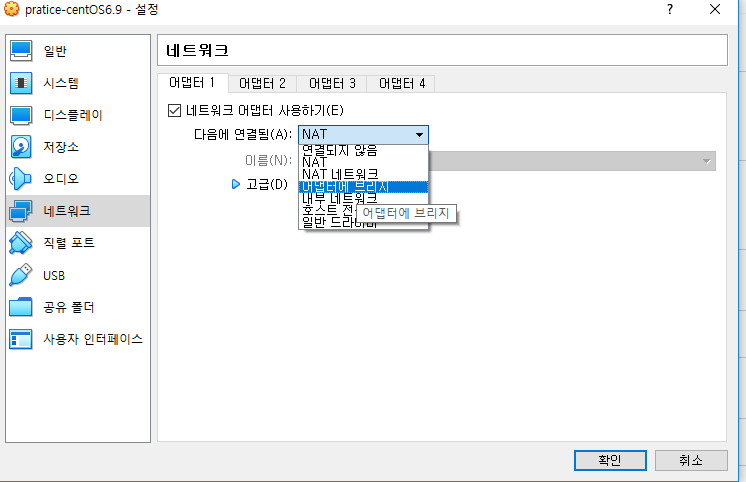
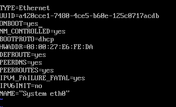
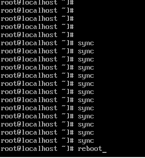

## Linux 설치 - 리눅스서버구축ppt

#### 1 - HW

---

#### 2 - 구성(계획- 파티션, 메모리 ... )

<https://kimhyun2017.tistory.com/21>

> ★ 파티션[^ 하나의 물리적인 디스크를 여러개의 논리적 디스크로 나누는 것]
>
> - 일반적으로 리눅스를 설치할 디스크에 파티션을 나눠서 사용한다.
>
> - 특별한 이유가 없는 한 다음 5개 정도의 파티션으로 나누어 설치하게 된다.
>
> 
>
> 1. 부트 파티션은 커널과 초기 RAM 디스크를 포함, GRUB에 관련된 파일을 저장하기 때문에 100(보통128)MB 정도면 충분하다.
>
> 2. /(루트) 파티션은 인스톨 예정의 RPM 패키지와 애플리케이션 소프트웨어를 인스톨 할 수 있는 정도의 사이즈가 필요
>
> 3. swap 영역은 RHEL에서 추천하는 다음 계산을 따른다.
>
> ​       메모리가 2GB 이하 : 물리 메모리의 2배
>
> ​       메모리가 2GB 이상 : 물리 메모리 + 2GB
>
> 4. kdump는 물리 메모리 사이즈의 2~3배 정도가 알맞다.
>
> 5. 데이터용 파티션은 애플리케이션 데이터 영역으로 운용 중에 데이터가 계속 증가할 영역으로 따로 파티션을 잡아두는 것이 좋다. 
>
> - 디스크 파티션 설정 화면에서는 “Default Layout” 이 아닌 “Custom Layout”를 선택해서 명시적으로 파티션을 구성하도록 한다.
>
> - LVM(Logical Volume Management)는 사용하지 않는 것이 원칙이다. (설치 시)
>
> - 데이터 양이 일정 한 영역과 데이터가 증가하는 영역으로 나눠서 관리하는 것이 디스크 관리의 기본이다.
>
> 
>
> **★ 마운트 (Mount)** - 특정 디렉토리에 파일시스템을 탑재 하는 것
>
>  - 리눅스 파일 단위로 모든 장치를 관리하기때문에 새롭게 만든 파일 시스템 사용하기위해서는 디스크 장치를 임의의 디렉토리에 마운트 시켜 사용해야한다.
>
>  **마운트 포인트 ( Mount Point )** - 디스크 장치와 디렉토리가 연결이되어야 하는데 이때
>     연결되는 디렉토리

---

#### 3 - 설치

\cafe24 수업\강의자료\02.강의\1. 리눅스서버구축.ppt 

**Virtual Box[^ 실제 서버 장비의 운용 전에 테스트 용도로 사용]** 

​					< = > docker(같은 가상인데 얜 os가 없음:cloud service)

**다운다운**

### 가상 머신 만들기 

가상 환경 경로 : D:\cafe24 수업\VirtualBoxVMs

​															**==>> 24GB ㄴㄴ 48GB ㅇㅇ**

### 만든 가상 머신 설정

1. 

>  NAT : 주소 변환(IP주소를 변환) => 가상머신이 사설 IP로 잡힘, 내부 접근 불가(?)
>
> <https://dany-it.tistory.com/36>

> 브리지 : 가상 스위치 (같은 네트워크에 있을 수 있게 설정 )

**어댑터에 브리지** 로 설정

2. 

---

**마우스 설정**

---

systen eth0 - 변경 - 적용

---

 #### 파티션 잡기

**여유공간 - 만들기 - 표준파티션**

**boot**

**swap**

**/**

-> 디스크에 변경 사항 기록 -> 설치완료 -> 재부팅

---

#### 4 - 초기 설정(커널 업데이트 ... )

`ifconfig -a` : 주소 확인 

주소 안 잡힘...!!!

​    ↓↓↓↓↓↓

#### **네트워크 설정해주기**

`vi /etc/sysconfig/network-script/ifcfg-eth0`

`i` : edit모드로 변경

ONBOOT=yes 로 변경!!!

`esc`  --> `:wq`   =====> :w 저장, :q 나가기, :wq 저장하고 나가기

**잘 됐는지 확인** 

`cat /etc/sysconfig/network-script/ifcfg-eth0`

**껐다 키기**

**다시 네트워크 주소 확인 ↓↓↓↓↓↓**   

​				네트워크 주소 뜬닷 --> inet addr : 192.168.1.50

로그아웃 : `exit` or `logout`

프로세스 확인 : `ps`

리눅스 버전 확인 :  `uname`, `uname -a`, `uname -r`

정지 : `shutdown -h +10` 10분뒤 꺼지게

​	 	  `shutdown -c` 취소

> 

> `shutdown -h +10 &`
>
> 
>
> **그냥 shutdown 을 ctrl + c 로 취소하면 위에처럼 좀비처럼 프로그램이 남아있음**
>
> **그래서 shutdown -c로 취소하면 아래처럼 사라짐**
>
> 

현재 접속자 확인 : `who`

리부트 : `init 6`   or    `reboot `   or    `shutdown -r now`

종료 : `init 0`

---

---

### 초기 설정

**yum** 을 이용해 패키지 업데이트 및 새로운 패키치 설치가 가능함 :

`yum repolist`

`yum update`

y/N 안물어보고 설치 : `yum -y install {}` 하면 됨~

`yum install vixie-cron`

> **그 밖에 자주 사용되는 yum 커맨드**
>
> `yum clean all`                  패키지 캐시 파일 삭제
>
> `yum list `                         모든 패키지 표시
>
> `yum remove <패키지 명>`  패키지 삭제
>
> `yum update  <패키지 명>`  패키지 업데이트

내부 구조 : `pstree`

