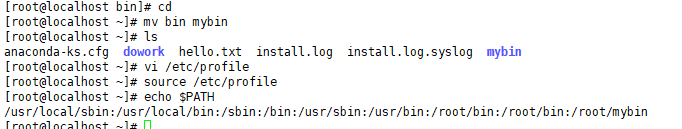

```sh
# cd
# mkdir bin
# cd bin
# mv ~    // ~:/root
# mv ~/dowork/sysprog/a.out .     //현재 dir로 옮겨라
```


`vi /etc/profile`

**맨 아래에 환경 변수 설정**


확인 

```shell
# source /etc/profile
# echo $PATH
> /usr/local/sbin:/usr/local/bin:/sbin:/bin:/usr/sbin:/usr/bin:/root/bin:/root/bin

```

근데 원래 root/bin이 있어서 다시 vi로 들어가서 주석으로 막아줌!





