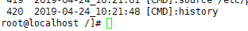
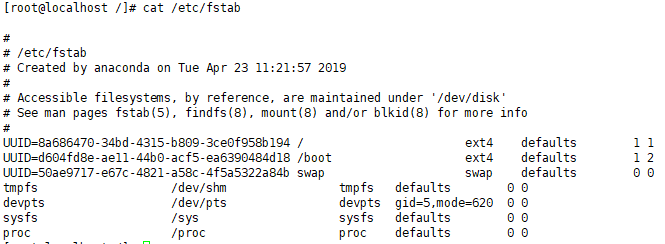
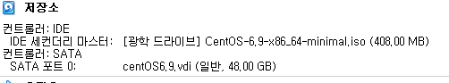
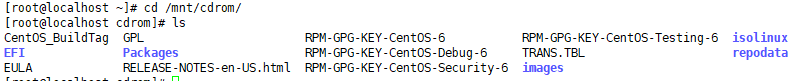

### 보안설정

해당 시간동안 입력이 없으면 자동으로 로그아웃 시키기

`export TMOUT=300`


`history` : 로그인 후 여태 쳤던 명령어들

`cd /`

`vi /etc/profile`

>  
>
>  ```
>  export TMOUT=9000
>  HISTTIMEFORMAT="%Y-%m-%d_%H:%M:%S [CMD]:"
>  ```

`# source /etc/profile`

`# history`




### 디스크

`# df -h` : 디스크 상태 확인


`# fidisk -l`  : 파티션 확인


---

 

---

#### 마운트란?

\- 특정 디바이스(device)를 사용하기 위해 하드웨어와 디렉토리를 연결하는 작업

\- 하드웨어 중 하드디스크의 장치명이 /dev/sda1라고 한다면 이 장치명을 지정된 마운트 포인트 (디렉터리 위치)와 연결하는 작업이 마운트(mount) 이다.

---

`# cat /etc/fstab`



`# blkid`   : 장치를 유효 아이디로 표현


> 1. 파일 시스템 장치명 /dev/sda3 는 마운트 포인트 (/ 디렉터리)에 연결되어 있다. 
>
> 2. 파일 시스템 장치명 /dev/sda3 는 xfs 파일 시스템이다.
>
> 3. 파일 시스템 장치명 /dev/sda3 는 default(rw, nouser, auto, exec, suid)속성을 가지는 파일 시스템
>
> 4. 덤프(백업)가 불가능하며 fsck가 무결성 체크를 하지 않는다.  


**마운트 걸어보기**

`# cd /mnt`


​                               디스크 이미지 선택 -> centos파일 (그냥 아무거나 임시로 넣어놓는거)



`# mkdir cdrom`

`# cd`

`# mount -t iso9660 /dev/cdrom /mnt/cdrom/`


**읽어보기**




**마운트 풀기**


