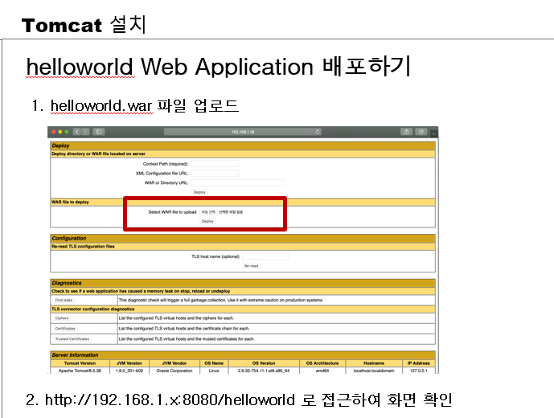
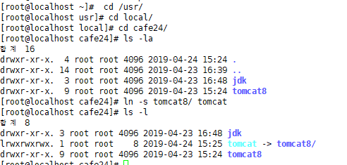
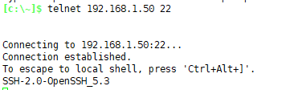
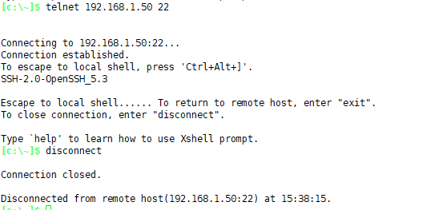
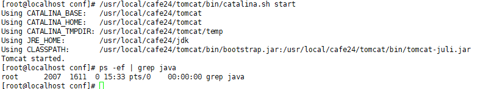
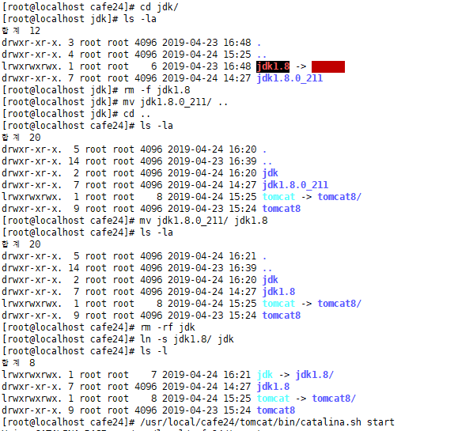
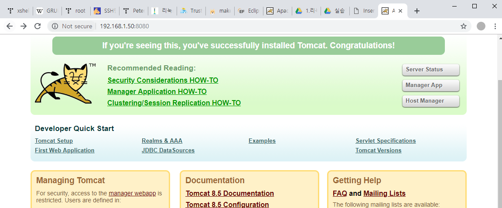

---

# tomcat - zip

<https://tomcat.apache.org/download-80.cgi>

`vi server.xml`

/8080검색

​									>>				**port 8080 확인**

내 주소 확인 : http://{{ ip }}:8080/

#### > 근데 8080이 linux방화벽에 막혔는지 확인 어떻게?

### > telnet!

**연결안됨**     -> `telnet 192.168.1.50 8080`    ==> 이렇게 해야함..

**연결됨**

**연결끊기** ctrl + alt + ]

---

---

서버 start

> iptables : 방화벽 풀기  `# vi /etc/sysconfig/iptables`

--> 8080 포트 열기

> `A INPUT -m state --state NEW -m tcp -p tcp --dport 8080 -j ACCEPT` 넣어주기

`# ps -ef | grep iptable` : ps -ef : 현재 실행중인 프로세스 보여줘 | grep iptable들어간거 출력

`# /etc/init.d/iptables stop`

`# /etc/init.d/iptables start`

## 여기서 jdk설치할 때 뭔가 꼬였었는데 고쳐주심

`# ps -ef | grep java`  : ps -ef : 모든 프로세스 중에 | java가 들어간 것을 출력해라

### 들어가지나 확인 :  <http://192.168.1.50:8080/>

