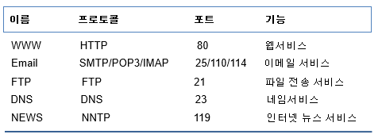
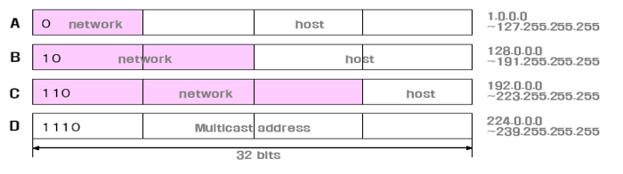
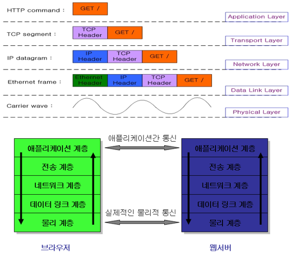
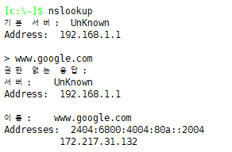

## 네트워크관리ppt 

**네트워크 ?**

- 유/무선으로 연결되어 있는 device들의 집합

**네트워킹?**

- 네트워크에 연결된 device간에 미리 약속된 프로토콜을 사용하여 데이터를 교환하는 것

**프로토콜?**

- 약속
- device 상호 간 데이터 통신을 위해 필요한 규약
- 통신규약!

**데이터 통신 방법**

- 두 개의 상이한  두 디바이스가  물리적으로  떨어져 있는 경우,  유/무선을 통해 네트워크 에 연결되어야  한다.

- 연결된 두 디바이스는  전류나  전파,  빛 등의 방식으로 데이터 통신을  한다.

- 이 데이터는 0/1 또는 on/off의  1bit로 표현되게 된다. (byte 단위 데이터 통신)

- 주소(  address ) - ip

​    - 두 디바이스가  데이터 통신을 하기 위해서는 서로의 위치를 알아야 한다.

​    - 이 위치를 네트워크에서는 node 라고 부른다.

​    - 각 node(호스트) 마다  고유의 주소를 가지고 있어야 한다.

- 데이터 통신을 할 때는 데이터 외에  어디로 보내야 하는 가  또는 누가 보내는 가 등의 정보를 담고 있어야 한다.

> [ 일반적인 소켓은 항상 request가 가면 response가 와야함! (응답 오기전에 다른 행동 X) ]
>
> **TCP Header 구조** 
>
> > [참고사이트](https://mindnet.tistory.com/entry/네트워크-쉽게-이해하기-19편-TCP-Header-4계층-TCP-헤더-구조)
>
> 

- 실제, 네트워크를 통한 데이터 통신을 할 때, Packet를 사용함

  - TCP 헤더에 붙어있음

  > (1) Header : 송신자/수신자 의 주소, 체크썸(checksum) 그리고  여러 제어 정보
  >
  > (2) Body : 전송할 데이터를 byte 단위로 포함한다.  

---

네트워크 게이트(?)를 통해  [driver]에 들어옴 

->  os(커널)에서 TCP/IP 를 보고 IP가 맞으면 APP으로 보냄 아니면 걸러냄 

-> 사실 우리는 TCP/IP보다 Data를 중요하게 여김 

---

---

### Internet - 네트워크의 결합체

- TCP/IP 기반의 네트워크가 전 세계적으로 확대되어 하나로 연결된 네트워크들의 네트워크

**인터넷 기반 서비스**

> 

---

하기 전에  : [TCP/IP 프로토콜 기본 개념](<https://popbox.tistory.com/68>)

> ​								**TCP/IP는 거의 완벽한 표준! 전세계적으로 확대됨**
>
> #### **Link계층 (Link Layer)**
>
> 1. Host(호스트)간의 네트워크를 통한 데이터 통신을 위한 물리적 연결(유/무선)에 대한 표준
>
> 2. LAN, WAN, MAN과 같은 네트워크 구성을 정의
>
> 3. 상위 계층인 Intenet 계층에서 형성된 Packet(패킷) 을 전기신호 또는  광 신호로 바꾸어 전달하는 역할을  담당한다.
>
> 4. 응용(Application) 개발자가 직접 접근할 수 있는 계층이 아니고 보통  네트워크 장비나 드라이버 개발자  들이 관심을 가지는 계층이다.
>
> 
>
> #### **Internet계층 (Internet Layer )** - 라우터 주소 정의 (주소체계)
>
> 1. Link 계층을 통해 물리적으로 연결된  각  Host간의 Packet의 전달 경로를 결정한다.
>
> 2. IP(Internet Protocol)은 인터넷 계층에 존재하는 프로토콜이다.
>
> 3. IP 프로토콜에는 IP 주소(Address)를 부여하는 방법과 체계를 정의하고 있다.
>
> 4. IP 프로토콜은 IP 주소를 기반으로 경로를 Routing 하는 방법을 정의하고 있다. 
>
> 5. Transport(전송) 계층과 함께 Internet에서 중요한 계층이다.
>
> 6. 데이터가  상대방에게 안전하게 전송되는 것을 보장하지 않는다.
>
> 7. Transport(전송) 계층이 데이터 전달에 대한 신뢰성을 책임진다는 가정하에 목적지로 Packet을 어떤 경로로 전송할 것  인가에 대한 문제만 해결하는 계층이다.
>
> 8. IP 주소는 다음과 같이 2종류로 나뉜다.
>
>    ​    IPv4 ( Internet Protocol Version 4) : 4byte 주소체계
>
>    ​    IPv6 ( Internet Protocol Version 6) : 16byte 주소체계
>
> 9. 4Byte IP주소는 Network주소와 Host(호스트) 주소로  나뉜다.
>
>    > 
>    >
>    > 192.168.1.## -> ##이 호스트 주소
>    >
>    > 네트워크 주소 : 192.158.1.0
>    >
>    > ==> 다 이러냐(다 마지막만 호스트 주소로쓰냐?) ㄴㄴ 네트워크 주소랑 호스트주소 얼만큼 주는지는 위의 그림처럼 다 다름,  우리는 192~ 로 시작하니까 C클래스!
>
> 
>
> #### **전송계층(Transport Layer)**
>
> 1. 하위 계층  Internet 계층의 IP가 해결한 목적지까지의 네트워크상의 경로에서 실제 데이터를 전송하는 역할을 한다. 
>
> 2. TCP와 UDP 라는  데이터의  전달을  책임지는 프로토콜이 존재한다.
>
> 3. IP는 하나의 Packet이 전달되는 과정에만  중심을 두고 설계 되었기 때문에 여러 Packet으로 나눠져 전달되는 데이터
>
> ​    의 순서와 전송 자체는 신뢰할 수 없다.
>
> 4. 데이터의 순서와  신뢰할 수 있는 데이터 전송을 보장하는 역할을 전송 계층의 프로토콜이 맡는다.
>
> 5. **TCP( Transmission Control Protocol)**  - 연결지향 
>
>    - **연결지향** 프로토콜이라 데이터를 전송/수신하기 전에 소켓을 통해 **양쪽 연결이 성립**
>    - 연결이 성립되면 TCP는 데이터의 손실이나 중복 없이 목적지에 확실하게 전달
>    -  만약 이때 보낸 데이터의 일부가 유실되었다면 수신자는 발신자에게 해당 데이터의 재전송을 요청한다.  
>    - 흔히,  TCP를  전화 통화와 비교된다.
>    - TCP는 UDP에 비해 프로토콜이 더 복잡하고 속도도 느리다. 
>    -  UDP에 비해 신뢰성 있는 데이터 전송이 가능하다는 장점 때문에 HTTP, FTP, TELNET 등 대 부분 응용계층 프로토콜은 전송 계층으로  TCP를 이용한다.
>
> 6. UDP - 편지(잘 갔는지 안갔는지 모름),   TCP - 전화(양쪽 연결)
>
>    > **그럼 왜 UDP를 써?**
>    >
>    > TCP는 데이터 통신할 때 버퍼가 있는데 
>    >
>    > A <-> B 가 주고 받을 떄, 
>    >
>    > 1 일단 A 버퍼에 데이터를 쌓아놓고
>    >
>    > 2 100byte B에 보냄 
>    >
>    > 3 B에서는 A에 101byte라고 보냄(데이터 받았다)
>    >
>    > 4 A버퍼는 전송했으니까 비움, 
>    >
>    > 5 근데 B에서 데이터 읽다가 다 못읽었을 경우-disk pull (버퍼를 다 못비움)
>    >
>    > 6 A에서 다음 데이터 100byte를 또 보냄 
>    >
>    > 7 B에서 나 지금 20byte밖에 못쓴다고 하면(창문이라고 함, 창문이 열렸다 닫혔다 - TCP Header에 window size가 있음 - ★**슬라이딩 알고리즘**)
>    >
>    > 8 A에서 20byte만 보냄
>    >
>    > 9 B에서 A한테 121byte라고 보냄(만약 100byte를 받았다면 201byte라고 보냈겠지)
>    >
>    > 10 A에서는 20byte만 보내고 지운다음에, 나머지 데이터는 그냥 갖고있음
>    >
>    > 11 A의 write버퍼가 계속 안비워지면 A에서 write error! 
>
> 7. **UDP( User Datagram Protocol )** - **끊겨도 되는 서비스 = 스트림 서비스!**  - 빠름
>
>    - UDP는 비 연결지향 프로토콜이다. 
>    - 전송한 데이터가 잘 전달되었는지 확인하지 않고 단지 데이터를 보내는 것으로 자신의 임무를 다한 것으로 생각한다.
>    - UDP는 TCP에 비해 신뢰성이 떨어지는 프로토콜이다. 
>    - 흔히,  편지를 보내는 것에 비유 
>    - 음악이나 동영상의 Streaming 서비스 같은 것에 적당한 프로토콜이다
>
>    
>
> #### **응용계층(Application Layer)**
>
> 1. 하위 계층이 목적지가 되는 호스트에 데이터를 안전하게 전달하는 신뢰에서 응용계층에서는 응용 프로그램(프로세스)들이 데이터 통신을 하게 된다.
>
> 2. 응용 계층의 응용 프로그램(프로세스) 들의 데이터 통신에는 매우 다양하다.
>
> ​           ex) 메일을 보내기(SMTP),  파일을 전송하기(FTP), 웹사이트에 접속하기(HTTP)
>
> ​           각 각의 목적에 맞는 데이터 통신을 위한 응용 프로토콜이 이미 정의되어 있기도 하고 
>
> ​           사용자 프로토콜을 설계하여 인터넷  기반의 서비스를 개발할 수 있다.
>
> 3. Socket(소켓)은  응용 계층에서 개발되는 응용 프로그램에서 하위 계층의 TCP/IP의 역할을 감추어 준다. (투명성)
>
> 4. Socket(소켓)이라는 도구를 사용하면 응용 프로그램 간의 성격에 따라 기 설계된  응용 프로토콜을 구현한 프로그램을 개발하거나 프로토콜을 설계하고 구현하면 된다. 
>
> 5. 대부분의 네트워크 프로그래밍은 socket을사용하여 위와 같은 작업을 하는 것이라 할 수 있다. 

---

---

### HTTP

- 문서들이 서로 연결 

**HTTP 프로토콜**

> 
>
> - 클라이언트는 웹 서버에 요청을 보냄
>
> - 웹 서버는 요청을 분석해 클라이언트에게 응답정보를 보냄
>
> < 순서 >
>
> 1. 클라이언트에서 웹서버 connect
>
> 2. 클라이언트 --요청--> 웹서버
>
> 3. 클라이언트 <--응답-- 웹서버
>
> 4. 웹서버에서 연결 close (한번의 요청, 한번의 응답 후 요청을 끊어버림)
>
>    > **왜 끊음? = stateless connection**
>    >
>    > 문서잖아, 문서 보내주면 클라이언트쪽에서 읽는데 시간이 걸리잖아 -> 서버비용 낭비
>    >
>    > ==> 그래서 session, cookie를 사용!!  !! 
>    >
>    > ==> ★keep alive : 다음 연결에도 연결을 안 끊을 테니까 ...  => 클라이언트에서 keep alive code를 보내고 sever도 keep alive기능을 제공할 경우 쓸 수 있음
>    >
>    > **채팅의 경우?**
>    >
>    > 계속해서 대화를 주고 받는데 연결을 끊는 것이 오히려 비 효율적 (연결정보를 갖고 계속해서 소켓과 연결된 유저들의 화면에 현재 채팅들을 띄워줘야 함! - 반대편 신호까지)
>
> 

---

---

**내일 배울 내용 잠~깐 설명**

---

GET/ HTTP/1.2

---

---

방입장 : `JOIN 둘리(\n)`  

메세지 : `MSG  안녕`

TCP는 데이터를 \n개행이 나올 떄 까지 read

★**Java.io** 에는 socket input stream이 있음 (부모는 input stream -> 추상화) 

> read만 쓰면 됨

> 소스에 꽂는 주 스트림 
>
> 보조 스트림은 주 스트림에 꽂음 -> 데코레이션
>
> 바이트를 문자로 바꿔주는 인코딩 -> 문자를 버퍼에 하나씩(개행까지) 저장
>
> 버퍼드 리더에서는 버퍼에 있는 문자를 개행까지 하나의 문자열로 return 

---

---

---

### TCP/IP 프로토콜 스택(stack, 계층)

ex)

LAMP Stack = Linux, apache, Mysql, php stack

MEAN Stack = Linux, Node, MongoDB, Express, Angular

- TCP/IP프로토콜 스택은 총 4개로 있음

- 네트워크 상의 데이터 통신 과정을 4개의 영역으로 "계층화"한 것

- 데이터 통신 과정을 작게 나눠서 계층화 하려는 노력의 결과임

- OSI 7계층은 왜 다 사용안함?

  > OSI 7계층은 이론/하드웨어 표준을 위해 제정한 것
  >
  > 실무에서 90%이상의 위의 프로토콜 스택을 기반으로 작업하게 됨

### 프로토콜 계층간의 데이터 캡슐화

**DNS : `nslookup**`

> 

★ 그림 만들어 넣기

