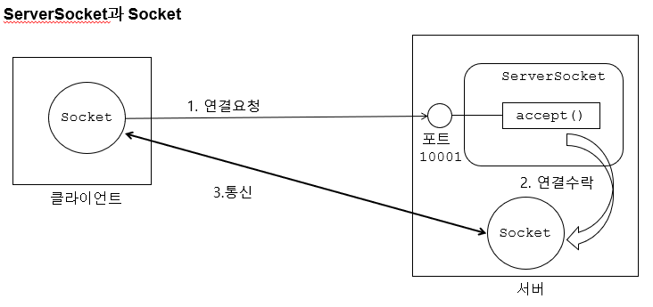
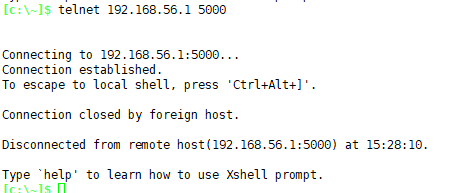
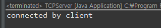
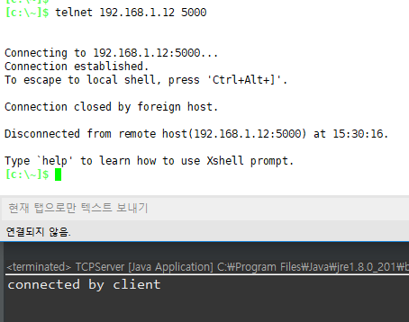
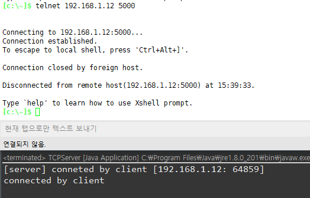
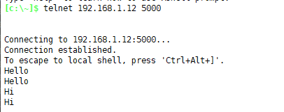

## TCP 소켓 프로그래밍 기본



> ServerSocket : 클라이언트의 연결 요청을 기다리면서 요청에 대한 수락 담당
>
> Socket : 클라이언트와 통신 직접 담당

> Socket은 무한루트 돌면서 요청이 들어오면 쓰레드를 하나씩 만들어서 줌

---


---

## java 소켓 프로그래밍 

**test/TCPServer.java**

```java
package test;

import java.io.IOException;
import java.net.InetAddress;
import java.net.InetSocketAddress;
import java.net.ServerSocket;
import java.net.Socket;

public class TCPServer {

	public static void main(String[] args) {
		ServerSocket serverSocket = null;
		try {
			// 1. 서버 소켓 생성
			serverSocket = new ServerSocket();
			
			// 2. 바인딩(binding) : Socket에 SocketAddress(IPAddress + Port)를 바인딩 한다.
			InetAddress inetAddress = InetAddress.getLocalHost();
			String localhost = inetAddress.getHostAddress();
			serverSocket.bind(new InetSocketAddress(localhost, 5000));
//			serverSocket.bind(new InetSocketAddress(inetAddress, 5000));
//			serverSocket.bind(new InetSocketAddress("0.0.0.0", 5000));
			
			// 3. accept : client의 연결요청을 기다린다.
			Socket socket = serverSocket.accept();  // blocking : 안되면 밑에 실행 X
			
			System.out.println("connected by client");
			
			
		} catch (IOException e) {
			e.printStackTrace();
		} finally {
			try {
				// 							소켓이 닫히지 않았을 경우!
				if(serverSocket != null && serverSocket.isClosed()) {
					serverSocket.close();
				}
			} catch (IOException e) {
				e.printStackTrace();
			}
		}

	}
}
```

### 코드 실행 후 test 해보기!

> **공유기로  : `telnet 192.168.56.1 5000`**
>
> 1.
>
> ```java
>             InetAddress inetAddress = InetAddress.getLocalHost();
>             serverSocket.bind(new InetSocketAddress(inetAddress, 5000));
> ```
>
> 2.
>
> ```java
> 			String localhost = inetAddress.getHostAddress();
> 			serverSocket.bind(new InetSocketAddress(localhost, 5000));
> ```
>
> 
>
> 
>
> > 

> **내 ip로 시도 : `telnet 192.168.1.12 5000`**
>
> 코드 수정
>
> ```java
> serverSocket.bind(new InetSocketAddress("0.0.0.0", 5000));
> ```
>
> 


---

```java
		serverSocket.bind(new InetSocketAddress("0.0.0.0", 5000));
```

**접근 ip 확인하기**

**TCPServer.java**

```java
package test;

import java.io.IOException;
import java.net.InetAddress;
import java.net.InetSocketAddress;
import java.net.ServerSocket;
import java.net.Socket;

public class TCPServer {

	public static void main(String[] args) {
		ServerSocket serverSocket = null;
		try {
			// 1. 서버 소켓 생성
			serverSocket = new ServerSocket();
			
			// 2. 바인딩(binding) : Socket에 SocketAddress(IPAddress + Port)를 바인딩 한다.
			InetAddress inetAddress = InetAddress.getLocalHost();
			
//			String localhost = inetAddress.getHostAddress();
//			serverSocket.bind(new InetSocketAddress(localhost, 5000));
//			serverSocket.bind(new InetSocketAddress(inetAddress, 5000));
			serverSocket.bind(new InetSocketAddress("0.0.0.0", 5000));
			
			// 3. accept : client의 연결요청을 기다린다.
			Socket socket = serverSocket.accept();  // blocking : 안되면 밑에 실행 X
			
			// down casting
			InetSocketAddress inetRemoteSocketAddress = (InetSocketAddress)socket.getRemoteSocketAddress();
			String remoteHostAddress = inetRemoteSocketAddress.getAddress().getHostAddress();
			int remotePort = inetRemoteSocketAddress.getPort();
			System.out.println("[server] conneted by client [" + remoteHostAddress + ": " + remotePort+"]");
			
			
		} catch (IOException e) {
			e.printStackTrace();
		} finally {
			try {
				// 							소켓이 닫히지 않았을 경우!
				if(serverSocket != null && serverSocket.isClosed()) {
					serverSocket.close();
				}
			} catch (IOException e) {
				e.printStackTrace();
			}
		}

	}

}

```

> 

---


---

### IOStream 받아오기

```java
			InputStream is = socket.getInputStream();
			OutputStream os = socket.getOutputStream();
```

**TCPServer.java - 채팅처럼 데이터 받아오기**

```java
package test;

import java.io.IOException;
import java.io.InputStream;
import java.io.OutputStream;
import java.net.InetAddress;
import java.net.InetSocketAddress;
import java.net.ServerSocket;
import java.net.Socket;

public class TCPServer {

	public static void main(String[] args) {
		ServerSocket serverSocket = null;
		try {
			// 1. 서버 소켓 생성
			serverSocket = new ServerSocket();
			
			// 2. 바인딩(binding) : Socket에 SocketAddress(IPAddress + Port)를 바인딩 한다.
			InetAddress inetAddress = InetAddress.getLocalHost();
			
//			String localhost = inetAddress.getHostAddress();
//			serverSocket.bind(new InetSocketAddress(localhost, 5000));
//			serverSocket.bind(new InetSocketAddress(inetAddress, 5000));
			serverSocket.bind(new InetSocketAddress("0.0.0.0", 5000));
			
			// 3. accept : client의 연결요청을 기다린다.
			Socket socket = serverSocket.accept();  // blocking : 안되면 밑에 실행 X
			
			// 3-2 host ipㅡport 가져오기
																		// down casting
			InetSocketAddress inetRemoteSocketAddress = (InetSocketAddress)socket.getRemoteSocketAddress();
			String remoteHostAddress = inetRemoteSocketAddress.getAddress().getHostAddress();
			int remotePort = inetRemoteSocketAddress.getPort();
			System.out.println("[server] conneted by client [" + remoteHostAddress + ": " + remotePort+"]");
//			System.out.println("connected by client");
			
			try {
				// 4. IOStream 받아오기
				InputStream is = socket.getInputStream();
				OutputStream os = socket.getOutputStream();
				
				while(true) {
					// 5. 데이터 읽기
					byte[] buffer = new byte[256];
					int readByCount = is.read(buffer);
					
					if(readByCount == -1) {
						// 정상 종료 - client쪽에서 우아하게 종료 ! close() 메소드를 호출해서 나 끈다~
						System.out.println("[server] closed by client");
					}
													// 0번째부터 readByCount까지
					String data = new String(buffer, 0, readByCount, "utf-8");
					System.out.println("[server] received : " + data);
				}
			}catch(IOException e) { // 정상종료 안하고 확 꺼버린 ..!
				e.printStackTrace();
			}finally {
				try {
					if(socket != null && socket.isClosed()) {
						socket.close();
					}
				} catch (IOException e) {
					e.printStackTrace();
				}
			}
			
			
		} catch (IOException e) {
			e.printStackTrace();
		} finally {
			try {
				// 							소켓이 닫히지 않았을 경우!
				if(serverSocket != null && serverSocket.isClosed()) {
					serverSocket.close();
				}
			} catch (IOException e) {
				e.printStackTrace();
			}
		}

	}

}

```

> 
>
> > 개행이 더 오는것 telnet의 문제! 나중에 client 제대로 만들면 안와~


#### outputstream

```java
					// 6. 데이터 쓰기 
					os.write(data.getBytes("utf-8"));
```

> 


#### 정상종료

```java
					if(readByteCount == -1) {
// 정상 종료 - client쪽에서 우아하게 종료 ! close() 메소드를 호출해서 나 끈다~
						System.out.println("[server] closed by client");
						break;
					}
```

> 


최종코드 

**TCPServer.java**

```java
package test;

import java.io.IOException;
import java.io.InputStream;
import java.io.OutputStream;
import java.net.InetAddress;
import java.net.InetSocketAddress;
import java.net.ServerSocket;
import java.net.Socket;

public class TCPServer {

	public static void main(String[] args) {
		ServerSocket serverSocket = null;
		try {
			// 1. 서버 소켓 생성
			serverSocket = new ServerSocket();
			
			// 2. 바인딩(binding) : Socket에 SocketAddress(IPAddress + Port)를 바인딩 한다.
			InetAddress inetAddress = InetAddress.getLocalHost();
			
//			String localhost = inetAddress.getHostAddress();
//			serverSocket.bind(new InetSocketAddress(localhost, 5000));
//			serverSocket.bind(new InetSocketAddress(inetAddress, 5000));
			serverSocket.bind(new InetSocketAddress("0.0.0.0", 5000));
			
			// 3. accept : client의 연결요청을 기다린다.
			Socket socket = serverSocket.accept();  // blocking : 안되면 밑에 실행 X
			
			// 3-2 host ipㅡport 가져오기
																		// down casting
			InetSocketAddress inetRemoteSocketAddress = (InetSocketAddress)socket.getRemoteSocketAddress();
			String remoteHostAddress = inetRemoteSocketAddress.getAddress().getHostAddress();
			int remotePort = inetRemoteSocketAddress.getPort();
			System.out.println("[server] conneted by client [" + remoteHostAddress + ": " + remotePort+"]");
//			System.out.println("connected by client");
			
			try {
				// 4. IOStream 받아오기
				InputStream is = socket.getInputStream();
				OutputStream os = socket.getOutputStream();
				
				while(true) {
					// 5. 데이터 읽기
					byte[] buffer = new byte[256];
					int readByCount = is.read(buffer); //blocking
					
					if(readByCount == -1) {
						// 정상 종료 - client쪽에서 우아하게 종료 ! close() 메소드를 호출해서 나 끈다~
						System.out.println("[server] closed by client");
					}
													// 0번째부터 readByCount까지
					String data = new String(buffer, 0, readByCount, "utf-8");
					System.out.println("[server] received : " + data);
					
					// 6. 데이터 쓰기 
					os.write(data.getBytes("utf-8"));
				}
			}catch(IOException e) { // 정상종료 안하고 확 꺼버린 ..!
				e.printStackTrace();
			}finally {
				try {
					if(socket != null && socket.isClosed()) {
						socket.close();
					}
				} catch (IOException e) {
					e.printStackTrace();
				}
			}
			
			
		} catch (IOException e) {
			e.printStackTrace();
		} finally {
			try {
				// 							소켓이 닫히지 않았을 경우!
				if(serverSocket != null && serverSocket.isClosed()) {
					serverSocket.close();
				}
			} catch (IOException e) {
				e.printStackTrace();
			}
		}

	}

}

```


