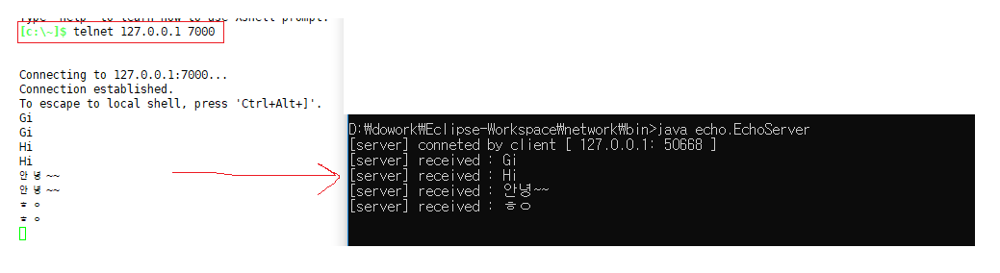

**echo/EchoServer.java**


[순서]

1. 서버 소켓 생성
2. 바인딩
3. accept
4. host ip-port 가져오기
5. IOStream 받기
6. 데이터 읽기
7. 데이터 쓰기

```java
package echo;

import java.io.BufferedReader;
import java.io.IOException;
import java.io.InputStreamReader;
import java.io.OutputStreamWriter;
import java.io.PrintWriter;
import java.net.InetSocketAddress;
import java.net.ServerSocket;
import java.net.Socket;
import java.net.SocketException;

public class EchoServer {
	
	private static final int PORT = 7000;
	
	public static void main(String[] args) {
		ServerSocket serverSocket = null;
		try {
			// 1. 서버 소켓 생성
			serverSocket = new ServerSocket();
			
			// 2. 바인딩(binding)
			serverSocket.bind(new InetSocketAddress("0.0.0.0", PORT)); 

			// 3. accept 
			Socket socket = serverSocket.accept();  
			
			// 3-2 host ipㅡport 가져오기										
			InetSocketAddress inetRemoteSocketAddress = (InetSocketAddress)socket.getRemoteSocketAddress();

			String remoteHostAddress = inetRemoteSocketAddress.getAddress().getHostAddress();
			
			int remotePort = inetRemoteSocketAddress.getPort();
			log("conneted by client [ " + remoteHostAddress + ": " + remotePort+" ]");
			
			try {
				// 4. IOStream 받아오기
				BufferedReader br = new BufferedReader(
						new InputStreamReader(socket.getInputStream(),"utf-8"));
				
				PrintWriter pr = new PrintWriter(
						new OutputStreamWriter(socket.getOutputStream(),"utf-8"), true);
																		// true:flash 자동 
				while(true) {
					// 5. 데이터 읽기 
					String data = br.readLine();
					if(data == null) {
						log("closed by client");
						break;
					}
					
					log("received : " + data);

					// 6. 데이터 쓰기
					pr.println(data);
				}
				
			}catch(SocketException e) { 
				System.out.println("[server] sudden closed by client");
			}catch(IOException e) { // 정상종료 안하고 확 꺼버린 ..!
				e.printStackTrace();
			}finally {
				try {
					if(socket != null && socket.isClosed()) {
						socket.close();
					}
				} catch (IOException e) {
					e.printStackTrace();
				}
			} //데이터 통신용 exception
			
			
		} catch (IOException e) {
			e.printStackTrace();
		} finally {
			try {
				// 							소켓이 닫히지 않았을 경우!
				if(serverSocket != null && serverSocket.isClosed()) {
					serverSocket.close();
				}
			} catch (IOException e) {
				e.printStackTrace();
			}
		}	// 소켓용 exception

	}

	public static void log(String log) {
		System.out.println("[server] " + losg);
		
	}

}
```

test

```cmd
D:\dowork\Eclipse-Workspace\network\bin>java echo.EchoServer
```

> 

