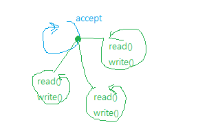

**echo/EchoClient.java**

[ 순서 ]

1. **Scanner 생성(표준입력 연결)**
2. **socket 생성**
3. **서버 연결**
4. **IOStream 생성(받아오기)**
5. **키보드 입력받기**
6. **데이터 쓰기**
7. **데이터 콘솔 출력**

```java
package echo;

import java.io.BufferedReader;
import java.io.IOException;
import java.io.InputStreamReader;
import java.io.OutputStreamWriter;
import java.io.PrintWriter;
import java.net.InetSocketAddress;
import java.net.Socket;
import java.util.Scanner;

public class EchoClient {
	
	private static final String SERVER_IP = "192.168.1.12";
	private static final int SERVER_PORT = 7000;
	
	public static void main(String[] args) {
		
		Scanner scanner = new Scanner(System.in);
		Socket socket = null;
		
		try {
			// 1. Scanner 생성(표준입력 연결)
			
			// 2. socket 생성
			socket = new Socket();
			
			// 3. 서버 연결
			socket.connect(new InetSocketAddress(SERVER_IP, SERVER_PORT));
			log("conndected");
			
			// 4. IOStream 생성(받아오기)
			BufferedReader br = new BufferedReader(
					new InputStreamReader(socket.getInputStream(),"utf-8"));
			
			PrintWriter pr = new PrintWriter(
					new OutputStreamWriter(socket.getOutputStream(),"utf-8"), true);
			
			while(true) {
				// 5. 키보드 입력받기
				System.out.print(">> ");
				String line = scanner.nextLine();
				if("quit".contentEquals(line)) {
					break;
				}
				
				// 6. 데이터 쓰기
				pr.println(line);
				
				// 7. 데이터 읽기
				String data = br.readLine();
				if(data == null) {
					log("closed by server");
					break;
				}
				
				// 8. 콘솔 출력
				System.out.println("<< " + data);
			}
			
			
		} catch (IOException e) {
			e.printStackTrace();
		} finally {
			try {
				if(scanner != null) {
					scanner.close();
				}
				
				if(socket != null && socket.isClosed() == false) {
					socket.close();
				}
			} catch (IOException e) {
				e.printStackTrace();
			}
		}
	}
	
	public static void log(String log) {
		System.out.println("[client] " + log);
	}
}
```

> 


### 현재 문제

> 

​                                                   << 다중 연결이 안됨 ! 1:1 밖에 >> 

**멀티 스레드가 필요!**


> 이렇게 멀리 스레드로 수행하도록 로직을 나눠야해 
>
> 

> thread 사용시 주의 : 변경 가능한 객체를 서로 공유해서 쓰는 것
>
> 근데 함부로 syncronized 걸면 효율이 떨어짐
>
> 그래서 함수형으로 잘 짜야함. 어떻게 짜야할까.
>
> > 함수를 불변의 객체로 짜고, 함수 내부에서는 외부를 건들면 안됨(파라미터 들어오면 내부에서 가공해서 새로운 데이터를 만드는 것 ) --> thread의 이런 문제들 떄문에 자바 1.8버전부터는 함수형으로 바꾸고,. 그런다 ~ 
> >
> > ** lambda 함수 얘기 잠깐.
> >
> > 