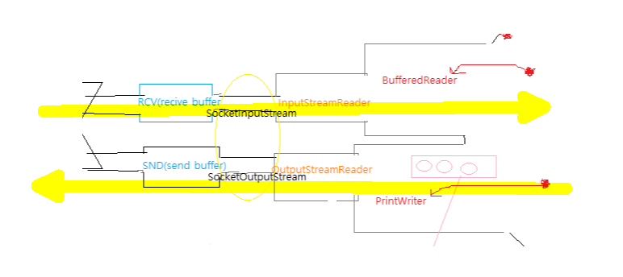
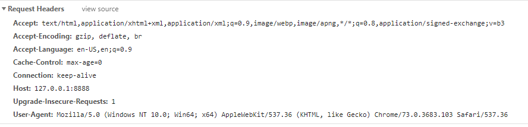
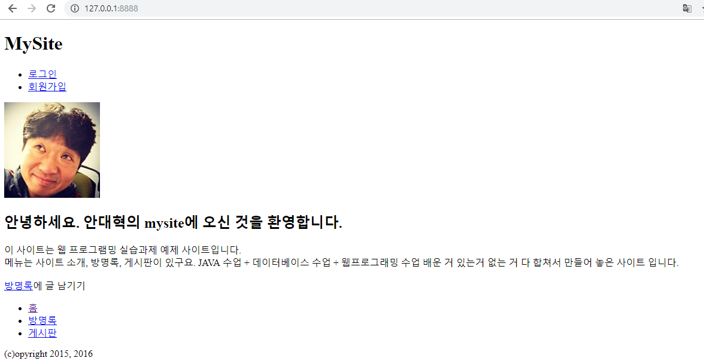
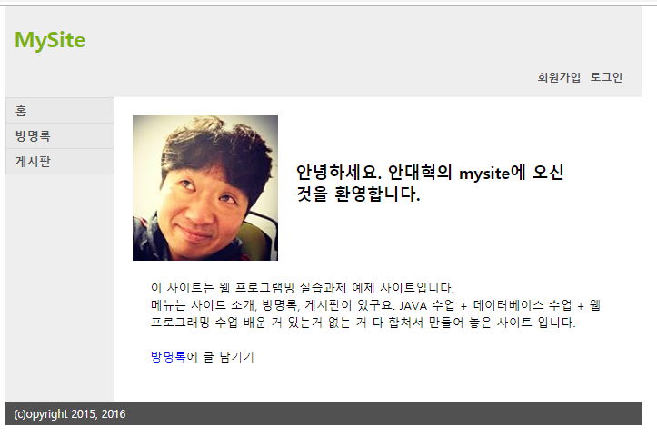
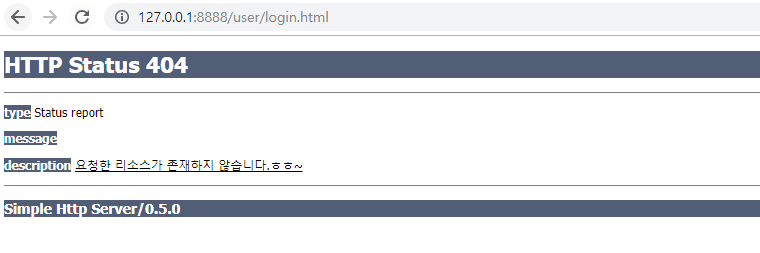

[TOC]

---

## 여담

> ActiveX
>
> .com 기술
>
> Applet

## http 그림

---



**[history]** 

0 : 소켓 연결

1 : accept (잠깐 blocking)

2: 새로운 소켓 생성

3: thread 생성

4: 소켓 thread 연결

5: 클라이언트 소켓과 새로 생성된 소켓 연결

6: requeset

7: response

8: stateless - 연결 끊음


---


**http/RequestHandler.java**

```java
while(true) {
    // request Header를 line단위로 읽을거
    String line = br.readLine();

    // 브라우저가 연결을 끊으면..
    if(line == null) {
        break;
    }

    // Request Header만 읽음
    if("".equals(line)) { // 개행이 나온 다음부터 body니까, 빈개행나오면 끝 
        break;
    }
    consoleLog("reveiced :" + line );
}

```

> 
>
> 
>
> #10 -> favicon -> 아이콘요청
>
> 

---


---

`GET(method) /(uri) HTTP/1.1(protocol)`만 가져오기

```java
while(true) {
    // request Header를 line단위로 읽을거
    String line = br.readLine();

    // 브라우저가 연결을 끊으면..
    if(line == null) {
        break;
    }

    // Request Header만 읽음
    if("".equals(line)) { // 개행이 나온 다음부터 body니까, 빈개행나오면 끝 
        break;
    }

    // Header의 첫번째 라인만 처리
    if(request == null) {
        request = line;
    }
}
consoleLog("reveiced :" + request );
```

> [HttpServer#1] httpd starts at 8888
> [RequestHandler#10] connected from 127.0.0.1:54787
> [RequestHandler#11] connected from 127.0.0.1:54788
> [RequestHandler#11] reveiced :GET / HTTP/1.1
> [RequestHandler#10] reveiced :GET /favicon.ico HTTP/1.1

---


## 파싱하기

**responseStaticResource Method 구현**

```java
	private static final String DOCUMENT_ROOT = "./webapp";

	...
        
    // 파싱하기
    String[] tokens = request.split(" ");
    if("GET".contentEquals(tokens[0])) {
        consoleLog("request : " +  tokens[1]);
        responseStaticResource(os, tokens[1], tokens[2]);
    }else { // 그 외 http Method는 무시 - POST, PUT, DELETE, HEAD(body없이 보낼 때), OPTION, CONNECT(프록시) ...etc
        consoleLog("Bad Request : " + tokens[1]);
    }

	...
        
	public void responseStaticResource(OutputStream os, String url, String protocol) {
		if("/".equals(url)) {
			url = "/index.html"; // welcome file 설정
		}
			
		File file = new File( DOCUMENT_ROOT + url );
		if(file.exists() == false) {
			/* Header 부분 체울 내용 
			 * <응답예시>
			 * HTTP/1.1 404 File Not Found\r\n    // 윈도우는 \n만 씀
			 * Content-Type:text/html; charset=utf-8/r/n
			 * \r\n
			 * HTML 에러 문서
			 */
			// response404Error(os, protocol);
			return;
		}
	}   
```

> ```java
> File file = new File( DOCUMENT_ROOT + url );
> if(file.exists() == false) {
> }
> ```
>
> 위와 아래 동일한 코드
>
> ```java
> try {
>     FileInputStream fs = new FileInputStream(DOCUMENT_ROOT + url);
> } catch (FileNotFoundException e) {
>     e.printStackTrace();
> }
> ```
>
> > 근데 이건 안좋아 -> 메모리를 많이 차지해 
> >
> > 어쩔 수 없는 상황에서 예외를 받아야하지만, 로직을 예외으로 짜는건 **바보**


**responseStaticResource Method 완성** - 404page 숙제

```java
public void responseStaticResource(OutputStream os, String url, String protocol) throws IOException{
    if("/".equals(url)) {
        url = "/index.html"; // welcome file 설정
    }

    File file = new File( DOCUMENT_ROOT + url );
    if(file.exists() == false) {
        /* Header 부분 체울 내용 
			 * <응답예시>
			 * HTTP/1.1 404 File Not Found\r\n    // 윈도우는 \n만 씀
			 * Content-Type:text/html; charset=utf-8/r/n
			 * \r\n
			 * HTML 에러 문서
			 */
        // response404Error(os, protocol);
        return;
    }

    // nio
    byte[] body = Files.readAllBytes(file.toPath());

    //응답
    os.write( (protocol + "HTTP/1.1 200 OK\r\n").getBytes( "UTF-8" ) );
    os.write( "Content-Type:text/html; charset=utf-8\r\n".getBytes( "UTF-8" ) );
    os.write( "\r\n".getBytes() ); 
    os.write( body );
}
```


---

## 전체코드

**RequestHandler.java**

```java
package http;

import java.io.BufferedReader;
import java.io.File;
import java.io.IOException;
import java.io.InputStreamReader;
import java.io.OutputStream;
import java.net.InetSocketAddress;
import java.net.Socket;
import java.nio.file.Files;

public class RequestHandler extends Thread {
	private static final String DOCUMENT_ROOT = "./webapp";
	private Socket socket;
	
	public RequestHandler( Socket socket ) {
		this.socket = socket;
	}
	
	@Override
	public void run() {
		try {
			// get IOStream

			// logging Remote Host IP Address & Port
			InetSocketAddress inetSocketAddress = ( InetSocketAddress )socket.getRemoteSocketAddress();
			consoleLog( "connected from " + inetSocketAddress.getAddress().getHostAddress() + ":" + inetSocketAddress.getPort() );
			
			// get IOStream
			OutputStream os = socket.getOutputStream();
			BufferedReader br = new BufferedReader(new InputStreamReader(socket.getInputStream(),"utf-8"));
			
			String request = null;
			
			while(true) {
				// request Header를 line단위로 읽을거
				String line = br.readLine();
				
				// 브라우저가 연결을 끊으면..
				if(line == null) {
					break;
				}
				
				// Request Header만 읽음
				if("".equals(line)) { // 개행이 나온 다음부터 body니까, 빈개행나오면 끝 
					break;
				}
				
				// Header의 첫번째 라인만 처리
				if(request == null) {
					request = line;
				}
//				consoleLog("reveiced :" + line );	
			}
//			consoleLog("reveiced :" + request );
			
			// 파싱하기
			String[] tokens = request.split(" ");
			if("GET".contentEquals(tokens[0])) {
				consoleLog("request : " +  tokens[1]);
				responseStaticResource(os, tokens[1], tokens[2]);
				
			}else { // 그 외 http Method는 무시 - POST, PUT, DELETE, HEAD(body없이 보낼 때), OPTION, CONNECT(프록시) ...etc
				consoleLog("Bad Request : " + tokens[1]);
			}
			
			// 예제 응답입니다.
			// 서버 시작과 테스트를 마친 후, 주석 처리 합니다.
			 					//Header 시작
//			os.write( "HTTP/1.1 200 OK\r\n".getBytes( "UTF-8" ) );
//			os.write( "Content-Type:text/html; charset=utf-8\r\n".getBytes( "UTF-8" ) );
//			os.write( "\r\n".getBytes() ); // 브라우저는 /r(빈 개행)이 나온순간 이 다음은 Body구나! 하고 암
//			os.write( "<h1>이 페이지가 잘 보이면 실습과제 SimpleHttpServer를 시작할 준비가 된 것입니다.</h1>".getBytes( "UTF-8" ) );

		} catch( Exception ex ) {
			consoleLog( "error:" + ex );
		} finally {
			// clean-up
			try{
				if( socket != null && socket.isClosed() == false ) {
					socket.close();
				}
				
			} catch( IOException ex ) {
				consoleLog( "error:" + ex );
			}
		}			
	}

	public void responseStaticResource(OutputStream os, String url, String protocol) throws IOException{
		if("/".equals(url)) {
			url = "/index.html"; // welcome file 설정
		}
		
		
		File file = new File( DOCUMENT_ROOT + url );
		if(file.exists() == false) {
			/* Header 부분 체울 내용 
			 * <응답예시>
			 * HTTP/1.1 404 File Not Found\r\n    // 윈도우는 \n만 씀
			 * Content-Type:text/html; charset=utf-8/r/n
			 * \r\n
			 * HTML 에러 문서
			 */
			// response404Error(os, protocol);
			return;
			
		}
		
		// nio
		byte[] body = Files.readAllBytes(file.toPath());

		//응답
		os.write( (protocol + "HTTP/1.1 200 OK\r\n").getBytes( "UTF-8" ) );
		os.write( "Content-Type:text/html; charset=utf-8\r\n".getBytes( "UTF-8" ) );
		os.write( "\r\n".getBytes() ); // 브라우저는 /r(빈 개행)이 나온순간 이 다음은 Body구나! 하고 암
		os.write( body );

	}
	
	public void consoleLog( String message ) {
		System.out.println( "[RequestHandler#" + getId() + "] " + message );
	}
}
```

> ```
> [HttpServer#1] httpd starts at 8888
> [RequestHandler#10] connected from 127.0.0.1:57587
> [RequestHandler#11] connected from 127.0.0.1:57588
> [RequestHandler#10] request : /
> [RequestHandler#11] request : /assets/css/mysite.css
> [RequestHandler#12] connected from 127.0.0.1:57589
> [RequestHandler#12] request : /assets/images/profile.jpg
> [RequestHandler#13] connected from 127.0.0.1:57590
> [RequestHandler#13] request : /favicon.ico
> ```
>
> 

> css파일이 안먹힘 >> MIME 타입
>
> > <https://developer.mozilla.org/ko/docs/Web/HTTP/Basics_of_HTTP/MIME_types/Complete_list_of_MIME_types>
>
> > ```java
> > // nio
> > byte[] body = Files.readAllBytes(file.toPath());
> > String contentType = Files.probeContentType(file.toPath());
> > 
> > //응답
> > os.write( (protocol + "HTTP/1.1 200 OK\r\n").getBytes( "UTF-8" ) );
> > os.write( ("Content-Type:"+ contentType +"; charset=utf-8\r\n").getBytes( "UTF-8" ) );
> > os.write( "\r\n".getBytes() ); 
> > os.write( body );
> > ```
> >
> > 

---


---

## ERROR Page

**RequestHandler.java - 62**

그외 http Method 받을 때 - 400

```java
/* Header 부분 체울 내용 
* <응답예시>
* HTTP/1.1 400 File Not Found\r\n    // 윈도우는 \n만 씀
* Content-Type:text/html; charset=utf-8/r/n
* \r\n
* HTML 에러 문서(./webapp/error/400.html)
*/
response400Error(os, tokens[2]);
```

Error Page Method

```java
	public void response404Error(OutputStream os, String protocol) throws IOException {
		String url = "/error/404.html";

		File file = new File( DOCUMENT_ROOT + url );
		if(file.exists() == false) {
		    return;
		}

		// nio
		byte[] body = Files.readAllBytes(file.toPath());

		//응답
		os.write( (protocol + "HTTP/1.1 200 OK\r\n").getBytes( "UTF-8" ) );
		os.write( "Content-Type:text/html; charset=utf-8\r\n".getBytes( "UTF-8" ) );
		os.write( "\r\n".getBytes() ); // 브라우저는 /r(빈 개행)이 나온순간 이 다음은 Body구나! 하고 암
		os.write( body );

		return;
		
	}
	
	public void response400Error(OutputStream os, String protocol) throws IOException {
		String url = "/error/400.html";

		File file = new File( DOCUMENT_ROOT + url );
		if(file.exists() == false) {
		    return;
		}

		// nio
		byte[] body = Files.readAllBytes(file.toPath());

		//응답
		os.write( (protocol + "HTTP/1.1 200 OK\r\n").getBytes( "UTF-8" ) );
		os.write( "Content-Type:text/html; charset=utf-8\r\n".getBytes( "UTF-8" ) );
		os.write( "\r\n".getBytes() ); // 브라우저는 /r(빈 개행)이 나온순간 이 다음은 Body구나! 하고 암
		os.write( body );

		return;
		
	}
```

> 
>
> 

