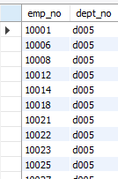
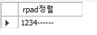
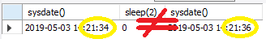
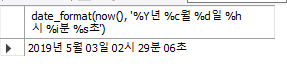
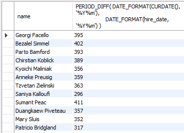
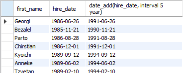

[TOC]

---

# 연습 DB 스키마 분석

> 

---

## **[ sql 연습 ]**

### concat()  문자열st

`select concat(first_name, ' ', last_name),gender, hire_date from employees;`

```mysql
MariaDB [employees]> select concat(first_name, ' ', last_name),gender, hire_date from employees limit 0, 5;
+------------------------------------+--------+------------+
| concat(first_name, ' ', last_name) | gender | hire_date  |
+------------------------------------+--------+------------+
| Georgi Facello                     | M      | 1986-06-26 |
| Bezalel Simmel                     | F      | 1985-11-21 |
| Parto Bamford                      | M      | 1986-08-28 |
| Chirstian Koblick                  | M      | 1986-12-01 |
| Kyoichi Maliniak                   | M      | 1989-09-12 |
+------------------------------------+--------+------------+
```

**alias**   -> as생략 가능

`select concat(first_name, ' ', last_name) as name, gender, hire_date from employees;`

```mysql
MariaDB [employees]> select concat(first_name, ' ', last_name) name, gender, hire_date from employees limit 0, 5;
+-------------------+--------+------------+
| name              | gender | hire_date  |
+-------------------+--------+------------+
| Georgi Facello    | M      | 1986-06-26 |
| Bezalel Simmel    | F      | 1985-11-21 |
| Parto Bamford     | M      | 1986-08-28 |
| Chirstian Koblick | M      | 1986-12-01 |
| Kyoichi Maliniak  | M      | 1989-09-12 |
+-------------------+--------+------------+
```

`select concat(first_name, ' ', last_name) as 이름, gender 성별, hire_date 입사일 from employees;`

> 


### 중복제거 distinct()

`select distinct(title) from titles;`   : 회사의 직급들이 나옴

```mysql
MariaDB [employees]> select distinct(title) from titles;
+--------------------+
| title              |
+--------------------+
| Senior Engineer    |
| Staff              |
| Engineer           |
| Senior Staff       |
| Assistant Engineer |
| Technique Leader   |
| Manager            |
+--------------------+
```


### order by

```mysql
select concat(first_name, ' ', last_name) as 이름,
 		gender 성별, 
 		hire_date 입사일 
 from employees
 order by hire_date desc;
 
 select emp_no, salary
 from salaries
 where emp_no=253406
 order by salary;
 
  select emp_no, salary, from_date
 from salaries
 where from_date like '2001%'
 order by salary desc;
```


### where and

```mysql
 select concat(first_name, ' ', last_name) as 이름,
 		gender 성별, 
 		hire_date 입사일 
 from employees
 where hire_date < '1991-01-01';
 
  select concat(first_name, ' ', last_name) as 이름,
 		gender 성별, 
 		hire_date 입사일 
 from employees
 where hire_date < '1991-01-01'
 and gender='f';
```


### in

```mysql
 select emp_no, dept_no 
 from dept_emp
 where dept_no in ('d005', 'd009');
```

> 


---

## **[ 함수 ]**

### upper

**--> 자바 upper보다 db가 훨씬 빠름!**

**--> 웬만하면 디비에서 다 처리하고 자바에서는 데이터 뿌려주기만 하면 좋음!!!**

```mysql
select upper('seoul'), ucase('seoul');
select upper(first_name) from employees;
```


### lower

```mysql
SELECT LOWER('SEoul'), LCASE('seOUL'); 
```


### subString()

substring(문장, index, length)

```mysql
select substring('Happy Day', 3, 2);

SELECT concat( first_name, ' ', last_name ) AS 이름,
	 substring( hire_date, 1, 4) AS 입사년도
FROM employees
WHERE substring( hire_date, 1, 4) = '1989';
```

> 


### lpad()- 오른 정렬 , rpad() -왼정렬

```mysql
select lpad('1234', 10, '-') 정렬;
select rpad('1234', 10, '-') 정렬;

SELECT emp_no, LPAD( cast(salary as char), 10, '*')      
  FROM salaries     
 WHERE from_date like '2001-%'       
   AND salary < 70000;
```

> 
>
> 
>
> 


### TRIM, LTRIM, RTRIM

```mysql
select concat('---', LTRIM('   hello   '), '---') LTRIM,
	   concat('---', RTRIM('   hello   '), '---') RTIRM,
       concat('---', TRIM('   hello   '), '---') TIRM,
       concat('---', TRIM(both 'x' from 'xxxxHELLOxxxx'), '---') TIRM2;
```

> 


### abs() 절대값 

> |-2| |2| = 2


### MOD(n, m)

> n을 m으로 나눈 나머지 값


### floor(x)

> x보다 크지 않은 가장 큰 정수를 반환! bingint로 자동 변환됨


### celling(x)

> x보다 작지 않은 가장 작은 정수 반환


### round(x), round(x,d)

> x에 가장 근접한 정수 반환

> x값 중에서 소수점 d자리에 가장 근접한 수로 반환
>
> 


### pow(x, y) power(x, y)

> x의 y제곱 승을 반환


### sign(x)

> x=음수면 -1을, x=0이면 0, x=양수면 1을 출력함


### greatest(x,y,....)   least(x, y, ....)

> 가장 큰 값 반환                   가장 작은 값 반환
>
> 문자일 경우도 마찬가지
>
> `LEAST("b","A","C") ` 일 경우 A 반환


## **[ 날짜 함수 ]**

### CURDATE()    CURRENT_DATE 

>  오늘 날짜를 YYYY-MM-DD나 YYYYMMDD 형식으로 반환한다. 


### CURTIME() CURRENT_TIME

> 현재 시각을 HH:MM:SS나 HHMMSS 형식으로 반환한다.


### select now(), sysdate(), current_timestamp()

> 

- **now와 sysdate 차이!?**

> 
>
> **now : 쿼리 실행 전에 실행**
>
> 
>
> **sysdate : 쿼리가 실행 하면서 실행**


### date_format(date, format)

> 입력된 date를 format 형식으로 반환

`select date_format(now(), '%Y년 %c월 %d일 %h시 %i분 %s초');`

select date_format(now(), '%Y-%c-%d  %h:%i:%s');

> 
>
> 


### PERIOD_DIFF(p1,p2)

> YYMM이나 YYYYMM으로 표기되는 p1과 p2의 차이 개월을 반환 한다.

```mysql
SELECT concat(first_name, ' ', last_name) AS name,               
       PERIOD_DIFF( DATE_FORMAT(CURDATE(), '%Y%m'),  
                    DATE_FORMAT(hire_date, '%Y%m') )
  FROM employees;
```

> 

### DATE_ADD, DATE_SUB, ADDDATE, SUBDATE(date,INTERVAL expr type) 

>  날짜 date에 type 형식으로 지정한 expr값을 더하거나 뺀다. DATE_ADD()와 ADDDATE()는 같은 동작이고,DATE_SUB()와 SUBDATE()는 같은 의미이다.   

```mysql
select first_name, 
	   hire_date,
       date_add(hire_date, interval 5 year) -- day, month, year
from employees;
```

> 


### cast(형변환)

> CAST 함수는 type을 변경(지정)하는데 유용하다. 
>
> CAST 함수의 사용법 :  CAST(expression AS type) 또는
>
> ​                    				  CONVERT(expression,type) 
>
> MySQL 타입: 
>
> ​		   BINARY 
>
> ​           CHAR 
>
> ​           DATE 
>
> ​           DATETIME 
>
> ​           SIGNED {INTEGER} 
>
> ​           TIME 
>
> ​           UNSIGNED {INTEGER}

```mysql
select now(), cast(now() as date);
+---------------------+
| cast(now() as date) |
+---------------------+
| 2003-09-25          |
+---------------------+

select cast(1-2 as unsigned);
+-----------------------+
| cast(1-2 as unsigned) |
+-----------------------+
|  18446744073709551615 |
+-----------------------+

mysql> select cast(cast(1-2 as unsigned) as signed);
+---------------------------------------+
| cast(cast(1-2 as unsigned) as signed) |
+---------------------------------------+
|                                    -1 |
+---------------------------------------+
```


## **[ 집계(통계) 함수 ]**

```mysql
select avg(salary), sum(salary)
from salaries
where emp_no = '10060';
```

> 이때는 select 절에 emp_no가 의미없음. 이미 10060넘버로 월급 평균, 합 테이블이 새로 만들어진 상태니까  --> **의미없음!!**

```mysql
	select avg(salary), sum(salary), emp_no
		from salaries
group by emp_no;
```

> 1번 뽑아서(샐러리) 합, 평균해서 넣고, 2번 넣고.. 3번 넣고 ..... 

### ★★**중요한얘기**  : having

```mysql
	select emp_no, avg(salary)
		from salaries
	 where from_date like '1985%'
group by emp_no
	having avg(salary) > 40000;
```

> 순서 :
>
> from 
>
> emp_no 1번데이터들 먼저 찾고, 
>
> where타고 날짜 검색 -> 임시테이블 만듦
>
> **평균 연봉이 200이상!?**
>
> --> 이미 where절을 지난 테이블에 대한 조건은 --> having


