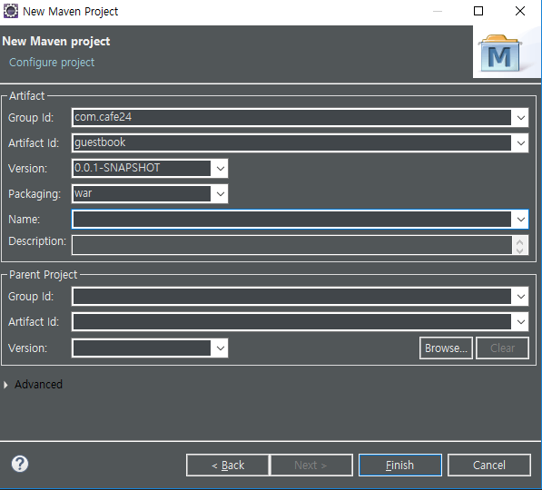
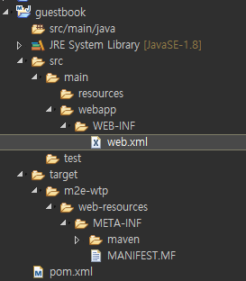
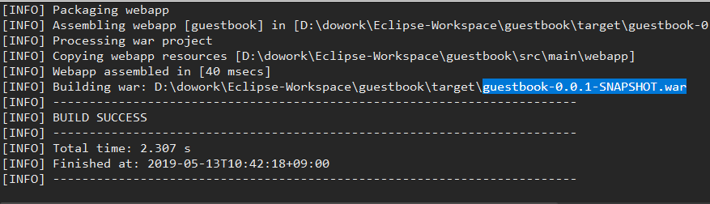
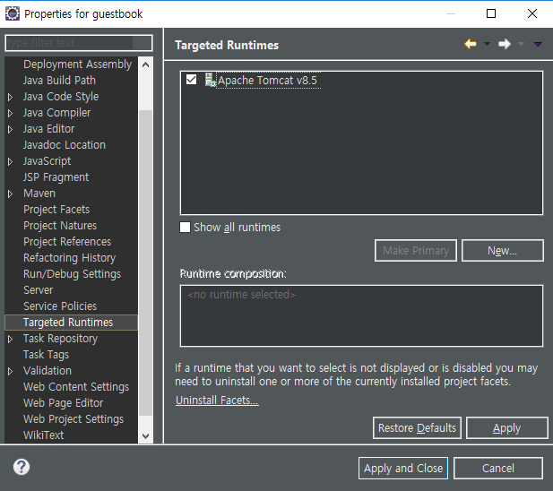

[TOC]


---

Model1(JSP) ==> Model 2, Servlet/JSP (MVC) => 많은 MVC Framework

--> spring --> spring MVC

---

new Maven Project





**pom.xml**

```xml
<project xmlns="http://maven.apache.org/POM/4.0.0"
	xmlns:xsi="http://www.w3.org/2001/XMLSchema-instance"
	xsi:schemaLocation="http://maven.apache.org/POM/4.0.0 http://maven.apache.org/xsd/maven-4.0.0.xsd">
	<modelVersion>4.0.0</modelVersion>
	<groupId>com.cafe24</groupId>
	<artifactId>guestbook</artifactId>
	<version>0.0.1-SNAPSHOT</version>
	<packaging>war</packaging>

	<properties>
		<project.build.sourceEncoding>UTF-8</project.build.sourceEncoding>
	</properties>

	<dependencies>
	</dependencies>

	<build>
		<sourceDirectory>src/main/java</sourceDirectory>

		<plugins>
			<plugin>
				<artifactId>maven-compiler-plugin</artifactId>
				<version>3.8.0</version>
				<configuration>
					<source>1.8</source>
					<target>1.8</target>
				</configuration>
			</plugin>
		</plugins>
	</build>
</project>
```

source dir 		 - src/main/java

(*.java, *.xml)	- src/main/resources

---

web content dir - /webapp   => 여기가 압축됨

(document root)		|- WEB-INF

​											|-web.xml

​											|- classes

​											|-lib

​									|- index.jsp

​									|- assets


WEB-INF 폴더 만들기

web.xml 만들기




**web.xml**  버전

```xml
<web-app xmlns:xsi="http://www.w3.org/2001/XMLSchema-instance" xmlns="http://java.sun.com/xml/ns/javaee" xsi:schemaLocation="http://java.sun.com/xml/ns/javaee http://java.sun.com/xml/ns/javaee/web-app_3_0.xsd" version="3.0">
```


**pom.xml** 추가

```xml
			<plugin>
				<groupId>org.apache.maven.plugins</groupId>
				<artifactId>maven-war-plugin</artifactId>
				<version>3.2.1</version>
				<configuration>
					<warSourceDirectory>src/main/webapp</warSourceDirectory>
				</configuration>
			</plugin>
```


**war 파일 만들기**





**pom.xml** - dependencies 추가

```xml
<!-- https://mvnrepository.com/artifact/org.mariadb.jdbc/mariadb-java-client -->
<dependency>
    <groupId>org.mariadb.jdbc</groupId>
    <artifactId>mariadb-java-client</artifactId>
    <version>2.4.0</version>
</dependency>
```


**index.jsp**




**pom.xml** - properties 추가

```xml
<project.reporting.outputEncoding>UTF-8</project.reporting.outputEncoding>
```


```xml
<project xmlns="http://maven.apache.org/POM/4.0.0"
	xmlns:xsi="http://www.w3.org/2001/XMLSchema-instance"
	xsi:schemaLocation="http://maven.apache.org/POM/4.0.0 http://maven.apache.org/xsd/maven-4.0.0.xsd">
	<modelVersion>4.0.0</modelVersion>
	<groupId>com.cafe24</groupId>
	<artifactId>guestbook</artifactId>
	<version>0.0.1-SNAPSHOT</version>
	<packaging>war</packaging>

	<properties>
		<project.build.sourceEncoding>UTF-8</project.build.sourceEncoding>
		<project.reporting.outputEncoding>UTF-8</project.reporting.outputEncoding>
	</properties>

	<dependencies>
		<!-- mariadb java client -->
		<dependency>
			<groupId>org.mariadb.jdbc</groupId>
			<artifactId>mariadb-java-client</artifactId>
			<version>2.4.0</version>
		</dependency>
	</dependencies>

	<build>
		<sourceDirectory>src/main/java</sourceDirectory>

		<plugins>
			<plugin>
				<artifactId>maven-compiler-plugin</artifactId>
				<version>3.8.0</version>
				<configuration>
					<source>1.8</source>
					<target>1.8</target>
				</configuration>
			</plugin>

			<plugin>
				<groupId>org.apache.maven.plugins</groupId>
				<artifactId>maven-war-plugin</artifactId>
				<version>3.2.1</version>
				<configuration>
					<warSourceDirectory>src/main/webapp</warSourceDirectory>
				</configuration>
			</plugin>
		</plugins>
	</build>
</project>
```


