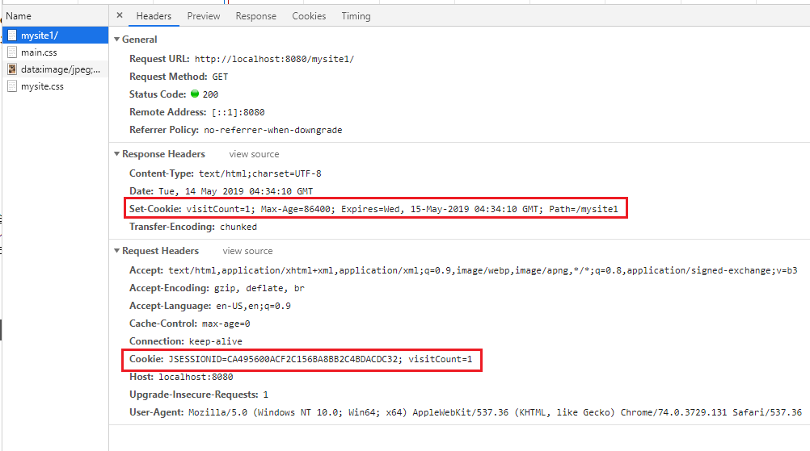
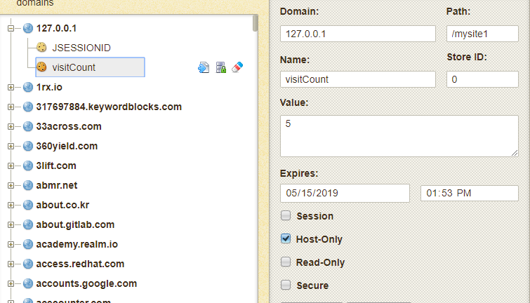
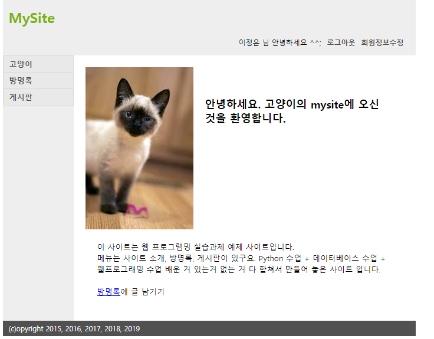

[TOC]

코드 : [Servlet-Basic](https://github.com/jungeunlee95/Servlet-Basic)

---

# Cookie & Session

## Cookie 

**MainAction.java**

몇번 방문했는지 visit count  쿠키 굽기

```java
@Override
public void execute(HttpServletRequest request, HttpServletResponse response) throws IOException, ServletException {
    // Cookie Test
    int count = 0;
    // 쿠키 읽기
    
    // 쿠키 쓰기
    count++;
    Cookie cookie = new Cookie("visitCount", String.valueOf(count));
    cookie.setMaxAge(24*60*60); //하루
    cookie.setPath(request.getContextPath());
    response.addCookie(cookie);


    WebUtil.forward(request, response, "/WEB-INF/views/main/index.jsp");
}
```

**쿠키 읽기**

```java
// 쿠키 읽기
Cookie[] cookies = request.getCookies();
if(cookies != null && cookies.length > 0) {
    for(Cookie c : cookies) {
        if("visitCount".equals(c.getName())) {
            count = Integer.parseInt(c.getValue());
        }
    }
}
```

> 

### 쿠키 확인

<https://chrome.google.com/webstore/detail/cookies/iphcomljdfghbkdcfndaijbokpgddeno/related?hl=ko>

> 

> 브라우저 껐다 다시 키면 바뀜
>
> 
>
> 

▼▼▼▼▼▼▼▼▼▼▼▼▼▼▼▼▼▼▼▼▼▼▼▼▼▼▼▼▼▼

> 
>
> 근데.. visitCount는 그대로...!?
>
> `cookie.setMaxAge(24*60*60); //하루`
>
> 


## Session

매핑 테이블에서

| JSESSIONID | Object |
| ---------- | ------ |
|            |        |

Object -> userVO

이렇게 값을 가지고 있음

`request.getSession();`했을때, 위의 테이블에 값이 있으면 return 없으면 만들어서 return

### login에서 session처리

**UserActionFactory.java**

```java
else if("login".equals(actionName)) {
    action = new LoginAction();
}
```

**UserDao**

```java
// 로그인
public UserVo get(String email, String password) {
    UserVo result = null;

    // 자원정리
    Connection conn = null;
    PreparedStatement pstmt = null;
    ResultSet rs = null;

    try {
        conn = getConnection();

        String sql = " select no, name "
            + " from user "
            + " where email = ? "
            + " and password = ? ";
        pstmt = conn.prepareStatement(sql);

        pstmt.setString(1, email);
        pstmt.setString(2, password);

        rs = pstmt.executeQuery();

        if (rs.next()) {
            Long no = rs.getLong(1);
            String name = rs.getString(2);

            result.setNo(no);
            result.setName(name);

        }

    } catch (SQLException e) {
        System.out.println("Error : " + e);
    } finally {
        try {
            if (rs != null) {
                rs.close();
            }
            if (pstmt != null) {
                pstmt.close();
            }
            if (conn != null) {
                conn.close();
            }
        } catch (SQLException e) {
            e.printStackTrace();
        }
    }

    return result;
}
```

**LoginAction.java**

```java
@Override
public void execute(HttpServletRequest request, HttpServletResponse response) throws IOException, ServletException {
    String email  = request.getParameter("email");
    String password = request.getParameter("password");

    UserVo authUser = new UserDao().get(email, password);

    // 로그인 실패
    if(authUser == null) {
        request.setAttribute("result", "fail");
        WebUtil.forward(request, response, "/WEB-INF/views/user/loginform.jsp");
        return;
    }

    // 로그인 성공
    HttpSession session = request.getSession(true); //없으면 만들어
    session.setAttribute("authUser", authUser);
    WebUtil.redirect(request, response, request.getContextPath());
}
```

**loginform.jsp**

```html
   <%
   String result = (String)request.getAttribute("result");
   if("fail".equals(result)){
   %>
    <p>로그인이 실패 했습니다.</p>
    <%
       }
    %>
```

**header.jsp**

```html
<%
	UserVo authUser = (UserVo)session.getAttribute("authUser");
%>
```


### logout

**UserActionFactory.java**

```java
else if("logout".equals(actionName)) {
    action = new LogoutAction();
} 
```

**LogoutAction.java**

```java
package com.cafe24.mysite.action.user;

public class LogoutAction implements Action {

    @Override
    public void execute(HttpServletRequest request, HttpServletResponse response) throws IOException, ServletException {
        HttpSession session = request.getSession();
        if(session != null && session.getAttribute("authUser") != null) {
            // 로그아웃 처리
            session.removeAttribute("authUser");
            session.invalidate();
        }
        WebUtil.redirect(request, response, request.getContextPath());
    }
}
```



---


## 회원정보수정

### Update

**UpdateFormAction.java**

```java
@Override
public void execute(HttpServletRequest request, HttpServletResponse response) throws IOException, ServletException {
    ///////////////////// 접근제어 -> 로그인 상태 아니면 안됨 ///////////////////
    HttpSession session = request.getSession();
    if(session == null) {
        WebUtil.redirect(request, response, request.getContextPath());
        return;
    }
    UserVo authUser = (UserVo)session.getAttribute("authUser");
    if(authUser == null) {
        WebUtil.redirect(request, response, request.getContextPath());
        return;
    }
    /////////////////////////////////////////////////////////////////

    Long userNo = authUser.getNo();
    UserVo userVo = new UserDao().get(userNo);
    request.setAttribute("userVo", userVo);

    WebUtil.forward(request, response, "/WEB-INF/views/user/updateform.jsp");
}
```