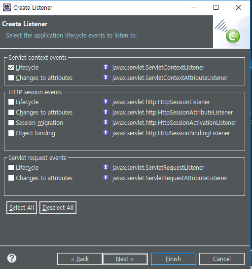

[TOC]


---

## web.xml과 클래스 어노테이션
web.xml에 mapping한 servlet/url 을 class에서 @어노테이션으로 매핑

톰캣이 CGLib를 사용해서 /mysite1의 클래스 파일을 전부다 스캐닝함 싹다!

`@WebServlet("")`되어있는 클래스를 모두 찾아서 HashMap 테이블에 넣으려고 함.

근데 web.xml에 이미 매핑되어있는데, 클래스에 어노테이션도 붙이면 에러뜨겠지??

---

```java
@WebServlet("/main")
public class MainServlet extends HttpServlet { }
```

```xml
<servlet>
    <servlet-name>MainServlet</servlet-name>
    <servlet-class>com.cafe24.mysite.controller.MainServlet</servlet-class>
</servlet>
<servlet-mapping>
    <servlet-name>MainServlet</servlet-name>
    <url-pattern>/main</url-pattern>
</servlet-mapping>
```

둘 중 하나만 하면 된다는 말!!

`@WebServlet(value={"", "/main", "/index"})` : 어노테이션 디폴트 값은 value

`@WebServlet({"", "/main", "/index"})`  여러개 멀티로설정도 가능

---


---

## filter


파라미터가 없으면 사용자가 설정

```java
	public void init(FilterConfig fConfig) throws ServletException {
		System.out.println("Encoding Filter Initialized...");
		encoding = fConfig.getInitParameter("encoding");
		if(encoding == null) {
			encoding = "utf-8";
		}
	}
```

filter에서도 어노테이션 설정 가능

```java
// 경로설정, 파라미터 설정
@WebFilter(value="/*", 
		initParams=@WebInitParam(name="encoding", value="utf-8") )
public class EncodingFilter implements Filter {
    
}
```

---


---

## Servlet init-param

**MainServlet.java**

init()추가

```java
@Override
public void init() throws ServletException {
    String configPath = getServletConfig().getInitParameter("config");
    System.out.println("init() called : " + configPath);
}
```

**web.xml** init-param 추가

```xml
<servlet>
    <servlet-name>MainServlet</servlet-name>
    <servlet-class>com.cafe24.mysite.controller.MainServlet</servlet-class>
    <init-param>
        <param-name>config</param-name>
        <param-value>/WEB-INF/servlet-context.xml</param-value>
    </init-param>
</servlet>
<servlet-mapping>
    <servlet-name>MainServlet</servlet-name>
    <url-pattern></url-pattern>
</servlet-mapping>
```

> 출력 : init() called : /WEB-INF/servlet-context.xml


---


---

## Listener



**web.xml**

```xml
  <listener>
  	<listener-class>com.cafe24.mysite.listener.ContextLoadListener</listener-class>
  </listener>
```

**ContextLoadListener.java**

```java
package com.cafe24.mysite.listener;
//@WebListener
public class ContextLoadListener implements ServletContextListener {

	public void contextInitialized(ServletContextEvent sce) {
		System.out.println("Container starts..... ");
	}
	public void contextDestroyed(ServletContextEvent sce) {
	}
}
```

> 

---


---

## web.xml에 전역변수

**web.xml**

```xml
  <context-param>
  	<param-name>contextConfigLocation</param-name>
  	<param-value>/WEB-INF/applicationContext.xml</param-value>
  </context-param>
```

> context = Application
>
> 어플리케이션에대한 정보, 컨테이너의 클래이스들이 어플리케이션이 어떻게 돌아야하는 정보를 갖고있는데,
>
> applicationContext.xml이 그 클래스들에대한 객체정보를 갖고있는것.
>
> 톰캣입장에서 웹 어플리케이션은 서블릿이라 보지만, 
>
> 스프링에서는 비즈니스객체들을 어플리케이션이라 봄 !!!! 

ApplicationContext를 컨테이너라고 봄

== 같은말 : Spring Container  : 비즈니스 객체들을 저장하고 있는 박스

```
context는 application이다.
톰캣은 context를 서블릿의 모음으로 보고
스프링은 비즈니스들의 객체라고 본다.
```

### 리스너에서 contextConfigLocation 읽기

```java
public void contextInitialized(ServletContextEvent servletContextEvent) {
    String contextConfigLocation =
        servletContextEvent.getServletContext().
        getInitParameter("contextConfigLocation");
    System.out.println("Container starts..... " + contextConfigLocation);
}
```

> 

