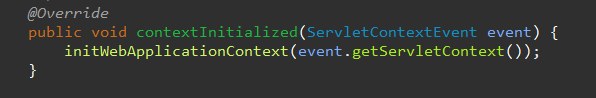
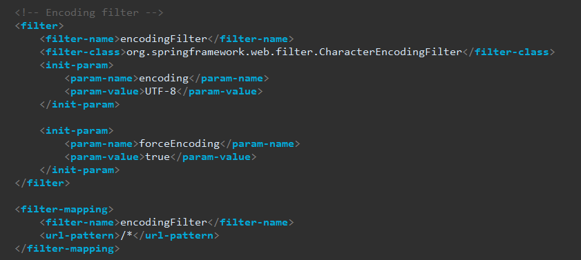
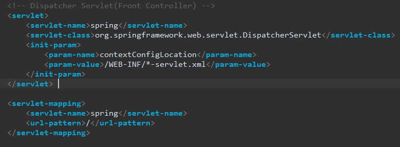
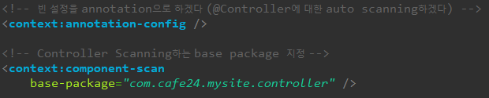
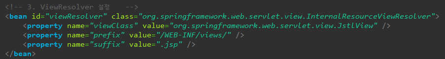

---

Tomcat에 프로젝트가 올라오면

### **Web.xml**을 읽어서 

#### Listener를 먼저 실행

 1. 리스너에서 

    contextInitialized 메소드를 를 통해 applicationContext.xml 를 읽어 **컨테이너를 만듦** ==> **BeanFactory**

	`this.context = createWebApplicationContext(servletContext);` 가 컨테이너 만드는거
	
2. applicationContext.xml
   
    를 스캔하면서 service와 dao객체들을 생성하고 객체들의 의존 관계를 만들어줌! (@Service, @Repository,@Autowired 등 어노테이션을 통해서)

#### filter 로딩

#### Dispatcher Servlet 객체만 생성

### 최초의 요청이 들어오면 

ex) /mysite

DispatcherServlet에서 

#### init(){} 메소드 실행

1. config path 접근

2. Application context 생성  : **spring-servlet.xml** ==> **Web Application Context 컨테이너** 생성!

   > 이때, 컨트롤러 객체를 생성하고  로딩하고, applicationContext.xml를 참조해서 주입관계를 넣어줌
   >
   > 
   >
   > 

3. Handler Mapping 생성 : `@RequestMapping` 어노테이션을 통해 요청url과 매핑정보 저장

   > 

4. view Resolver 생성 : 설정이 있으면 설정

   > 

### service()를 통해 요청 처리

#### doGet, doPost를 통해 

각각 로직의 작업을 거치고, return 값에 따라 

view Resolver에서 렌더하고 알맞은 작업 처리

---

---

순서

1. init(){

   -config path 접근

   -Application context 생성

   -Handler Mapping 생성

   -view Resolver 생성

   }

2. Sevice()

3. doPost, doGect(req, res) {} 

   얘가 contextpath는 이제 신경 안써도되고 /hello url과 매핑된 클래스를 핸들러매핑에서 찾아서 메소드 호출,

   컨트롤러가 Handler.hello()를 부르면  `return [Mac, String, etc Object]` 세가지를 리턴할수있음 

   > **String**
   >
   > - 메소드의 어노테이션을 보고 reponsebody(내가 리턴하는 애를 바디에 붙여)가 붙어있으면 String을 html로 인식하고 브라우저에 바로 보냄 
   > - 안붙어있는 경우 view이름으로 해석-> view로 fowarding
   >
   > view가 있는지 확인하고(viewResolver)  view를 받아와서 view.render()-> 포워딩
   >
   > - 리다이렉트는 스트링을 파싱할때 redirect: 를 확인하고 view.resolver거치지 않고 바로 보내버림
   >
   > **ModelAndView** : Model이랑 View 들어있는거
   >
   > **Object** -  xml이나 json으로 바꿈 

   -- 여기까지 dispahcerServlet -- 

   이제부터 컨트롤러 코드 타기 시작 

   ---

   