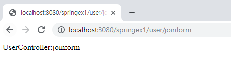
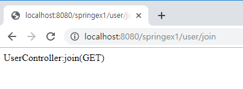
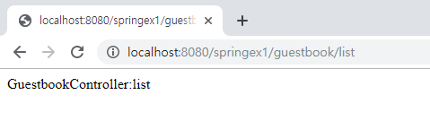
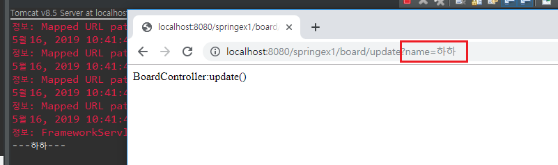
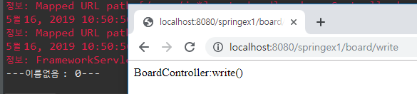
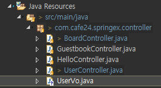
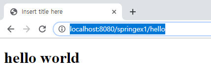

[TOC]


---

# 주요 어노테이션&Mapping

## UserController

### - @ResponseBody

**UserController.java**

```java
@ResponseBody
@RequestMapping("/user/joinform")
public String joinform() {
    return "UserController:joinform";
}
```

? 

---


### - RequestMethod.GET/POST

```java
@ResponseBody
@RequestMapping(value="/user/joinform", method=RequestMethod.GET)
public String joinform() {
    return "UserController:joinform";  
}
```

> GET방식으로만 접근 가능


> joinform과 join을 나눌필요없이 GET방식이면 조인폼, POST면 가입! 
>
> URL을 따로 할 필요 없다

```java
@ResponseBody
@RequestMapping(value="/user/join", method=RequestMethod.GET)
// @GetMapping("join") 완전 동일
public String join() {
    return "UserController:join(GET)";  
}

@ResponseBody
@RequestMapping(value="/user/join", method=RequestMethod.POST)
// @PostMapping(value= {"/join", "/j"}) 완전 동일
public String join(String name, String email, String password, String gender) {
	return "UserController:join(POST)"; 
}
```


### - Controller 에 @RequestMapping

```java
@Controller
@RequestMapping("/user")
public class UserController {

    @ResponseBody
    @RequestMapping(value="/join", method=RequestMethod.GET)
    public String join() {
        return "UserController:join(GET)";  
    }

    @ResponseBody
    @RequestMapping(value= {"/join", "/j"}, method=RequestMethod.POST)
    public String join(String name, String email, String password, String gender) {
        return "UserController:join(POST)"; 
    }
}
```

> 


---


## GuestbookController

### - type 단독 매핑 - 메소드이름을 url

**GuestbookController.java**

```java
@RequestMapping("/guestbook/*")
@Controller
public class GuestbookController {
	@ResponseBody
	@RequestMapping
	public String list() {
		return "GuestbookController:list";
	}

}
```

`@RequestMapping("/guestbook/*")` 이렇게 클래스 설정하면 메소드 이름으로 찾아감

> 

---


---

## BoardController

### - Method 단독 매핑

```java
/*
 * @RequestMapping
 * Method 단독 매핑
 */
@Controller
public class BoardController {

    @ResponseBody
    @RequestMapping("/board/write")
    public String write() {
        return "BoardController:write()";
    }

    @ResponseBody 
    @RequestMapping("/board/view")
    public String view() {
        return "BoardController:view()";
    }

}
```


### - RequestParam

```java
	@ResponseBody 
	@RequestMapping("/board/update")
	public String update(String name) {
		System.out.println("---" + name + "---");
		return "BoardController:update()";
	}
```

> 

`public String update(@RequestParam("n") String name) `

> 
>
> 근데 이렇게 하면 파라미터를 안보내면 **400 ERROR!!**
>
> -> default값 설정하면 좋겠다


`required=false` : 파라미터 없어도 에러 안남 대신 null값이 들어옴

```java
@ResponseBody
@RequestMapping("/board/write")
public String write(@RequestParam(value="n", required=false ) String name ) {
    return "BoardController:write()";
}
```

> 

`@RequestParam(value="n", required=true, defaultValue="이름없음") String name`

> 

```java
@ResponseBody
@RequestMapping("/board/write")
public String write(@RequestParam(value="n", required=true, defaultValue="이름없음") String name,
                    @RequestParam(value="age", required=true, defaultValue="0") int age) {
    System.out.println("---" + name + " : " + age + "---"); 
    return "BoardController:write()";
}
```

> `defaultValue="0"`이여도 `int age`니까  자동으로 int변환시켜줌
>
> 


### - @PathVariable

```java
@ResponseBody  
@RequestMapping("/board/view/{no}")
public String view(@PathVariable(value="no") Long no) {
    System.out.println("@@@ " + no + " @@@");
    return "BoardController:view()";
}
```

> 


---


---

## UserController

### - valid, redirect


> **join.jsp추가**
>
> 

```java
@RequestMapping(value="/join", method=RequestMethod.GET)
public String join() {
    return "/WEB-INF/views/user/join.jsp";  
}
```

> 

---

**join.jsp**

```jsp
<form id="join-form" name="joinForm" method="post"
      action="${pageContext.servletContext.contextPath}/user/join">
```


**UserController.java**

```java
@RequestMapping(value= {"/join", "/j"}, method=RequestMethod.POST)
public String join(String name, String email, String password, String gender) {
    System.out.println(name + ":" + email + ":" + password + ":" + gender);
    return "UserController:join(POST)"; 
}
```


#### - userVo

> 

```java
@RequestMapping(value= {"/join", "/j"}, method=RequestMethod.POST)
public String join(UserVo vo) {
    System.out.println(vo);
    return "UserController:join(POST)"; 
}
```

> 

> `@Valid` 같은거 설정할수있음 `Length`같은거 check
>
> 문자열 길이가 ~넘으면 안되고.. 이런 조건? 같은거 
>
> ```java
> @RequestMapping(value= {"/join", "/j"}, method=RequestMethod.POST)
> public String join(UserVo userVo) {
>     if(valid(userVo)==false) {
>         return "/WEB-INF/views/user/join.jsp"; 
>     }
>     return "redirect:/hello";
> }
> 
> private boolean valid(UserVo userVo) {
>     return true;
> }
> ```
>
> **성공하면 redirect**
>
> 

