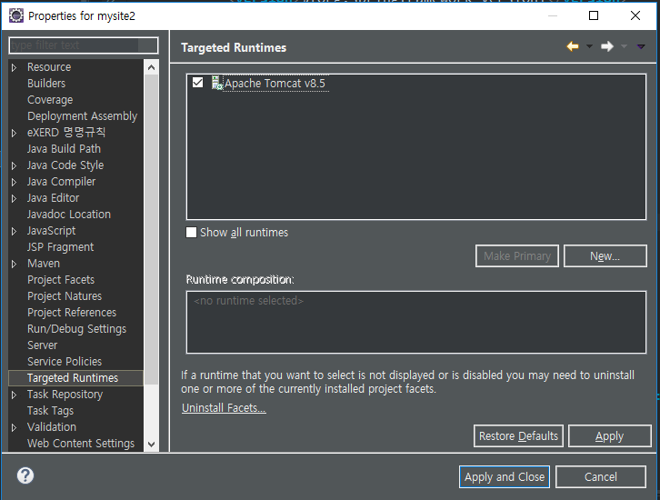
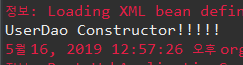
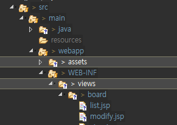
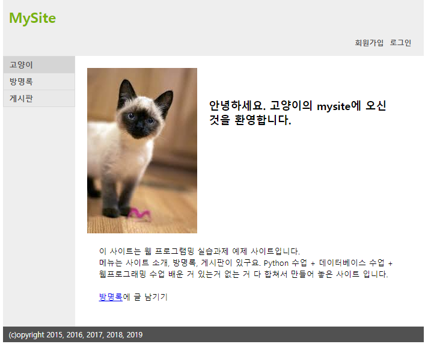

[TOC]


---

# Application Context

## new project mysite2 설정


pom.xml


web.xml

maven update project

test remove


target runtimes



---


---

## contextConfigLocation & ContextLoaderListener

**web.xml** 추가

```xml
<context-param>
    <param-name>contextConfigLocation</param-name>
    <param-value>/WEB-INF/applicationContext.xml</param-value>
</context-param>

<!--  Context Loader Lister -->
<listener>
    <listener-class>org.springframework.web.context.ContextLoaderListener</listener-class>
</listener>
```


**applicationContext.xml** 만들기

> 

com.cafe24.repository : dao 클래스

> 

```xml
<?xml version="1.0" encoding="UTF-8"?>
<beans xmlns="http://www.springframework.org/schema/beans"
	xmlns:xsi="http://www.w3.org/2001/XMLSchema-instance"
	xmlns:aop="http://www.springframework.org/schema/aop"
	xmlns:context="http://www.springframework.org/schema/context"
	xsi:schemaLocation="http://www.springframework.org/schema/beans http://www.springframework.org/schema/beans/spring-beans.xsd
        http://www.springframework.org/schema/aop http://www.springframework.org/schema/aop/spring-aop.xsd
        http://www.springframework.org/schema/context http://www.springframework.org/schema/context/spring-context.xsd
        http://www.springframework.org/schema/jee http://www.springframework.org/schema/jee/spring-jee.xsd
        http://www.springframework.org/schema/lang http://www.springframework.org/schema/lang/spring-lang.xsd
        http://www.springframework.org/schema/tx http://www.springframework.org/schema/tx/spring-tx.xsd
        http://www.springframework.org/schema/util http://www.springframework.org/schema/util/spring-util.xsd
        http://www.springframework.org/schema/task http://www.springframework.org/schema/task/spring-task.xsd">

	<context:annotation-config />
	<context:component-scan base-package="com.cafe24.mysite.repository">
		<context:include-filter type="annotation" expression="org.springframework.stereotype.Repository" />
		<context:include-filter type="annotation" expression="org.springframework.stereotype.Service" />
		<context:include-filter type="annotation" expression="org.springframework.stereotype.Component" />
	</context:component-scan>
</beans>

```

pom.xml 추가

```xml
<!-- mariadb java client -->
<dependency>
    <groupId>org.mariadb.jdbc</groupId>
    <artifactId>mariadb-java-client</artifactId>
    <version>2.4.0</version>
</dependency> 

<!-- jstl --> 
<dependency>  
    <groupId>jstl</groupId>
    <artifactId>jstl</artifactId>
    <version>1.2</version>
</dependency> 
```

### Dao 클래스 모두 열어서 `@Repository` 추가


**UserDao.java**

```java
	public UserDao() {
		System.out.println("UserDao Constructor!!!!!");
	} 
```

서버 실행시 생성하는 것을 확인

> 


---


---

## filter 추가

**web.xml**

```xml
<filter>
   <filter-name>encodingFilter</filter-name>
   <filter-class>org.springframework.web.filter.CharacterEncodingFilter</filter-class>
   <init-param>
      <param-name>encoding</param-name>
      <param-value>UTF-8</param-value>
   </init-param>

   <init-param>
      <param-name>forceEncoding</param-name>
      <param-value>true</param-value>
   </init-param>
</filter>  
   
<filter-mapping>
   <filter-name>encodingFilter</filter-name>
   <url-pattern>/*</url-pattern>
</filter-mapping>
```


## DispatcherServlet 추가

**web.xml**

```xml
<!-- Dispatcher Servlet(Front Controller) -->
	<servlet>
		<servlet-name>spring</servlet-name>
		<servlet-class>org.springframework.web.servlet.DispatcherServlet</servlet-class>
		<init-param>
			<param-name>contextConfigLocation</param-name>
			<param-value>/WEB-INF/*-servlet.xml</param-value>
		</init-param>
	</servlet>

	<servlet-mapping>
		<servlet-name>spring</servlet-name>
		<url-pattern>/</url-pattern>
	</servlet-mapping>
```


# controller만들기

com.cafe24.mysite.controller 패키지


## spring-servlet.xml -controller 추가


```xml
<?xml version="1.0" encoding="UTF-8"?>
<beans
       xmlns:xsi="http://www.w3.org/2001/XMLSchema-instance"
       xmlns:aop="http://www.springframework.org/schema/aop" 
       xmlns="http://www.springframework.org/schema/beans"
       xmlns:p="http://www.springframework.org/schema/p" 
       xmlns:context="http://www.springframework.org/schema/context"
       xmlns:mvc="http://www.springframework.org/schema/mvc"
       xsi:schemaLocation="http://www.springframework.org/schema/mvc http://www.springframework.org/schema/mvc/spring-mvc.xsd
                           http://www.springframework.org/schema/aop http://www.springframework.org/schema/aop/spring-aop.xsd
                           http://www.springframework.org/schema/beans http://www.springframework.org/schema/beans/spring-beans.xsd
                           http://www.springframework.org/schema/context http://www.springframework.org/schema/context/spring-context.xsd">

    <context:annotation-config />
    <context:component-scan base-package="com.cafe24.mysite.controller" />

</beans>
```


## mysite1 jsp 옮겨오기




**MainController.java**

```java
package com.cafe24.mysite.controller;

@Controller
public class MainController {

    @RequestMapping({"/", "/main"})
    public String main() {
        return "/WEB-INF/views/main/index.jsp";
    }
}
```


---


## Default servlet handler

- HandlerMapping이 URL과 컨트롤러의 메소드(핸들러) 와의 매핑 정보를 가지고 있다.
- HandlerMapping에서 정적자원에 대한 URL은 DefaultServlet으로 위임할 수 있도록 설정 해주어야 한다

**spring-servlet.xml**

```xml
<?xml version="1.0" encoding="UTF-8"?>
<beans xmlns:xsi="http://www.w3.org/2001/XMLSchema-instance"
	xmlns:aop="http://www.springframework.org/schema/aop"
	xmlns="http://www.springframework.org/schema/beans"
	xmlns:p="http://www.springframework.org/schema/p"
	xmlns:context="http://www.springframework.org/schema/context"
	xmlns:mvc="http://www.springframework.org/schema/mvc"
	xsi:schemaLocation="http://www.springframework.org/schema/mvc http://www.springframework.org/schema/mvc/spring-mvc.xsd
	http://www.springframework.org/schema/aop http://www.springframework.org/schema/aop/spring-aop.xsd
	http://www.springframework.org/schema/beans http://www.springframework.org/schema/beans/spring-beans.xsd
	http://www.springframework.org/schema/context http://www.springframework.org/schema/context/spring-context.xsd">

	<!-- validator, conversionService, messageConverter를 자동으로 등록 -->
	<mvc:annotation-driven />

	<!-- 서블릿 컨테이너의 디폴트 서블릿 위임 핸들러  -->
	<mvc:default-servlet-handler />

    <!-- 빈 설정을 annotation으로 하겠다 (@Controller에 대한 auto scanning하겠다)-->
	<context:annotation-config />
    
    <!-- Controller Scanning하는  base package 지정 -->
	<context:component-scan base-package="com.cafe24.mysite.controller" />

</beans>

```




