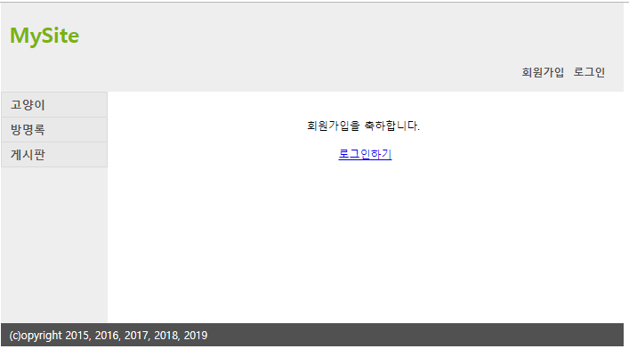
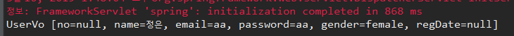
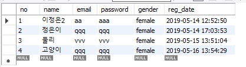
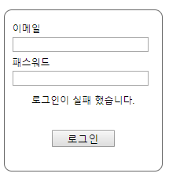

[TOC]


---

## 회원가입

jsp 경로/ 폴더이름 변경

> 

> 


**UserController.java**

```java
@Controller
@RequestMapping("/user")
public class UserController {

    @RequestMapping(value="/join", method=RequestMethod.GET)
    public String join() {
        return "user/join";
    }
}
```

> 

**join.jsp** - action url 변경

> ```jsp
> <form id="join-form" name="joinForm" method="post"
>       action="${pageContext.servletContext.contextPath}/user/join">
> ```

**UserController.java**

```java
@RequestMapping(value="/join", method=RequestMethod.POST)
public String join(@ModelAttribute UserVo userVo) {
    System.out.println(userVo);
    return "redirect:/user/joinsuccess";
}

@RequestMapping(value="/joinsuccess")
public String joinsuccess() {
    return "user/joinsuccess";
}
```

> 
>
> 

---

> UserController는 UserDao가 없으면 돌아가지 않아.
>
> **UserController.java**
>
> ```java
> 	@Autowired
> 	private UserDao userDao;
> 
> 	@RequestMapping(value="/join", method=RequestMethod.POST)
> 	public String join(@ModelAttribute UserVo userVo) {
> 		userDao.insert(userVo);
> 		return "redirect:/user/joinsuccess";
> 	}
> ```
>
> Web Application Context 컨테이너가 UserController를 생성하고,  `@Autowired` 를 통해 UserDao를 찾아보고 자기 컨테이너에 없으면 , 부모 컨테이너 Root Application Context에 물어보고, 루트 컨텍스트에 UserDao가 있으면, 데려와서 UserController에 주입시킴! 그럼 주입당했잖아? 앞으로 UserDao쓸때 new 안해도 된다구!

>  가입됨^^

---


## 로그인

**login.jsp**

```jsp
<form id="login-form" name="loginform" method="post"
      action="${pageContext.servletContext.contextPath}/user/login">
```

**UserController.java**

```java
@RequestMapping(value="/login", method=RequestMethod.GET)
public String login() {
    return "user/login";
}

@RequestMapping(value="/login", method=RequestMethod.POST)
public String login(@RequestParam(value="email", required=true, defaultValue="") String email, 
                    @RequestParam(value="password", required=true, defaultValue="") String password,
                    HttpSession session) {

    UserVo authUser = userDao.get(email,password);
    if(authUser == null) {
        // data 넘기기
		model.addAttribute("result","로그인에 실패했습니다");
        return "user/login";
    }

    // session 처리
    session.setAttribute("authUser", authUser);

    return "redirect:/";
}
```

**login.jsp**

```jsp
<c:if test="${result == 'fail' }">
    <p>로그인이 실패 했습니다.</p>
</c:if>
```

> 


## 로그아웃

**UserController.java**

```java
	@RequestMapping(value="/logout")
	public String logout(HttpSession session) {
		session.removeAttribute("authUser");
		session.invalidate();
		return "redirect:/";
	}
```