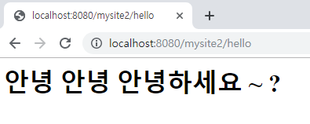
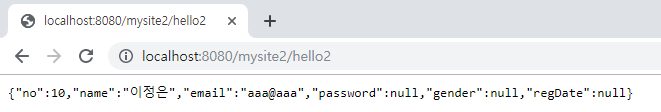
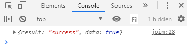
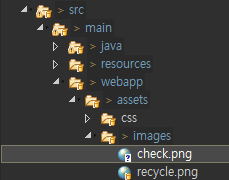
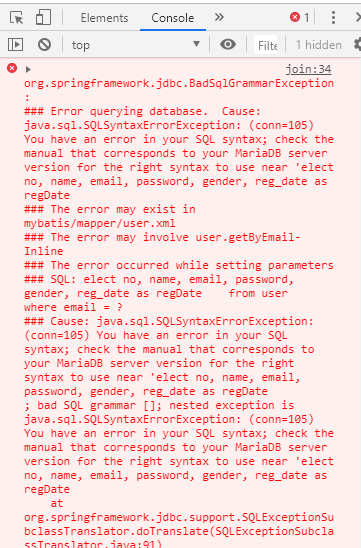
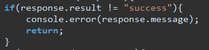
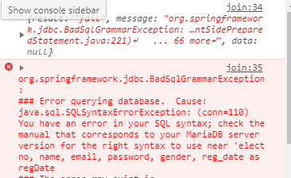

[TOC]


---

**MainController.java**

```java
@ResponseBody
@RequestMapping("/hello")
public String hello() {
    return "<h1>  안녕 안녕 안녕하세요 ~ ?  </h1>";
}
```

> 
>
> String을 컨버팅 해주는 encoding설정을 안했음

## message-converters 설정

> **spring-servlet.xml**
>
> ```xml
> <mvc:annotation-driven>
>     <mvc:message-converters>
>         <bean class="org.springframework.http.converter.StringHttpMessageConverter">
>             <property name="supportedMediaTypes">
>                 <list>
>                     <value>text/html; charset=UTF-8</value>
>                 </list>
>             </property>
>         </bean>
>     </mvc:message-converters>
> </mvc:annotation-driven>
> ```
>
> 

### jackson core library 추가

**pom.xml** -> 자바 객체를 순회해서 mapping해주는 역할

```xml
<!-- jackson -->
<dependency>
    <groupId>com.fasterxml.jackson.core</groupId>
    <artifactId>jackson-databind</artifactId>
    <version>2.9.8</version>
</dependency>
```

**spring-servlet.xml** - message converters에 추가

```xml
<bean class="org.springframework.http.converter.json.MappingJackson2HttpMessageConverter">
    <property name="supportedMediaTypes">
        <list>
            <value>application/json; charset=UTF-8</value>
        </list>
    </property>
</bean>
```

---


---

**MainController.java**

```java
@ResponseBody
@RequestMapping("/hello2")
public UserVo hello2() {
    UserVo vo = new UserVo();
    vo.setNo(10L);
    vo.setName("이정은");
    vo.setEmail("aaa@aaa");
    return vo;
}
```

> 

---


---

**user/join.jsp** 추가

```jsp
<script src="${pageContext.servletContext.contextPath}/assets/js/jquery/jquery-1.9.0.js"></script>
```

## ajax

```jsp
<script>
	$(function(){
		$('#check-button').click(function(){
			var email = $('#email').val();
			if(email == ''){
				return;
			} 
			 
			/* ajax 통신 */
			$.ajax({
				url : "${pageContext.servletContext.contextPath }/user/api/checkemail?email=" + email,
				type : "get",
				dataType : "json",
				data : "",
				success: function(response){
					console.log(response);
				},
				error : function(xhr, error){
					console.error("error : " + error);
				}
			});
		});
	});
</script>

<body>
	<label class="block-label" for="email">이메일</label> 
	<input id="email" name="email" type="text" value=""> 
	<input type="button" id="check-button" value="이메일 중복체크"> 
</body>
```


---

new java package => com.cafe24.mysite.controller.api

scanning등록

**spring-servlet.xml** 추가

```xml
<context:component-scan
		base-package="com.cafe24.mysite.controller, com.cafe24.mysite.exception.api, com.cafe24.mysite.exception" />
```

---

**UserController.java**

```java
package com.cafe24.mysite.controller.api;
@Controller("userAPIController")
@RequestMapping("/user/api")
public class UserController {
	
	@Autowired
	private UserService userService;
	
    @ResponseBody
	@RequestMapping("/checkemail")
	public Map<String, Object> checkEmail(
			@RequestParam(value="email", required=true, defaultValue="") String email) {
		
		Boolean exist = userService.existEmail(email);
		Map<String, Object> map = new HashMap<String, Object>();
		map.put("result", "success");
		map.put("data", exist); // data = true면 사용 못하는 이메일
		return null;
	}
}
```

**UserService.java**

```java
public boolean existEmail(String email) {
    UserVo userVo = userDao.get(email);
    return userVo != null; // true면 중복된 아이디!
}
```

**UserDao.java**

```java
public UserVo get(String email) {
    return sqlSession.selectOne("user.getByEmail", email);
}
```

**user.xml**

```xml
<select id="getByEmail" resultType="uservo" parameterType='string'>
    <![CDATA[
  select no, name, email, password, gender, reg_date as regDate
   from user 
  where email = #{email }
 ]]>
</select>
```

> 브라우저에서 미리 확인해보기
>
> 
>
> 


### 체크 표시 만들기

<https://www.iconfinder.com/>

> 

```jsp
 
```

```jsp
<script>
	$(function(){
		$('#email').change(function(){
			$('#check-button').show();
			$('#check-image').hide();
		});
		 
		$('#check-button').click(function(){
			var email = $('#email').val();
			if(email == ''){
				return;
			} 
			 
			/* ajax 통신 */
			$.ajax({
				url : "${pageContext.servletContext.contextPath }/user/api/checkemail?email=" + email,
				type : "get",
				dataType : "json",
				data : "",
				success: function(response){
					if(response.result != "success"){
						console.error(response.message);
						return;
					}
					if(response.data == true){
						alert('이미 존재하는 이메일 입니다.');
						$("#email").focus();
						$("#email").val("");
						return;
					} 
					$('#check-button').hide();
					$('#check-image').show();
				},
				error : function(xhr, error){
					console.error("error : " + error);
				}
			});
		});
	});
</script>
```


### dto - API 통신 포맷 만들기

new package com.cafe24.mysite.dto 

**JSONResult.java**

```java
private String result; // success, fail
private String message; // if fail, set
private Object data; // if success, set data

public static JSONResult success(Object data) {
    return new JSONResult("success", null, data);
}

public static JSONResult fail(String message) {
    return new JSONResult("fail", message, null);
}

private JSONResult(String result, String message, Object data) {
    this.result = result;
    this.message = message;
    this.data = data;
}
```

**UserController.java**

```java
@ResponseBody
@RequestMapping("/checkemail")
public JSONResult checkEmail(
    @RequestParam(value="email", required=true, defaultValue="") String email) {
    Boolean exist = userService.existEmail(email);
    return JSONResult.success(exist);
}
```

**GlobalExceptionHandler.java**

json error 브라우저에서 응답 처리

```java
package com.cafe24.mysite.exception;
@ControllerAdvice
public class GlobalExceptionHandler {
	
	@ExceptionHandler( Exception.class )
	public void handlerException( HttpServletRequest request, 
									HttpServletResponse response,
									Exception e) throws Exception {
		// 1. 로깅
		e.printStackTrace();
		StringWriter errors = new StringWriter(); // 버퍼 
		e.printStackTrace(new PrintWriter(errors));
		// LOGGER.error(errors.toString());
		System.out.println(errors.toString());
		
		// json 응답 처리
		String accept = request.getHeader("accept");
		// accept=text/html; image/jpeg; application/json 헤더의 내용을 뽑아서 확인
		if(accept.matches(".*application/json.*")) {
			// json 응답해주기
			response.setStatus(HttpServletResponse.SC_OK);
			
			JSONResult jsonResult = JSONResult().fail(errors.toString());
			String result = new ObjectMapper().writeValueAsString(jsonResult);
			
			OutputStream os = response.getOutputStream();
			os.write(result.getBytes("UTF-8")); 
            os.flush();
			os.close();
			
		} else {
			// 2. 안내 페이지 가기 + 정상종료(response)
			request.setAttribute("uri", request.getRequestURI());
			request.setAttribute("exception", errors.toString());
			
			request.getRequestDispatcher("/WEB-INF/views/error/exception.jsp").forward(request, response);
		}
	}

	private JSONResult JSONResult() {
		// TODO Auto-generated method stub
		return null;
	}
}
```

> 
>
> - response의 message를 출력하고 있음
>
>    


```jsp
console.log(response);
console.error(response.message);
```




