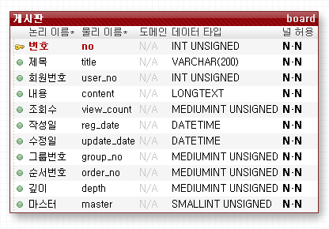
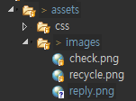

[TOC]

---

cookie로 조회수 하루 설정 

리스트에서 게시물 검색 기능 

페이징 처리 


답글 -> 계층형 게시판



select Max(group_no) + 1

​				-> ifnull -> 1

총 리스트 -> select `order by` 가 중요함

> g_no, o_no 순으로 desc

답글달기할때 write에 하면됨 그냥 -> 최신글이 맨 위로오게, 현재 o_no보다 크거나 같은애들은 모두 o_no +1하고 내가 현재 o_no 가지면 됨

| no   | title  | g_no | o_no | depth |
| ---- | ------ | ---- | ---- | ----- |
| 1    | 저녁?  | 1    | 1    | 0     |
| 2    | 짜장면 | 1    | 3    | 1     |
| 3    | 라면   | 1    | 2    | 1     |
| 4    | 웬짜장 | 1    | 5    | 2     |
| 5    | ㅇㅋ   | 1    | 4    | 2     |
| 6    | 아침?  | 2    | 1    | 0     |
| 7    | 돈까스 | 2    | 2    | 1     |

아침?

​	- 돈까스

저녁?

​	-라면

​	-짜장면

​		-ㅇㅋ

​		-웬짜장

---

## reply 

${10*depth}

**board/list.jsp**



```jsp
<script src="${pageContext.servletContext.contextPath}/assets/js/jquery/jquery-1.9.0.js"></script>

<td style="text-align: left; padding-left: ${10*depth};">
    
    <a href="${pageContext.servletContext.contextPath}/board/view/${vo.no}">${vo.title }</a>
</td>

<!-- pager 추가 -->
<div class="pager">
    <ul>
        <li><a href="">◀</a></li>
        <li><a href="">1</a></li>
        <li class="selected">2</li>
        <li><a href="">3</a></li>
        <li>4</li>
        <li>5</li>
        <li><a href="">▶</a></li>
    </ul>
</div>		 			
<!-- pager 추가 -->
```

**board.css도 수정함**


첫게시글은 now -> 1