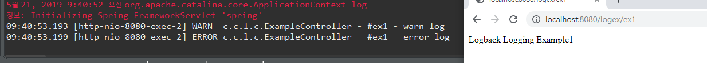
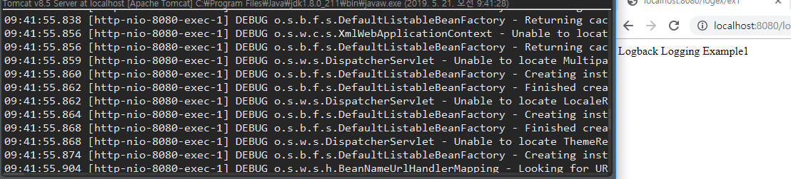
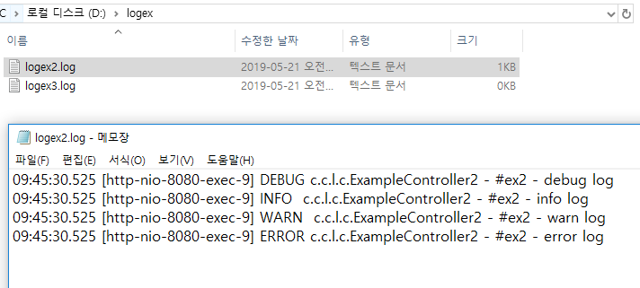
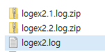

[TOC]


---

# Logging

프로젝트 가져오기 : https://github.com/jungeunlee95/logex.git

Logback 라이브러리 사용

---

**pom.xml**   jcl 라이브러리

```xml
<properties>
    <org.springframework-version>4.2.1.RELEASE</org.springframework-version>
    <jcloverslf4j.version>1.7.6</jcloverslf4j.version>		
    <logback.version>1.1.1</logback.version>
</properties>
```

```xml
<dependencies>
    <!-- JCL 제외 -->
    <exclusions>
        <exclusion>
            <groupId>commons-logging</groupId>
            <artifactId>commons-logging</artifactId>
        </exclusion>
    </exclusions>
</dependencies>
```

> spring의 commons-logging과 jcl이충돌나니까 제외시켜야함

```xml
<!-- Logback --> 
<dependency>                                    
    <groupId>org.slf4j</groupId>                
    <artifactId>jcl-over-slf4j</artifactId>     
    <version>${jcloverslf4j.version}</version>  
</dependency>
<dependency>
    <groupId>ch.qos.logback</groupId>
    <artifactId>logback-classic</artifactId>
    <version>${logback.version}</version>
</dependency>
```

> jcl을 logback으로 사용

---

**resource/ logback.xml**

```xml
<appender name="consoleAppender" class="ch.qos.logback.core.ConsoleAppender">
    <encoder>
        <charset>UTF-8</charset>
        <Pattern>
            %d{HH:mm:ss.SSS} [%thread] %-5level %logger{5} - %msg%n
        </Pattern>
    </encoder>
</appender>
```

> appender 설정
>
> <Pattern> : 로그 포맷


```xml
<appender name="fileAppender2" class="ch.qos.logback.core.rolling.RollingFileAppender">
    <file>/logex/logex2.log</file>
    <encoder class="ch.qos.logback.classic.encoder.PatternLayoutEncoder">
        <Pattern>
            %d{HH:mm:ss.SSS} [%thread] %-5level %logger{5} - %msg%n
        </Pattern>
    </encoder>
    <rollingPolicy class="ch.qos.logback.core.rolling.FixedWindowRollingPolicy">
        <FileNamePattern>/logex/logex2.%i.log.zip</FileNamePattern>
        <MinIndex>1</MinIndex>
        <MaxIndex>10</MaxIndex>
    </rollingPolicy>
    <triggeringPolicy
                      class="ch.qos.logback.core.rolling.SizeBasedTriggeringPolicy">
        <MaxFileSize>50KB</MaxFileSize>
    </triggeringPolicy>
</appender>
```

> 50KB가 넘으면 zip으로 묶음 1~10까지 10개


```xml
<!--
  com.cafe24.logex2 아래 패키지 로그들만  \logex\logex2.log 파일에만  출력하는 로거
 -->
<logger name="com.cafe24.logex2"  level="debug" additivity="false">
    <appender-ref ref="fileAppender2" />
</logger>
```

> com.cafe24.logex2 아래 클래스들이 로그를 남기면 fileAppender2를 통해 /logex/logex2.log에 저장!
>
> `level="debug"` 레벨이 높아서 엄청 길게 다나옴

```xml
<!-- 루트(글로벌) 로거 -->
<root level="warn">
    <appender-ref ref="consoleAppender" />
</root>
```

> 특정 패키지를 제외한 로거들은 global logger로 빠짐

---


---

## global logger

**ExampleController.java** : global logger

```java
//Logger 생성
private static final Log LOG = LogFactory.getLog( ExampleController.class );

@RequestMapping( "/ex1" )
@ResponseBody
public String ex1() {

    /**
		 *  이 예제에서는 logback.xml 에서,
		 *  
		 *  1. consoleAppender 와 root logger 만 세팅해서 테스트 해 볼 수 있습니다. 
		 *  2. root logger의 level="DEBUG" 조정해 봅니다.
		 *  
		 *  3. 테스트 해보면,
		 *     DEBUG  > INFO > WARN > ERROR 순으로 로그가 출력 되는 것을 확인할
		 *     수 있습니다.
		 *     
		 *     가령, WARN 설정하면, warn, error 메서드의 로그 메세지만 출력 됩니다.
		 *     직접 테스트 해 보세요.
		 *  
		 */
    LOG.debug( "#ex1 - debug log" );
    LOG.info( "#ex1 - info log" );
    LOG.warn( "#ex1 - warn log" );
    LOG.error( "#ex1 - error log" );

    return "Logback Logging Example1";
}
```

### `<root level="warn">`

> 

### `<root level="debug">`

> 

---


## logex2

> 
>
> 

---


---

# mysite2 logback 설정

**GlobalExceptionHandler.java**

```java
private static final Log LOGGER = LogFactory.getLog(GlobalExceptionHandler.class);
```

**pom.xml**

```xml
<jcloverslf4j.version>1.7.6</jcloverslf4j.version>		
<logback.version>1.1.1</logback.version>
```

```xml
			<!-- JCL 제외 -->
			<exclusions>
			   <exclusion>
				  <groupId>commons-logging</groupId>
				  <artifactId>commons-logging</artifactId>
			   </exclusion>
			</exclusions>	
```

```xml
			<!-- Logback --> 
		<dependency>                                    
			<groupId>org.slf4j</groupId>                
			<artifactId>jcl-over-slf4j</artifactId>     
			<version>${jcloverslf4j.version}</version>  
		</dependency>
		<dependency>
			<groupId>ch.qos.logback</groupId>
			<artifactId>logback-classic</artifactId>
			<version>${logback.version}</version>
		</dependency>
```

**src/main/resources/logback.xml**

```xml
<?xml version="1.0" encoding="UTF-8"?>
<configuration>

 	<appender name="consoleAppender" class="ch.qos.logback.core.ConsoleAppender">
		<encoder>
			<charset>UTF-8</charset>
			<Pattern>
				%d{HH:mm:ss.SSS} [%thread] %-5level %logger{5} - %msg%n
			</Pattern>
		</encoder>
	</appender>

 	<appender name="fileAppender" class="ch.qos.logback.core.rolling.RollingFileAppender">
		<file>/mysite-log/exception.log</file>
		<encoder class="ch.qos.logback.classic.encoder.PatternLayoutEncoder">
			<Pattern>
				%d{HH:mm:ss.SSS} [%thread] %-5level %logger{5} - %msg%n
			</Pattern>
		</encoder>
		<rollingPolicy class="ch.qos.logback.core.rolling.FixedWindowRollingPolicy">
			<FileNamePattern>/mysite-log/exception.%i.log.zip</FileNamePattern>
			<MinIndex>1</MinIndex>
			<MaxIndex>10</MaxIndex>
		</rollingPolicy>
		<triggeringPolicy
			class="ch.qos.logback.core.rolling.SizeBasedTriggeringPolicy">
			<MaxFileSize>50KB</MaxFileSize>
		</triggeringPolicy>
	</appender>

 	<logger name="com.cafe24.mysite.exception"  level="info" additivity="false">
            <appender-ref ref="consoleAppender" />
            <appender-ref ref="fileAppender" />
    </logger>

 	<root level="debug">
		<appender-ref ref="consoleAppender" />
	</root>

 </configuration> 
```


