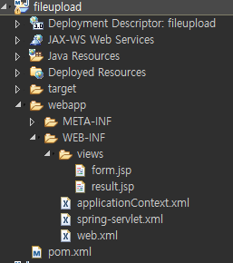
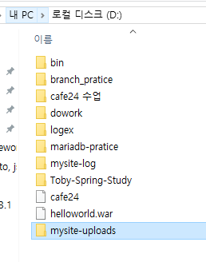
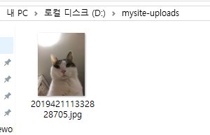
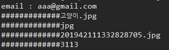
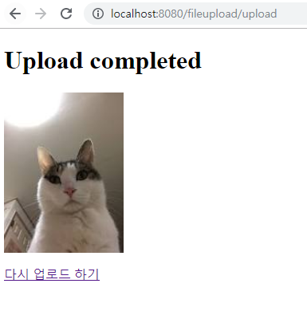

[TOC]


---

# Fileupload

자료에서 프로젝트 받아서 import하기

> 

**pom.xml**

```xml
<!-- common fileupload -->
<dependency>
    <groupId>commons-fileupload</groupId>
    <artifactId>commons-fileupload</artifactId>
    <version>1.2.1</version>
</dependency>
<dependency>
    <groupId>commons-io</groupId>
    <artifactId>commons-io</artifactId>
    <version>1.4</version>
</dependency>
```

**spring-servlet.xml** 설정

```xml
<!--  뷰 리졸버 (bean 설정)-->
<bean id="viewResolver"
      class="org.springframework.web.servlet.view.InternalResourceViewResolver">
    <property name="viewClass"
              value="org.springframework.web.servlet.view.JstlView" />
    <property name="prefix" value="/WEB-INF/views/" />
    <property name="suffix" value=".jsp" />
    <property name="order" value="1" />
</bean>

<!-- 멀티파트 리졸버 -->
<bean id="multipartResolver" 
      class="org.springframework.web.multipart.commons.CommonsMultipartResolver">
    <!-- 최대업로드 가능한 바이트크기 -->
    <property name="maxUploadSize" value="52428800" />
    <!-- 디스크에 임시 파일을 생성하기 전에 메모리에 보관할수있는 최대 바이트 크기 -->
    <!-- property name="maxInMemorySize" value="52428800" /-->
    <!-- defaultEncoding -->
    <property name="defaultEncoding" value="utf-8" />
</bean>	
```

---


---

## new package

### controller

com.cafe24.fileupload.controller

spring-servlet.xml에 추가

```xml
<context:component-scan base-package="com.cafe24.fileupload.controller" />
```


### service

com.cafe24.fileupload.service

applicationContext.xml에 추가

```xml
<context:component-scan base-package="com.cafe24.fileupload.service">
```

---

**FileuploadController.java**

```java
package com.cafe24.fileupload.controller;

@Controller
public class FileuploadController {
	
	@Autowired
	private FileuploadService fileuploadService;
	
	@RequestMapping("/form")
	public String form() {
		return "form";
	}
	
	@PostMapping(("/upload")) 
	public String upload(@RequestParam(value="email", required=true, defaultValue="") String email, 
						 @RequestParam(value="file1") MultipartFile multipartFile,
						 Model model) {
		System.out.println("email : " + email);
		String url = fileuploadService.restore(multipartFile);
		model.addAttribute("url", url);
		return "result";
	}
} 
```


**FileuploadService.java**

```java
package com.cafe24.fileupload.service;
@Service
public class FileuploadService {
	private static final String SAVE_PATH = "/mysite-uploads"; // d드라이브
	private static final String URL = "/images";
			
	public String restore(MultipartFile multipartFile) {
		String url = "";
		try {
			if(multipartFile.isEmpty()) {
				return url;
			}
			
			String originalFilename = multipartFile.getOriginalFilename();
			
			String extName = originalFilename.substring(originalFilename.lastIndexOf('.')+1);
			String saveFileName = generateSaveFileName(extName);
			
			long fileSize = multipartFile.getSize();
			
			System.out.println("#############" + originalFilename);
			System.out.println("#############" + extName);
			System.out.println("#############" + saveFileName);
			System.out.println("#############" + fileSize);
		
			byte[] fileData = multipartFile.getBytes();
			OutputStream os = new FileOutputStream(SAVE_PATH + "/" + saveFileName);
			os.write(fileData);
			os.close();
			
			url = URL + "/" + saveFileName;
			
		} catch (IOException e) {
			throw new RuntimeException("Fileupload error" + e);
		}
		
		return url;
	}

	private String generateSaveFileName(String extName) {
		String filename = "";
		
		Calendar calendar = Calendar.getInstance();
		//String += 연산은 for문 돌리면안돼!!!! String Buffer로 하던가!
		filename += calendar.get(Calendar.YEAR);
		filename += calendar.get(Calendar.MONTH);
		filename += calendar.get(Calendar.DATE);
		filename += calendar.get(Calendar.HOUR);
		filename += calendar.get(Calendar.MINUTE);
		filename += calendar.get(Calendar.SECOND);
		filename += calendar.get(Calendar.SECOND);
		filename += calendar.get(Calendar.MILLISECOND);
		filename += ("." + extName);
		
		return filename;
	}
}
```

> 폴더 만들기
>
> 
>
> 
>
> 


### url 과 resource 매핑 

**spring-servlet.xml**

```xml
<!-- the mvc resources tag does the magic -->
<mvc:resources mapping="/images/**" location="file:/mysite-uploads/" />
```

> 


