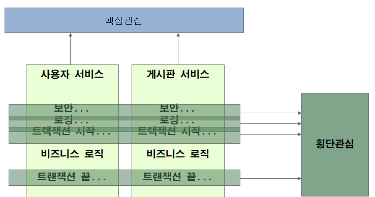
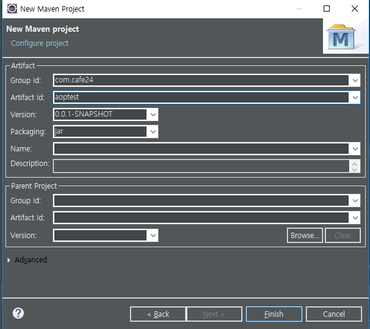
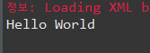
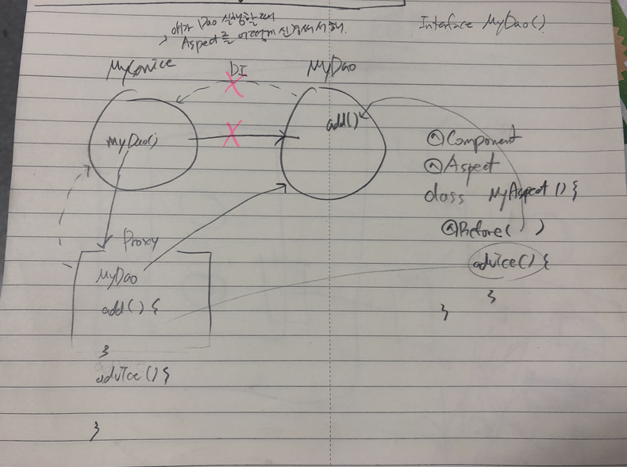

[TOC]

---

# AOP

> Aspect Oriented Programming 관점 지향 프로그래밍
>
> - 관심의 분리
>
>   
>
>   1. 핵심관심 : 시스템의 핵심 가치와 목적이 그대로 드러난 관심영역
>
>   2. 횡단관심: 핵심관심 전반에 걸쳐 반복적으로 나오게 되는 로깅, 트랜잭션, 보안, 인증, 리소스 풀링, 에러체크 등의 관심영역
>
>   3. 관심의 분리: 여러 핵심관심에 걸쳐 등장하는 횡단관심을 분리하여 독립적인 모듈로 만들고 핵심관심이 실행되는 동안 횡단관심을 호출하는 코드를 직접 명시하지 않고 선언적으로 처리
>
>   4. 핵심관심 모듈의 중간중간에서 필요한 횡단관심 모듈을 직접 호출하지 않고 위빙(Weaving)이라 불리는작업을 이용하여 횡단관심 코드가 삽입되도록 만든다. 
>
>   5. 핵심관심모듈에서는 횡단관심모듈이 무엇인지 조차 인식할 필요가 없음

---

## **AOP의 구성요소**

### - JoinPoint(when)

After

Before

After Returning 

After throwing

Around

### - PointCut(where)

\- 어느 조인포인트에 횡단관심모듈을 삽입할지를 결정하는 기능

\- 횡단관심이 삽입될 특정 클래스의 특정 메소드를 선택하는 방법  정의 

### - Advice(or Interceptor, what)

 \- 횡단관심모듈(로깅, 보안, 트랜잭션 등)

### - Weaving(위빙)

\- 어드바이스(횡단관심)를 삽입하는 과정

\- 위빙작업이 일어나는 시간

> 컴파일 시  - 특별한 컴파일러 필요
>
> 클래스 로딩시 - 특별한 클래스로더 필요
>
> 런타임시 - 프록시를 이용한 방법(스프링)

### - Aspect(Advisor)

1. 어디에서 무엇을  언제  할 것인가?

2. PointCut + Advice를 정의 
3. `@Aspect`는 자동 스캐닝 안돼서 `@Component` 같이 달아줘야함

---


---

# 실습

1.new project



2.pom.xml 설정

```xml
<properties>
    <project.build.sourceEncoding>UTF-8</project.build.sourceEncoding>
    <project.reporting.outputEncoding>UTF-8</project.reporting.outputEncoding>
    <org.springframework-version>4.3.1.RELEASE</org.springframework-version>
    <jcloverslf4j.version>1.7.6</jcloverslf4j.version>
    <logback.version>1.1.1</logback.version>
</properties>

<dependencies>
    <!-- Spring Core -->
    <dependency>
        <groupId>org.springframework</groupId>
        <artifactId>spring-context</artifactId>
        <version>${org.springframework-version}</version>
    </dependency>

    <!-- spring aspect -->
    <dependency>
        <groupId>org.springframework</groupId>
        <artifactId>spring-aspects</artifactId>
        <version>${org.springframework-version}</version>
    </dependency>
</dependencies>

<build>
    <sourceDirectory>src/main/java</sourceDirectory>
    <plugins>
        <plugin>
            <artifactId>maven-compiler-plugin</artifactId>
            <version>3.8.0</version>
            <configuration>
                <source>1.8</source>
                <target>1.8</target>
            </configuration>
        </plugin>
        <plugin>
            <groupId>org.apache.maven.plugins</groupId>
            <artifactId>maven-war-plugin</artifactId>
            <version>3.2.1</version>
            <configuration>
                <warSourceDirectory>src/main/webapp</warSourceDirectory>
            </configuration>
        </plugin>
    </plugins>
</build>

</project>
```

3.package : com.cafe24.aoptest


```xml
<?xml version="1.0" encoding="UTF-8"?>
<beans xmlns="http://www.springframework.org/schema/beans"
       xmlns:xsi="http://www.w3.org/2001/XMLSchema-instance"
       xmlns:aop="http://www.springframework.org/schema/aop"
       xmlns:context="http://www.springframework.org/schema/context"
       xsi:schemaLocation="http://www.springframework.org/schema/beans http://www.springframework.org/schema/beans/spring-beans.xsd
                           http://www.springframework.org/schema/aop http://www.springframework.org/schema/aop/spring-aop.xsd
                           http://www.springframework.org/schema/context http://www.springframework.org/schema/context/spring-context.xsd
                           http://www.springframework.org/schema/jee http://www.springframework.org/schema/jee/spring-jee.xsd
                           http://www.springframework.org/schema/lang http://www.springframework.org/schema/lang/spring-lang.xsd
                           http://www.springframework.org/schema/tx http://www.springframework.org/schema/tx/spring-tx.xsd
                           http://www.springframework.org/schema/util http://www.springframework.org/schema/util/spring-util.xsd
                           http://www.springframework.org/schema/task http://www.springframework.org/schema/task/spring-task.xsd">
    <context:annotation-config />
    <context:component-scan base-package="com.cafe24.aoptest"> 
        <context:include-filter type="annotation" expression="org.springframework.stereotype.Repository" />
        <context:include-filter type="annotation" expression="org.springframework.stereotype.Service" />
        <context:include-filter type="annotation" expression="org.springframework.stereotype.Component" />
    </context:component-scan>
</beans>
```

**App.java**

> 자기 컨테이너 안에 서비스 만들고 끝날듯

```java
public class App {
	public static void main(String[] args) {
		ApplicationContext ac = new ClassPathXmlApplicationContext("config/applicationContext.xml");
            			// 이 xml읽어서 자기(컨테이너)안에 객체 만들어라

		ProductService ps = ac.getBean( ProductService.class ); 
        						//야 너 안에 이 클래스 타입 객체 내놔!
		ps.hello();
	}
}
```

**ProductService.java**

```java
@Service
public class ProductService {
	public void hello() {
		System.out.println("Hello World");
	}
}
```

> 

---


## **Dependency 추가**

**pom.xml**

```xml
<!-- spring aspect -->
<dependency>
    <groupId>org.springframework</groupId>
    <artifactId>spring-aspects</artifactId>
    <version>${org.springframework-version}</version>
</dependency>
```

**applicationContext.xml**

```xml
	<!-- auto proxy -->
	<aop:aspectj-autoproxy />
```

#### proxy



**ProductVo.java**

```java
public class ProductVo {
	private String name;
	public ProductVo(String name) {
		this.name = name;
	}
	public String getName() {
		return name;
	}
	public void setName(String name) {
		this.name = name;
	}
	@Override
	public String toString() {
		return "ProductVo [name=" + name + "]";
	}
}
```

**App.java**

```java
public static void main(String[] args) {

    ApplicationContext ac =
        new ClassPathXmlApplicationContext("config/applicationContext.xml");

    ProductService ps = ac.getBean( ProductService.class );
    ProductVo vo = ps.find("TV");
    System.out.println("[main] " + vo);
}
```

**ProductService.java**

```java
@Service
public class ProductService {
    public ProductVo find(String name) {
        System.out.println("[ProductService] finding ... ");
        return new ProductVo(name);
    }
}
```


### - `@Before` test

```java
@Aspect
@Component
public class MyAspect {
	@Before("execution(ProductVo com.cafe24.aoptest.ProductService.find(String))")
	public void beforeAdvice() {
		System.out.println("--- before advice ---");
	}
}
```

>  `@Before("execution(ProductVo com.cafe24.aoptest.ProductService.find(String)")`
>
> returnType + 클래스/메소드 + 파라미터
>
> ```
> --- @Before advice ---
> [ProductService] finding ... 
> [main] ProductVo [name=TV]
> ```


### - `@After` test

```java
@After("execution(* *..*.ProductService.*(..))") 
public void afterAdvice() {
    System.out.println("--- @After advice ---");
} 
```

> ```
> --- @Before advice ---
> [ProductService] finding ... 
> --- @After advice ---
> [main] ProductVo [name=TV]
> ```


### - `@AfterReturning` test

```java
@AfterReturning("execution(* *..*.ProductService.*(..))") 
public void afterReturningAdvice() {
    System.out.println("--- @AfterReturning advice ---");
} 
```

> ```
> --- @Before advice ---
> [ProductService] finding ... 
> --- @After advice ---
> --- @AfterReturning advice ---
> [main] ProductVo [name=TV]
> ```


### - `@AfterThrowing` test

```java
@AfterThrowing(value="execution(* *..*.ProductService.*(..))", throwing="ex") 
public void afterThrowingAdvice() {
    System.out.println("--- @AfterThrowing advice ---");
} 
```

> ```
> --- @Before advice ---
> [ProductService] finding ... 
> --- @After advice ---
> --- @AfterReturning advice ---
> [main] ProductVo [name=TV]
> ```


### - `@Around` test

```java
@Around(value="execution(* *..*.ProductService.*(..))")
public Object roundAdvice(ProceedingJoinPoint pjp) throws Throwable {
    // before advice
    System.out.println("--- around(before) advice ---");

    // Point Cut 되는 메소드 호출
    Object result = pjp.proceed();

    // after advice
    System.out.println("--- around(after) advice ---");

    return result;
}
```

> ```
> --- @Around(before) advice ---
> --- @Before advice ---
> [ProductService] finding ... 
> --- @Around(after) advice ---
> --- @After advice ---
> --- @AfterReturning advice ---
> [main] ProductVo [name=TV]
> ```

###  `@Around` test2

```java
@Around(value="execution(* *..*.ProductService.*(..))")
public Object roundAdvice(ProceedingJoinPoint pjp) throws Throwable {
    // before advice
    System.out.println("--- @Around(before) advice ---");

    // Point Cut 되는 메소드 호출
    Object[] parameters = {"Camera"};
    Object result = pjp.proceed(parameters);

    // after advice
    System.out.println("--- @Around(after) advice ---");

    return result;
}
```

> ```
> --- @Around(before) advice ---
> --- @Before advice ---
> [ProductService] finding ... 
> --- @Around(after) advice ---
> --- @After advice ---
> --- @AfterReturning advice ---
> [main] ProductVo [name=Camera]
> ```

>  `return null`이면 `[main] null` 출력


