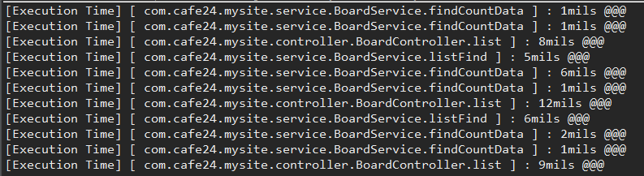

[TOC]

---

# mysite2 DAO 시간 재기

## StopWatch

**UserDao.java**

```java
public UserVo get(String email) {
    return sqlSession.selectOne("user.getByEmail", email);
}
```

> 바로 리턴하면 못재

```java
public UserVo get(String email) {
    StopWatch sw = new StopWatch();
    sw.start();

    UserVo vo = sqlSession.selectOne("user.getByEmail", email);

    sw.stop();
    Long totalTime = sw.getTotalTimeMillis();
    System.out.println(totalTime);

    return vo;
}
```


> 이렇게 코드도 고쳐야하고 길어지잖아 AOP는 이렇게 안해도 된다!!!!


## Aspect

dao 코드 수정없이 시간재볼까~?

POM.XML

```xml
<!-- spring aspect -->
<dependency>
    	<groupId>org.springframework</groupId>
    	<artifactId>spring-aspects</artifactId>
    	<version>${org.springframework-version}</version>
</dependency>

```

new package - com.cafe24.mysite.aspect

**applicationContext.xml**

```xml
<!-- auto proxy -->
<aop:aspectj-autoproxy />

<context:component-scan base-package="com.cafe24.mysite.repository, com.cafe24.mysite.service, com.cafe24.mysite.aspect">
```

**spring-servlet.xml**

```xml
<!-- auto proxy -->
<aop:aspectj-autoproxy />
```


**MeasureExecutionTimeAspect.java** 만들

```java
@Aspect
@Component
public class MeasureExecutionTimeAspect {
    @Around("execution(* *..repository.*.*(..))")
    public Object aroundAdvice(ProceedingJoinPoint pjp) throws Throwable {
        // brefore
        StopWatch sw = new StopWatch();
        sw.start();

        // method 실행
        Object result = pjp.proceed();

        //after
        sw.stop();
        Long totalTime = sw.getTotalTimeMillis();
        // 어떤 클래스가 실행?
        String className = pjp.getTarget().getClass().getName();
        String methodName = pjp.getSignature().getName();
        String task = className + "." + methodName;
        System.out.println("[Execution Time] [ " + task + " ] : " + totalTime + "mils @@@");
        return result;
    }
}
```

여러 패키지 적용

`@Around("execution(* *..repository.*.*(..)) || execution(* *..service.*.*(..)) || execution(* *..controller.*.*(..))")`

> 


