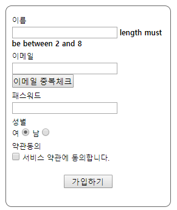
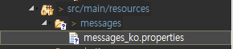
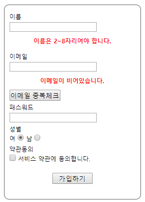
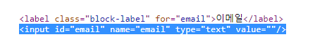
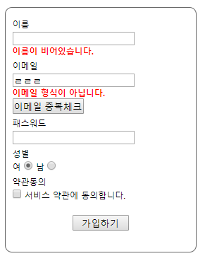
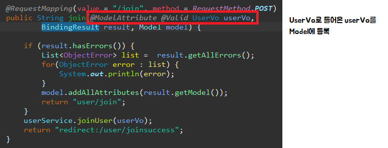
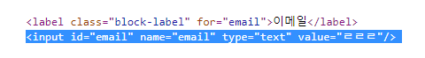
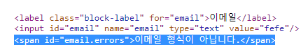

[TOC]

---

# Form Validation

- 스프링에서는 서블릿 2.3 표준스펙  중 JSR-303 Validator 를 확장하고  Annotation 기반으로 제공하고 있다.

- mvc:annotation-driven 을 통해 간단하게 Bean Validation을 사용할 수 있다.

- 검증을 위한 Bean에는 @Valid 를 사용하여 자동 검증을 하게 된다.

- 실제 검증은 모델 오브젝트에 달린 제약조건  Annotation을 이용해 검증 작업이 이루어 진다.

 

## Dependency추가
**pom.xml**

```xml
<!-- validation -->
<dependency>
    <groupId>javax.validation</groupId>
    <artifactId>validation-api</artifactId>
    <version>1.0.0.GA</version>
</dependency>

<dependency>
    <groupId>org.hibernate</groupId>
    <artifactId>hibernate-validator</artifactId>
    <version>4.2.0.Final</version>
</dependency>

```

**UserVo.java**

```java
private Long no;

@NotEmpty
@Length(min=2, max=8)
private String name;

@Email
@NotEmpty
private String email;

private String password;
private String gender;
private String regDate;
```

**UserController.java**

`@Valid` 추가

```java
@RequestMapping(value = "/join", method = RequestMethod.POST)
public String join(@ModelAttribute @Valid UserVo userVo, BindingResult result) {
		if(result.hasErrors()){
			List<ObjectError> list =  result.getAllErrors();
			for(ObjectError error : list) {
				System.out.println(error);
			}
			return "user/join";
		}
		userService.joinUser(userVo);
		return "redirect:/user/joinsuccess";
	}
```

> ```
> Field error in object 'userVo' on field 'email': rejected value []; codes [NotEmpty.userVo.email,NotEmpty.email,NotEmpty.java.lang.String,NotEmpty]; arguments [org.springframework.context.support.DefaultMessageSourceResolvable: codes [userVo.email,email]; arguments []; default message [email]]; default message [may not be empty]
> Field error in object 'userVo' on field 'name': rejected value []; codes [NotEmpty.userVo.name,NotEmpty.name,NotEmpty.java.lang.String,NotEmpty]; arguments [org.springframework.context.support.DefaultMessageSourceResolvable: codes [userVo.name,name]; arguments []; default message [name]]; default message [may not be empty]
> ```

```java
	@RequestMapping(value = "/join", method = RequestMethod.POST)
	public String join(@ModelAttribute @Valid UserVo userVo, BindingResult result, Model model) {
		if (result.hasErrors()) {
			model.addAllAttributes(result.getModel());
			return "user/join";
		}
		userService.joinUser(userVo);
		return "redirect:/user/joinsuccess";
	}
```

**join.jsp**

**태그 라이브러리 추가**

```jsp
<%@ taglib uri="http://www.springframework.org/tags" prefix="spring" %>

<spring:hasBindErrors name="userVo">
    <c:if test="${errors.hasFieldErrors('name') }">
        <br><strong>${errors.getFieldError( 'name' ).defaultMessage }</strong>
    </c:if>
</spring:hasBindErrors> 
```

> 


---

## 커스텀 메세지

**spring-servlet.xml**

```xml
 <!-- 6. MessageSource -->
<bean id="messageSource" class="org.springframework.context.support.ResourceBundleMessageSource">
   <property name="basenames">
      <list>
	<value>messages/messages_ko</value>
      </list>
   </property>
</bean>

```



#### messages_ko.properties 만들기!

```properties
NotEmpty.userVo.name=\uC774\uB984\uC774 \uBE44\uC5B4\uC788\uC2B52\uB2C8\uB2E4.
Length.userVo.name=\uC774\uB984\uC740 2~8\uC790\uB9AC\uC5EC\uC57C \uD569\uB2C8\uB2E4. 
NotEmpty.userVo.email=\uC774\uBA54\uC77C\uC774 \uBE44\uC5B4\uC788\uC2B5\uB2C8\uB2E4.
Email.userVo.email=\uC774\uBA54\uC77C \uD615\uC2DD\uC774 \uC544\uB2D9\uB2C8\uB2E4.
```

**join.jsp**

```jsp
<label class="block-label" for="name">이름</label> 
<input id="name" name="name" type="text" value="">
<spring:hasBindErrors name="userVo">
    <c:if test="${errors.hasFieldErrors('name') }">
        <br>
        <p style="font-weight: bold; color: red;">
            <spring:message  code="${errors.getFieldError( 'name' ).codes[0] }" text="${errors.getFieldError( 'name' ).defaultMessage }" />
        </p>
    </c:if>
</spring:hasBindErrors>

<label class="block-label" for="email">이메일</label> 
<input id="email" name="email" type="text" value=""> 
<spring:hasBindErrors name="userVo">
    <c:if test="${errors.hasFieldErrors('email') }">
        <br>
        <p style="font-weight: bold; color: red;">
            <spring:message code="${errors.getFieldError( 'email' ).codes[0] }" text="${errors.getFieldError( 'email' ).defaultMessage }" />
        </p>
    </c:if>
</spring:hasBindErrors>
```

> 

---

## form 태그 라이브러리 활용 `<form:form>`

**join.jsp**

```jsp
<%@ taglib uri="http://www.springframework.org/tags/form" prefix="form" %>
```

자바 변수 이름으로 넘어옴 modelAttribute="userVo"

```jsp
<form:form 
           modelAttribute="userVo"
           id="join-form" 
           name="joinForm" 
           method="post"
           action="${pageContext.servletContext.contextPath}/user/join">
    <form:input path="email" /> 
```

**UserController.java**

```java
@RequestMapping(value = "/join", method = RequestMethod.GET)
public String join(@ModelAttribute UserVo userVo) {
    return "user/join";
}
```

> 

> 형식이 안맞아도 데이터가 그대로 살아있음
>
> 
>
> modelAttribute로 값을 받아서 
>
> 
>
> 
>
> `value`에 들어옴

```jsp
<form:errors path="email"/>
```

> 


#### 코드 비교

**1 기존**

```jsp
<label class="block-label" for="email">이메일</label> 
<input id="email" name="email" type="text" value=""> 
<spring:hasBindErrors name="userVo">
    <c:if test="${errors.hasFieldErrors('email') }">
        <br>
        <p style="font-weight: bold; color: red;">
            <spring:message code="${errors.getFieldError( 'email' ).codes[0] }" text="${errors.getFieldError( 'email' ).defaultMessage }" />
        </p>
    </c:if>
</spring:hasBindErrors>
```

**2 form 태그 라이브러리**

```jsp
<label class="block-label" for="email">이메일</label> 
<form:input path="email" /> 
<p style="font-weight: bold; color: red; text-align: left; padding: 0;">
    <form:errors path="email"/>
</p>
```

> 


