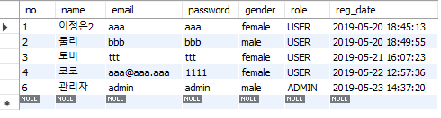

---


---

**AdminController.java**

```java
package com.cafe24.mysite.controller;
@Controller
@RequestMapping("/admin")
public class AdminController {
	
	@RequestMapping({"","/main"})
	public String main() {
		return "admin/main";
	}

	@RequestMapping("/user")
	public String user() {
		return "admin/user";
	}
	
	@RequestMapping("/board")
	public String board() {
		return "admin/board";
	}
	
	@RequestMapping("/guestbook")
	public String guestbook() {
		return "admin/guestbook";
	}
}

```


테이블 추가


테이블 수정

```mysql
 alter table user 
 add column role enum('ADMIN', 'USER') default 'USER' NOT null
 after gender;
```



---


site메인을 위한 image 설정

**spring-servlet.xml**

```xml
<!-- the mvc resources tag does the magic --> 
<mvc:resources mapping="/images/**" location="file:/mysite-uploads" />
```


```jsp

```

하면 됨!


