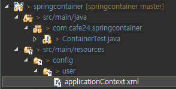
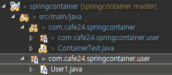
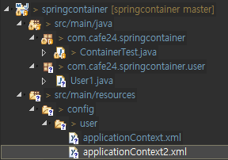

[TOC]


---

#  IoC Container

Spring Container의 종류

1. **BeanFactory**
2. **ApplicationContext**


## **[1] BeanFacotry**

### springcontainer project

pom.xml 수정

**applicationContext.xml**



```xml
<?xml version="1.0" encoding="UTF-8"?>
<beans xmlns="http://www.springframework.org/schema/beans"
       xmlns:xsi="http://www.w3.org/2001/XMLSchema-instance"
       xmlns:aop="http://www.springframework.org/schema/aop"
       xmlns:tx="http://www.springframework.org/schema/tx"
       xmlns:context="http://www.springframework.org/schema/context"
       xsi:schemaLocation="http://www.springframework.org/schema/beans http://www.springframework.org/schema/beans/spring-beans.xsd
                           http://www.springframework.org/schema/tx http://www.springframework.org/schema/tx/spring-tx.xsd
                           http://www.springframework.org/schema/aop http://www.springframework.org/schema/aop/spring-aop.xsd
                           http://www.springframework.org/schema/context http://www.springframework.org/schema/context/spring-context.xsd">

    <context:annotation-config />
    <context:component-scan
                            base-package="com.cafe24.springcontainer.user">
        <context:include-filter type="annotation" expression="org.springframework.stereotype.Component" />
    </context:component-scan>

</beans>

```

**User1.java**



```java
@Component
public class User1 {
	
	public String getName() {
		return "사용자1";
	}
}
```


### Auto-Configuration(Scanning) 설정

**ContainerTest.java**

```java
public class ContainerTest {

	public static void main(String[] args) {
		testBeanFactory();
	}

	public static void testBeanFactory() {
		BeanFactory bf1 = 
				new XmlBeanFactory( new ClassPathResource( "config/user/applicationContext.xml" ) );
		
		// Auto-Configuration(Scanning) 설정인 경우
		// Bean의 id가 자동으로 만들어짐
		User1 user = (User1) bf1.getBean("user1"); // -> id로 검색 
		System.out.println(user.getName());
	}
}
```

> ```
> 사용자1
> ```


###  XML Bean 설정

**applicationContext2.xml**



```xml
<bean class="com.cafe24.springcontainer.user.User1" />
```

**ContainerTest.java**

```java
public class ContainerTest {
	public static void main(String[] args) {
		testBeanFactory();
	}

	public static void testBeanFactory() {
		// XML Bean 설정인 경우 id자동 부여가 되지 않음
		BeanFactory bf2 = 
				new XmlBeanFactory( new ClassPathResource( "config/user/applicationContext2.xml" ) );
		User1 user = (User1)bf2.getBean(User1.class);
		System.out.println(user.getName());
		
	}
}
```

---


---

## [2] **ApplicationContext**

**ContainerTest.java**

```java
public class ContainerTest {
    public static void main(String[] args) {
        testApplicationContext();
    }

    public static void testApplicationContext() {
        ApplicationContext appContext = new ClassPathXmlApplicationContext("config/user/applicationContext.xml");

        User1 user = (User1) appContext.getBean("user1"); 
        System.out.println(user.getName());

        user = appContext.getBean(User1.class);
        System.out.println(user.getName());
        
   		// 자원정리
		((ConfigurableApplicationContext)appContext).close();
    }
}
```

> ```
> > 사용자1
> > 사용자1
> ```

```java
public static void testApplicationContext() {
    ApplicationContext appContext = new ClassPathXmlApplicationContext("config/user/applicationContext2.xml");
    // 오류 : 빈설정 id나 name을 설정해야한다.
    //		User1 user = (User1) appContext.getBean("user1"); 
    //		System.out.println(user.getName());

    User1 user = appContext.getBean(User1.class);
    System.out.println(user.getName());

    // 자원정리
    ((ConfigurableApplicationContext)appContext).close();
}
```


### - id, name 설정으로 가져오기

User 객체 만들기

```java
package com.cafe24.springcontainer.user;
public class User {
    private String name = "이정은";

    public User() {
		super();
		// TODO Auto-generated constructor stub
	}
    
    public User(String name) {
		this.name = name;
	}
    
    public String getName() {
		return name;
	}

	public void setName(String name) {
		this.name = name;
	}
    @Override
    public String toString() {
        return "User [name=" + name + "]";
    }
}
```

> 빈 설정시 기본 생성자를 꼭! 설정해줘야함 컨테이너가 사용함

**applicationContext2.xml**

```xml
<bean id="usr" name="user" class="com.cafe24.springcontainer.user.User" />
```

> 같은 타입의 빈이 2개이상 존재하면 타입으로 빈을 가져올수 없음!

**ContainerTest.java**

```java
	public static void main(String[] args) {
//		testBeanFactory();
		testApplicationContext();
	}
	
	public static void testApplicationContext() {
		ApplicationContext appContext = new ClassPathXmlApplicationContext("config/user/applicationContext2.xml");
		//name으로 가져오기
		User user = (User) appContext.getBean("user");
		System.out.println(user);
		
		//id로 가져오기
		user = (User) appContext.getBean("usr");
		System.out.println(user);
		
		
		// 자원정리
		((ConfigurableApplicationContext)appContext).close();
	}
```


### - 파라미터 생성자 지정

**applicationContext2.xml**

```xml
<bean id="usr2" class="com.cafe24.springcontainer.user.User">
    <constructor-arg value="둘리" />
</bean>
```

```java
		User user2 = (User) appContext.getBean("usr2");
		System.out.println(user2);
```

> User [no=null, name=둘리]


**User.java**

no추가

```java
	private Long no;
	private String name = "이정은";
```

**applicationContext2.xml**

```xml
<bean id="usr3" class="com.cafe24.springcontainer.user.User">
    <constructor-arg value="1" />
    <constructor-arg value="마이콜" />
</bean>
```

​										 **위나 아래랑 같음**

```xml
<bean id="usr3" class="com.cafe24.springcontainer.user.User">
    <constructor-arg index="1" value="마이콜"/>
    <constructor-arg index="0" value="1"/>		
</bean>
```

```java
		User user3 = (User) appContext.getBean("usr3");
		System.out.println(user3);
```

> User [no=1, name=마이콜]

---


---

### - 객체 ref 사용

**applicationContext2.xml**

```xml
<bean id="usr4" class="com.cafe24.springcontainer.user.User">
    <property name="no" value="2" />	
    <property name="name" value="도우너" />	
</bean>
```

```java
		User user4 = (User) appContext.getBean("usr4");
		System.out.println(user4);
```

> User [no=2, name=도우너]


**Frined.java 객체 만들기**

```java
private String name;
public Friend() {
    super();
    // TODO Auto-generated constructor stub
}

public Friend(String name) {
    this.name = name;
}
```


**User.java에서 Friend객체 사용을 위해 변수 지정**

```java
public class User {
	private Long no;
	private String name = "이정은";
	private Friend friend;
}
```

**xml ref 설정**

```xml
<bean id="friend" class="com.cafe24.springcontainer.user.Friend">
    <property name="name" value="또치친구" />
</bean>

<bean id="usr5" class="com.cafe24.springcontainer.user.User">
    <property name="no" value="2" />	
    <property name="name" value="도우너" />
    <property name="Frined" ref="friend" />	
</bean>
```

```java
		User user5 = (User) appContext.getBean("usr5");
		System.out.println(user5);
```

> User [no=2, name=도우너, frined=Friend [name=또치친구]]


**User객체 생성하면서 Frined객체 생성해서 넣을때**

```xml
<bean id="usr3" class="com.cafe24.springcontainer.user.User">
    <constructor-arg index="1" value="마이콜"/>
    <constructor-arg index="0" value="1"/>	
    <property name="friend" >
        <bean class="com.cafe24.springcontainer.user.Friend">
            <property name="name" value="마이콜 친구" />
        </bean>
    </property>	
</bean>
```

```java
		User user3 = (User) appContext.getBean("usr3");
		System.out.println(user3);
```

> User [no=1, name=마이콜, friend=Friend [name=마이콜친구], friends=null]


### - 객체 리스트

**User객체에 친구리스트를 받을 때**

```java
	private Long no;
	private String name = "이정은";
	private Friend friend;
	private List<String> friends;
```

```xml
<bean id="usr2" class="com.cafe24.springcontainer.user.User">
    <constructor-arg value="둘리" />
    <property name="friends">
        <list>
            <value>둘리친구1</value>
            <value>둘리친구2</value>
            <value>둘리친구3</value>
        </list>
    </property>
</bean>
```

```java
		User user2 = (User) appContext.getBean("usr2");
		System.out.println(user2);
```

> User [no=null, name=둘리, frined=null, friends=[둘리친구1, 둘리친구2, 둘리친구3]]

