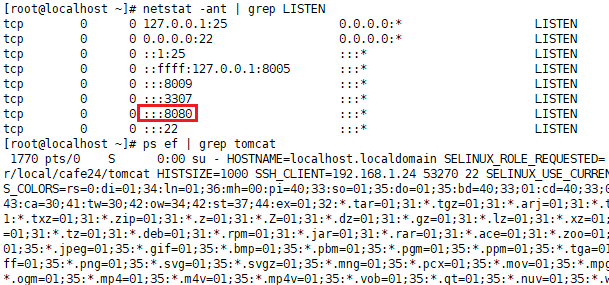
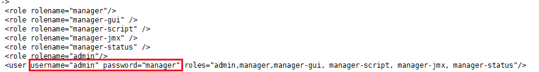
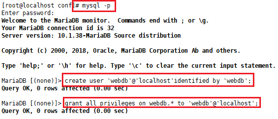
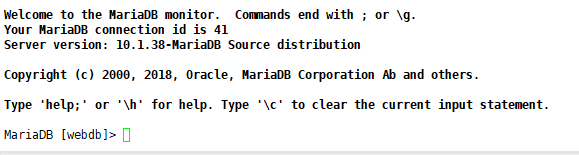
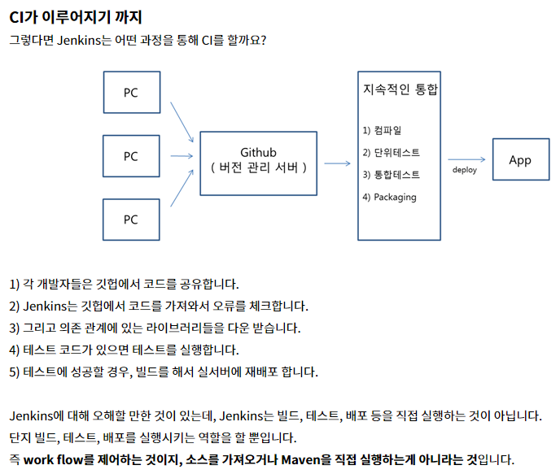
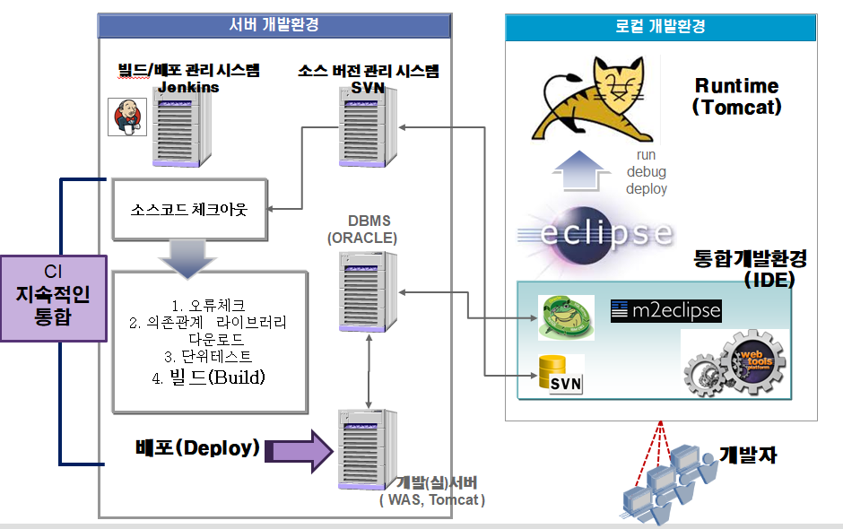
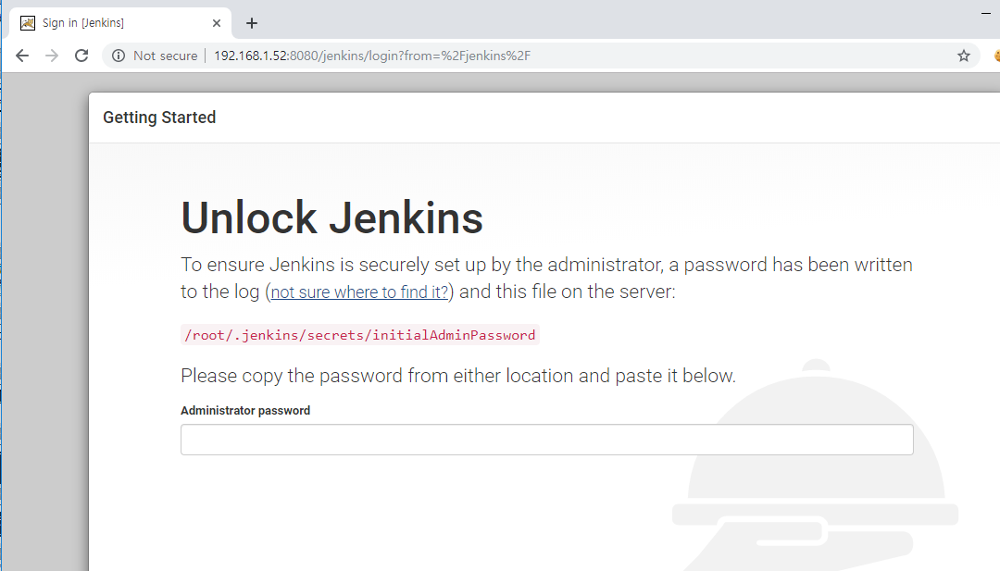
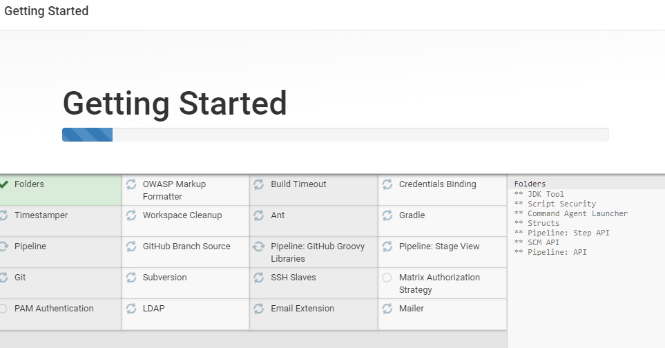
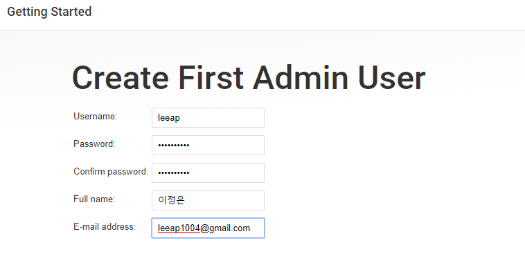
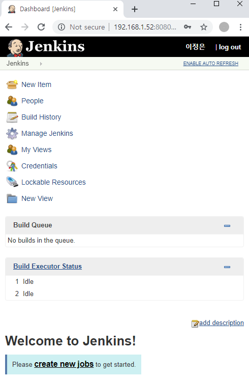

[TOC]


---

### *톰캣 띄우기  확인



---

### *admin 계정 확인하기

```shell
[root@localhost conf]# cd /usr/local/cafe24/tomcat/conf/
[root@localhost conf]# cat tomcat-users.xml
```



---

### *webdb 계정 권한



### * 접속

`[root@localhost conf]# mysql -u webdb -D webdb -p`

> webdb 



---

# CI - Jenkins



[젠킨스](<https://victorydntmd.tistory.com/229>)




## 리눅스에 Jenkins 설치

`wget http://mirrors.jenkins.io/war-stable/latest/jenkins.war`

`mv jenkins.war /usr/local/cafe24/tomcat/webapps/`

> <http://192.168.1.52:8080/jenkins/>



### **비밀번호 확인**

```
cd
ls -a
cd .jenkins/
cd secrets/
cat initialAdminPassword 
```





http://192.168.1.52:8080/jenkins/




