[TOC]

---

# 설정

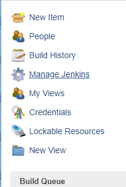

## Global Tool Configuration 설정

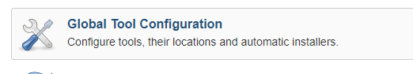

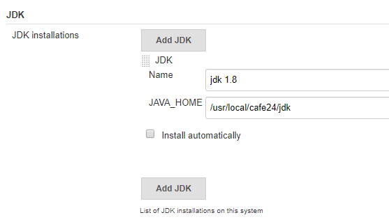


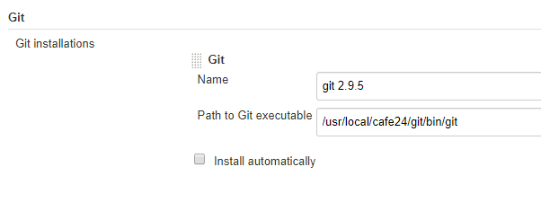

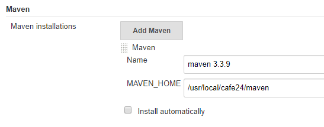

---

## New item


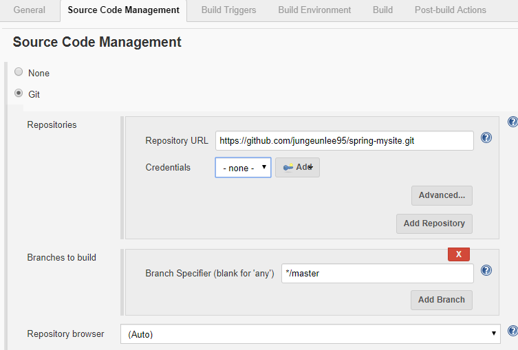

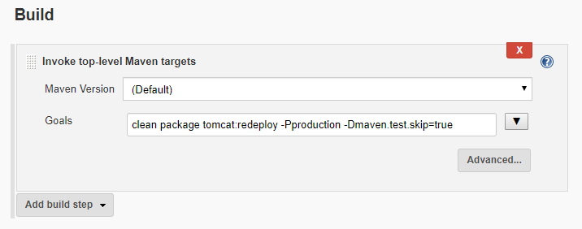

`clean package tomcat:redeploy -Pproduction -Dmaven.test.skip=true`

---


---

# Build Now

## mvn error :eight_pointed_black_star:

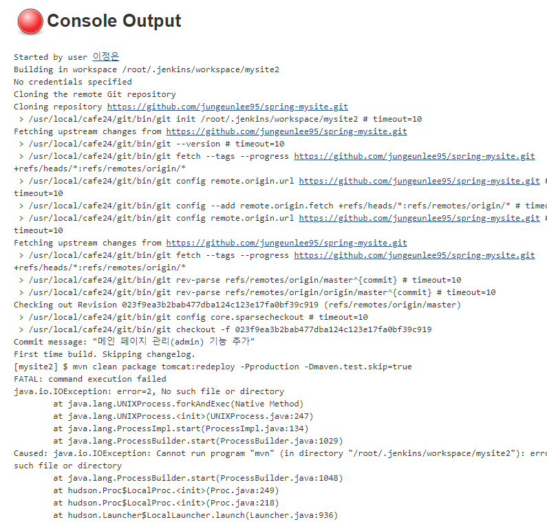

> path 추가해줘야해
>
> `vi /etc/init.d/tomcat`
>
> 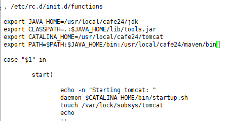
>
> `[root@localhost ~]# /etc/init.d/tomcat stop`
>
> `[root@localhost ~]# /etc/init.d/tomcat start`

---

## 다시 빌드

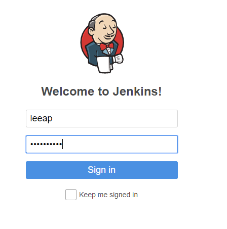


**다시 build now**

## Compile Error :eight_pointed_black_star:

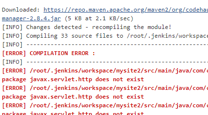

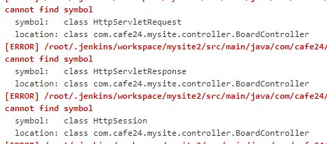

> 리눅스에서 마이사이트
>
> ```shell
> cd
> cd .jenkins/
> ls
> ls -la
> cd workspace/
> ls -la
> cd mysite2/
> ```
> 
>톰캣 라이브러리들이 없는 것 같음
> 
>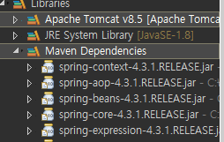
> 
>Apache라이브러리를 Maven으로 옮겨줘야해


##  mysite/pom.xml에 Profiles추가

```xml
<profiles>
    <profile>
        <id>production</id>
        <build>
            <resources>
                <resource>
                    <directory>${project.basedir}/src/main/resources</directory>
                    <excludes>
                        <exclude>**/*.java</exclude>
                    </excludes>
                </resource>
            </resources>
            <plugins>
                <plugin>
                    <groupId>org.apache.maven.plugins</groupId>
                    <artifactId>maven-resources-plugin</artifactId>
                    <configuration>
                        <encoding>UTF-8</encoding>
                    </configuration>
                </plugin>
            </plugins>
        </build>
        <dependencies>
            <!-- Servlet -->
            <dependency>
                <groupId>javax.servlet</groupId>
                <artifactId>javax.servlet-api</artifactId>
                <version>3.0.1</version>
                <scope>provided</scope>
            </dependency>
            <dependency>
                <groupId>javax.servlet.jsp</groupId>
                <artifactId>jsp-api</artifactId>
                <version>2.0</version>
                <scope>provided</scope>
            </dependency>
        </dependencies>
    </profile>
</profiles>
```

> mvn실행할때 -Pproduction 했던 명령어가 적용되는거야
>
> git push후 다시 Build


> **라이브러리 다운중~**


## Compile Error :eight_pointed_black_star:

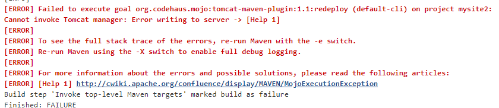

**plugin 추가**

```xml
			<plugin>
				<groupId>org.codehaus.mojo</groupId>
				<artifactId>tomcat-maven-plugin</artifactId>
				<configuration>
					<url>http://127.0.0.1/manager/text</url>
					<path>/mysite3</path>
					<username>admin</username>
					<password>manager</password>
				</configuration>
			</plugin>

```

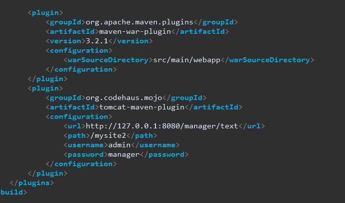

다시 빌드!!!!!!!


## port 번호 error ! :eight_pointed_black_star:

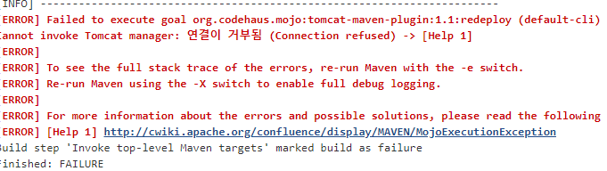

**8080추가**


 다시 빌드!!!


## 빌드 성공 !! :blue_heart:

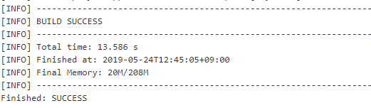


## db서버 변경

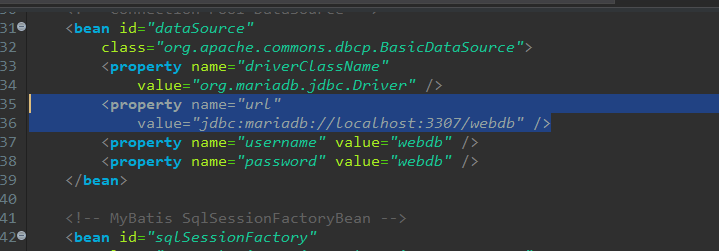


이렇게 하면 

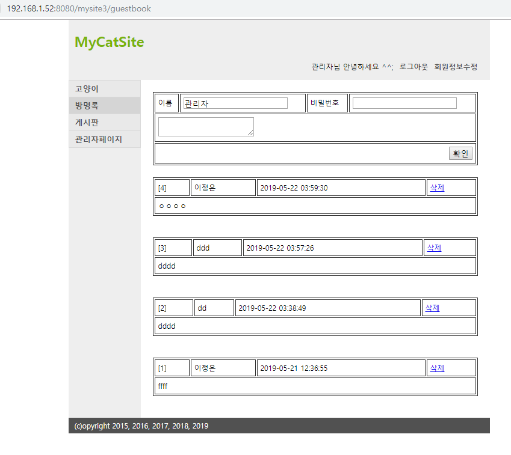
