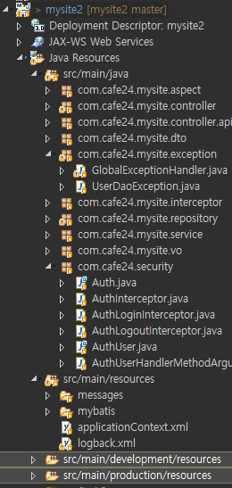
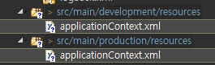
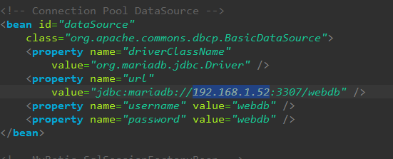
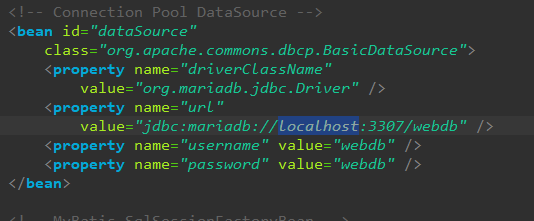
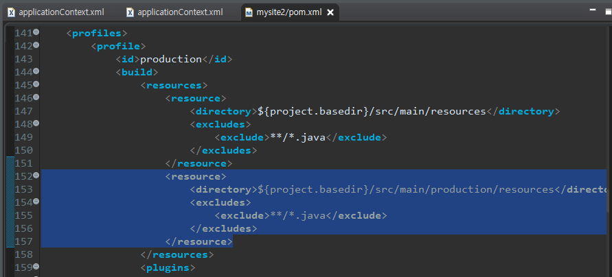
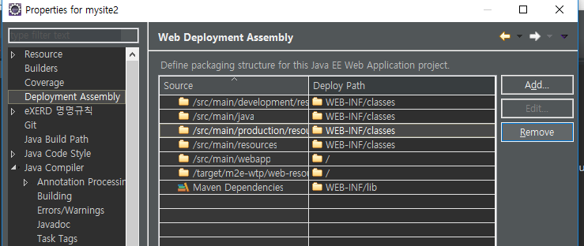
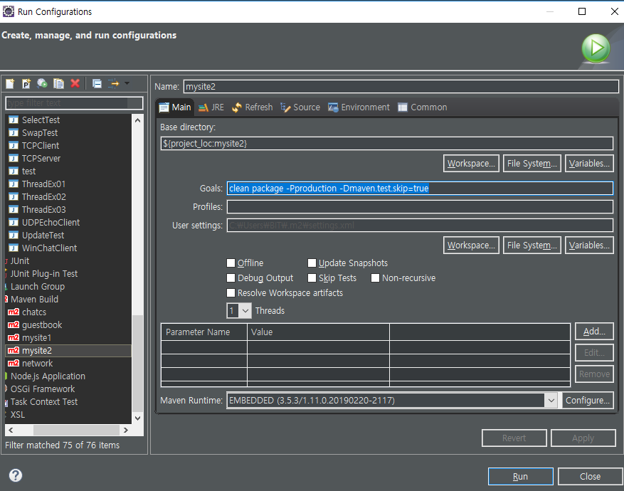

[TOC]

---

개발용과 배포용 파일을 나눠야함

---

[공통]

src/main/java

src/main/resources

- mybatis

---

src/main/development/resources

- applicationContext.xml

src/main/production/resources

- applicationContext.xml

src/main/development/resources

> 

src/main/production/resources

**pom.xml추가해줘야함**

**production 지워** 

**src/main/resources의 applicationContext.xml도 지워!**

다시 빌드

성공

---

---

eclipse에서 Maev Build

