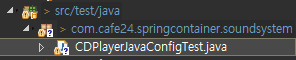
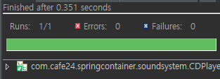
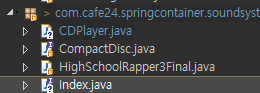

[TOC]


---


# Package 구성 :file_folder:

=== src/main/java

```
config.user
	|-- UserConfig.java

config.soundsystem
	|-- CDPlayerConfig.java    - auto(암시)

config.videosystem
	|-- DVDPlayerConfig.java   - 명시적 설정
```

=== src/main/resources   

```
config.user
	|-- UserConfig.xml

config.soundsystem
	|-- CDPlayerConfig.xml    - auto(암시)    

config.videosystem
	|-- DVDPlayerConfig.xml   - 명시적 설정
```

=== src/test/java

```
|--com.cafe24.springcontainer.soundsystem
	|-- CDPlayerJavaConfigTest.java
	|-- CDPlayerXMLConfigTest.java
```


------

# Test - JUnit :bookmark_tabs:

**pom.xml**  추가

```xml
<!-- Test -->
<dependency>
    <groupId>org.springframework</groupId>
    <artifactId>spring-test</artifactId>
    <version>${org.springframework-version}</version>
</dependency>
<dependency>
    <groupId>JUNIT</groupId>
    <artifactId>junit</artifactId>
    <version>4.12</version>
    <scope>test</scope>
</dependency>
```

> Test를 같은 컨테이너에 넣어야 주입을 받을 수 있음! 


```java
@RunWith(SpringJUnit4ClassRunner.class)
@ContextConfiguration(classes=UserConfig01.class)
//@ContextConfiguration(locations= {"xml위치!"})
public class UserTest {
	@Autowired
	private User user;
	
	@Test
	public void testUser() {
		assertTrue(12-2==10);
	}
}
```

> 


`assertNotNull()` 

---


---

# 자동(Auto) Config - java config :book:

springcontainer project

com.cafe24.springcontainer.user/**User.java**

```java
	private Long no;
	private String name = "이정은";
	private Friend friend;
	private List<String> friends;
```


config.user/**UserConfig01.java**

```java
public class UserConfig01 {
    @Bean
    public User user() {
        return new User();
    }
}
```

com.cafe24.springcontainer/**JavaConfigTest01.java**

```java
public class JavaConfigTest01 {
	public static void main(String[] args) {
		testUser01();
	}

	public static void testUser01() {
		ApplicationContext appCtx = 
				new AnnotationConfigApplicationContext(UserConfig01.class);
		User user = appCtx.getBean(User.class);
		System.out.println(user);
		
		((ConfigurableApplicationContext)appCtx).close();
	}
}
```

> User [no=null, name=이정은, friend=null, friends=null]

---


---

**package 명을 줬을 때,**  `@Configuration`

**JavaConfigTest01.java**

```java
public static void main(String[] args) {
    testUser02();
}

public static void testUser02() {
    ApplicationContext appCtx = 
        new AnnotationConfigApplicationContext("config.user");
    User user = appCtx.getBean(User.class);
    System.out.println(user);

    ((ConfigurableApplicationContext)appCtx).close();
}
```

**UserConfig02.java**

```java
@Configuration
public class UserConfig02 {
	@Bean
	public User user() {
		return new User();
	}
}
```

---


---

## Sound System - **Auto Configuration**

---

### - interface

new package - com.cafe24.springcontainer.soundsystem

new interface - **CompactDisc.java**

```java
public interface CompactDisc {
	public void play();
}
```

com.cafe24.springcontainer.soundsystem/**HighSchoolRapper3Final.java**

```java
@Component
public class HighSchoolRapper3Final implements CompactDisc {
	private String title = "지구멸망";
	private String artist = "양승호";
	
	@Override
	public void play() {
		System.out.println("Playing " + title + " by " + artist);
	}
}
```

### - Test 만들기



```java
/*
 * Auto Configuration - Java Config Test
 * Component Scanning(@Component, @Named,  @Autowired, @Inject)
 */
@RunWith(SpringJUnit4ClassRunner.class)
@ContextConfiguration(classes=CDPlayerConfig.class)
public class CDPlayerJavaConfigTest {
	@Autowired
	private CompactDisc cd;
    @Test
	public void testCDNull() {
		assertNotNull(cd);
	}
}
```


### - config 만들고 테스트


```java
@Configuration
@ComponentScan(basePackages="com.cafe24.springcontainer.soundsystem")
public class CDPlayerConfig {

}
```

> cd NotNull 확인
>
> 

---


---

com.cafe24.springcontainer.soundsystem/**CDPlayer.java**

```java
package com.cafe24.springcontainer.soundsystem;

@Component
public class CDPlayer {
	
	// 와이어링01
//	@Autowired
	private CompactDisc cd;
	
	public CDPlayer() {
	}
	
	// 와이어링02
	//@Autowired // 생성자 주입
	public CDPlayer(@Qualifier("HighSchoolRapper3Final")CompactDisc cd) {
		System.out.println("1");
		this.cd = cd;
	}
	
	// 와이어링03
	//@Autowired
	public void setCompactDisc(@Qualifier("HighSchoolRapper2Final")CompactDisc cd) {
		System.out.println("2");
		this.cd = cd;
	}

	
	// 와이어링04
    @Autowired
//	public void insertCompactDisc(CompactDisc cd) {
	public void insertCompactDisc(@Qualifier("HighSchoolRapper3Final")CompactDisc cd) {
		System.out.println("3");
//	public void insertCompactDisc(@Qualifier("HighSchoolRapper3Final")CompactDisc cd) {
		this.cd = cd;
	}
	
	public void play() {
		cd.play();
	}
}
```


#### test 라이브러리 추가

```xml
<!-- https://mvnrepository.com/artifact/com.github.stefanbirkner/system-rules -->
<dependency>
    <groupId>com.github.stefanbirkner</groupId>
    <artifactId>system-rules</artifactId>
    <version>1.19.0</version>
    <scope>test</scope>
</dependency>
```


**CDPlayerJavaConfigTest.java**

```java
@Rule
public final SystemOutRule systemOutRule = new SystemOutRule().enableLog();

@Autowired
private CompactDisc cd;

@Autowired
private CDPlayer player;

@Test
public void testCDNull() {
    assertNotNull(cd);
}

@Test
public void testPlayerNull() {
    assertNotNull(player);
}

//@Test
//public void testPlay() {
//    player.play();
//    assertEquals("Playing 지구멸망 by 양승호\r\n", systemOutRule.getLog());
//}

@Test
public void testPlay() {
    player.play();
    assertEquals("Playing 지구멸망 by 양승호", systemOutRule.getLog().replace("\r\n", "").replace("\n", ""));
}
```


### `ComponentScan`

**CDPlayerConfig.java** 

```java
@ComponentScan(basePackages= {"com.cafe24.springcontainer.soundsystem", "com.cafe24.springcontainer.videosystem"})
```

```java
// basePackageClasses에 지정한 클래스가 속한 패키지를 Base Package로 사용한다 
@ComponentScan(basePackageClasses=Index.class)
```



```java
public interface Index {
}
```

---


---

**CDPlayer.java**

```java
@Component
public class CDPlayer {
	
//  와이어링01
//	@Autowired
	private CompactDisc cd;
    
	public CDPlayer() {
	}
    
//  와이어링02	
	@Autowired // 생성자 주입
	public CDPlayer(CompactDisc cd) {
		this.cd = cd;
	}
	
	public void play() {
		cd.play();
	}

}
```

---


---

**pom.xml** 추가

```xml
<!-- 자바 표준 (JSR33-) scanning, wiring Annotation 지원-->
<dependency>
    <groupId>javax.inject</groupId>
    <artifactId>javax.inject</artifactId>
    <version>1</version>
</dependency>
```


**HighSchoolRapper3Final.java**

```java
@Component("HighSchoolRapper3Final")
//@Named("HighSchoolRapper3Final")
```

---


---

# Auto Config - XMLConfig


**CDPlayerXMLConfigTest.java**

```java
/*
 * Auto Configuration - XML Config Test
 * Component Scanning(@Component, @Named,  @Autowired, @Inject)
 */
@RunWith(SpringJUnit4ClassRunner.class)
@ContextConfiguration(locations = { "classpath:config/soundsystem/CDPlayerConfig.xml" })
public class CDPlayerXMLConfigTest {
    @Rule
    public final SystemOutRule systemOutRule = new SystemOutRule().enableLog();

    @Autowired
    private CompactDisc cd;

    @Autowired
    private CDPlayer player;

    @Test
    public void testCDNull() {
        assertNotNull(cd);
    }

    @Test
    public void testPlayerNull() {
        assertNotNull(player);
    }

    @Test
    public void testPlay() {
        player.play();
        assertEquals("Playing 지구멸망 by 양승호", systemOutRule.getLog().replace("\r\n", "").replace("\n", ""));
    }
}
```


**CDPlayerConfig.xml**

```xml
<?xml version="1.0" encoding="UTF-8"?>
<beans xmlns="http://www.springframework.org/schema/beans"
       xmlns:xsi="http://www.w3.org/2001/XMLSchema-instance"
       xmlns:aop="http://www.springframework.org/schema/aop"
       xmlns:tx="http://www.springframework.org/schema/tx"
       xmlns:context="http://www.springframework.org/schema/context"
       xsi:schemaLocation="http://www.springframework.org/schema/beans http://www.springframework.org/schema/beans/spring-beans.xsd
                           http://www.springframework.org/schema/tx http://www.springframework.org/schema/tx/spring-tx.xsd
                           http://www.springframework.org/schema/aop http://www.springframework.org/schema/aop/spring-aop.xsd
                           http://www.springframework.org/schema/context http://www.springframework.org/schema/context/spring-context.xsd">
    <context:annotation-config />
    <context:component-scan base-package="com.cafe24.springcontainer.soundsystem">
        <context:include-filter type="annotation" expression="org.springframework.stereotype.Component" />
    </context:component-scan>
</beans>
```


