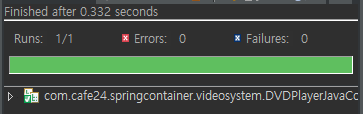
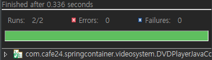
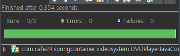
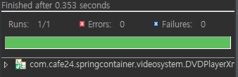
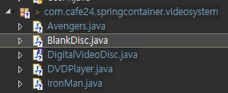

[TOC]

---

# Package 구성 :file_folder:

**=== src/main/java**

```
com.cafe24.springcontainer.user

com.cafe24.springcontainer.soundsystem

com.cafe24.springcontainer.videosystem
	|-- DigitalVideoDisc
	|-- Avengers
	|-- DVDPlayer
	|-- BlankDVD 	-> 주입
	|-- DVDPack		-> collection
```

```
config.user
	|-- UserConfig.java

config.soundsystem
	|-- CDPlayerConfig.java    - auto(암시)

config.videosystem
	|-- DVDPlayerConfig.java   - 명시적 설정
```

**=== src/main/resources**   

```
config.user
	|-- UserConfig.xml

config.soundsystem
	|-- CDPlayerConfig.xml    - auto(암시)    

config.videosystem
	|-- DVDPlayerConfig.xml   - 명시적 설정
```

**=== src/test/java**

```
|--com.cafe24.springcontainer.soundsystem
	|-- CDPlayerJavaConfigTest.java
	|-- CDPlayerXMLConfigTest.java
|--com.cafe24.springcontainer.videosystem
	|-- DVDPlayerJavaConfigTest.java
	|-- DVDPlayerXMLConfigTest.java
	|-- DVDPlayerXixingConfigTest01.java
	|-- DVDPlayerXixingConfigTest02.java
	|-- DVDPlayerXixingConfigTest03.java
```

---


---

# 명시적(Explicit) Configuration

## Java Config

src/text/java/com.cafe24.springcontainer.videosystem

**DVDPlayerJavaConfigTest.java** 

```java
/*
 * 명시적(Explicit) Configuration - Java Config Test
 * @Bean
 */

@RunWith(SpringJUnit4ClassRunner.class)
@ContextConfiguration(classes=DVDPlayerConfig.class)
public class DVDPlayerJavaConfigTest {
    @Rule 
    public final SystemOutRule systemOutRule = new SystemOutRule().enableLog();

    @Autowired
    private DigitalVideoDisc dvd;

    @Test
    public void testDVDNull() {
        assertNotNull(dvd);
    }
}
```


com.cafe24.springcontainer.videosystem/**DigitalVideoDisc.java**


```java
public interface DigitalVideoDisc {
	void play();
}
```


**Avengers.java** 

```java
public class Avengers implements DigitalVideoDisc {
	private String title = "Avengers";
	private String studio = "MARVEL";
	
	@Override
	public void play() {
		System.out.println("Playing Movie " + studio + "'s " + title);
	}
}
```


config.videosystem/**DVDPlayerConfig.java** 

```java
@Configuration
public class DVDPlayerConfig {
	
	@Bean
	public Avengers avengers() {
		return new Avengers();
	}
}
```



---


---

**DVDPlayerJavaConfigTest.java** - player 테스트 코드 추가

```java
	@Autowired
	private DVDPlayer player;

	@Test
	public void testPlayerNull() {
		assertNotNull(player);
	}
```


com.cafe24.springcontainer.videosystem/**DVDPlayer.java**


```java
public class DVDPlayer {
	private DigitalVideoDisc dvd;
	public DVDPlayer(DigitalVideoDisc dvd) {
		this.dvd = dvd;
	}
}
```


### 주입하기 01

**DVDPlayerConfig.java**

```java
// 주입하기 01
@Bean
public DVDPlayer dvdPlayer() {
    return new DVDPlayer(avengers());		
}
```



---


---

**주입 확인** :white_check_mark:

**DVDPlayer.java**

```java
	public void play() {
		dvd.play();
	}
```

**DVDPlayerJavaConfigTest.java**

```java
@Test
public void testPlay() {
    player.play();
    assertEquals("Playing Movie MARVEL's Avengers", systemOutRule.getLog().replace("\r\n", "").replace("\n", ""));
}
```

---


### 주입하기 02

**DVDPlayerConfig.java**

```java
// 주입하기 02
@Bean
public DVDPlayer dvdPlayer2(DigitalVideoDisc dvd) {
    return new DVDPlayer(dvd);		
}
```

---


---

### 주입하기 03

**DVDPlayer.java** - setter 추가

```java
public void setDigitalVideoDisc(DigitalVideoDisc dvd) {
    this.dvd = dvd;
}
```

**DVDPlayerConfig.java**

```java
// 주입하기 03
@Bean
public DVDPlayer dvdPlayer3(DigitalVideoDisc dvd) {
    DVDPlayer player = new DVDPlayer(dvd);
    player.setDigitalVideoDisc(dvd);
    return player;
}
```


---

### 주입하기 04 - `@Bean(name="")`

**DVDPlayerConfig.java**

```java
// 주입하기 03
@Bean(name="dvdPlayer3")
public DVDPlayer dvdPlayer3(DigitalVideoDisc dvd) {
    DVDPlayer player = new DVDPlayer(dvd);
    player.setDigitalVideoDisc(dvd);
    return player;
} 

// 주입하기 04
@Bean(name="dvdPlayer4")
public DVDPlayer  dvdPlayer4(DigitalVideoDisc dvd) {
    return new DVDPlayer(avengers());
} 
```

**DVDPlayerJavaConfigTest.java**

```java
@Autowired
@Qualifier("dvdPlayer3")
private DVDPlayer player;
```



---


---

## XML Config

**DVDPlayerXmlConfigTest.java**

```java
/*
 * 명시적(Explicit) Configuration - XML Config Test
 * @Bean
 */

@RunWith(SpringJUnit4ClassRunner.class)
@ContextConfiguration(locations = { "classpath:config/videosystem/DVDPlayerConfig.xml" })
public class DVDPlayerXmlConfigTest {
	@Rule 
	public final SystemOutRule systemOutRule = new SystemOutRule().enableLog();
	
}
```


### 간단한 빈 설정, id 부여

**DVDPlayerConfig.xml**

```xml
<!-- 01. 간단한 빈 설정  -->
<bean class="com.cafe24.springcontainer.videosystem.Avengers" />

<!-- 02. 설정된 빈에 아이디 부여하기 -->
<bean id="ironMan" class="com.cafe24.springcontainer.videosystem.IronMan" />
```


**DVDPlayerXmlConfigTest.java**

```java
@Autowired
@Qualifier("ironMan")
private DigitalVideoDisc dvd2;

@Test
public void testDVD2Null() {
    assertNotNull(dvd2);
}
```




---

### 생성자를 통한 빈 주입 1

**DVDPlayerXmlConfigTest.java**

```java
@Autowired
@Qualifier("ironMan")
private DigitalVideoDisc dvd2;

@Autowired
@Qualifier("dvdPlayer2")
private DVDPlayer player2;

@Test
public void testDVD2Null() {
    assertNotNull(dvd2);
}

@Test
public void testPlayer2Null() {
    assertNotNull(player2);
}
```

**DVDPlayerConfig.xml**

```xml
<!-- 03. 생성자를 통한 빈 주입 01 -->
<bean id="dvdPlayer2" class="com.cafe24.springcontainer.videosystem.DVDPlayer">
    <constructor-arg ref="ironMan"/>
</bean>
```


---

### 생성자를 통한 빈 주입 2 - c-namespace name

**DVDPlayerXmlConfigTest.java**

```java
@Test
public void testPlay2() {
    player2.play();
    assertEquals("Playing Movie MARVEL's IronMan", systemOutRule.getLog().replace("\r\n", "").replace("\n", ""));
}
```


**DVDPlayerXmlConfigTest.java**

```java
@Autowired
@Qualifier("dvdPlayer3")
private DVDPlayer player3;	

@Test
public void testPlay3() {
    player3.play();
    assertEquals("Playing Movie MARVEL's IronMan", systemOutRule.getLog().replace("\r\n", "").replace("\n", ""));
}
```

**DVDPlayerConfig.xml**

```xml
xmlns:c="http://www.springframework.org/schema/c"
xmlns:p="http://www.springframework.org/schema/p"
xmlns:util="http://www.springframework.org/schema/util"

<!-- 04. 생성자를 통한 빈 주입 02 : c-namespace의 argument name 사용 
    Spring 3.0 부터 c-namespace, p-namespace 사용-->
<bean id="dvdPlayer3" 
      class="com.cafe24.springcontainer.videosystem.DVDPlayer"
      c:dvd-ref="ironMan"/> 
```

---


---

### 생성자를 통한 빈 주입 3- c-namespace index

**DVDPlayerXmlConfigTest.java**

```java
@Autowired
@Qualifier("dvdPlayer4")
private DVDPlayer player4;

@Test
public void testPlay4() {
    player3.play();
    assertEquals("Playing Movie MARVEL's IronMan", systemOutRule.getLog().replace("\r\n", "").replace("\n", ""));
}
```


**DVDPlayerConfig.xml**

```xml
<!-- 05. 생성자를 통한 빈 주입 03 : c-namespace의 argument index 사용 (argument가 하나인 경우)
    Spring 3.0 부터 c-namespace, p-namespace 사용-->
<bean id="dvdPlayer4" 
      class="com.cafe24.springcontainer.videosystem.DVDPlayer"
      c:_0-ref="ironMan"/> 
```

---


---

### 생성자를 통한 빈 주입  : literal를 사용

**DVDPlayerXmlConfigTest.java**

```java
@Autowired
@Qualifier("dvdPlayer5")
private DVDPlayer player5;

@Test
public void testPlay5() {
    player5.play();
    assertEquals("Playing Movie MARVEL's IronMan", systemOutRule.getLog().replace("\r\n", "").replace("\n", ""));
}
```


---

**BlankDisc.java**

```java
public class BlankDisc implements DigitalVideoDisc {
    private String title;
    private String studio;
    public BlankDisc(String title, String studio) {
        this.title = title;
        this.studio = studio;
    }
    @Override
    public void play() {
        System.out.println("Playing Movie " + studio + "'s " + title);
    }
}
```


**DVDPlayerXmlConfigTest.java**

```java
@Autowired
@Qualifier("avengersInfinityWar")
private DigitalVideoDisc dvd3;

@Autowired
@Qualifier("avengersEndgame")
private DigitalVideoDisc dvd4;

@Test
public void testDVD3() {
    assertNotNull(dvd3);
    System.out.println(dvd3.toString());
    assertEquals("BlankDisc [title=Avengers Infinity War, studio=MAVEL]", systemOutRule.getLog().replace("\r\n", "").replace("\n", ""));
}

@Test
public void testDVD4() {
    assertNotNull(dvd4);
    System.out.println(dvd4.toString());
    assertEquals("BlankDisc [title=Avengers Endgame, studio=MAVEL]", systemOutRule.getLog().replace("\r\n", "").replace("\n", ""));
}
```


**DVDPlayerConfig.xml**

```xml
<!-- 06. 생성자를 통한 빈 주입 05 : literal를 사용하는 경우 -->
<bean id="avengersInfinityWar"
      class="com.cafe24.springcontainer.videosystem.BlankDisc">
    <constructor-arg name="title" value="Avengers Infinity War" />
    <constructor-arg name="studio" value="MARVEL" />
</bean>
```


```xml
<!-- 07. 생성자를 통한 빈 주입 05 : literal를 사용하는 경우02 -->
<bean id="avengersEndgame"
      class="com.cafe24.springcontainer.videosystem.BlankDisc"
      c:title="Avengers Endgame"
      c:studio="MAVEL">
</bean>
```

---


**DVDPlayerXmlConfigTest.java**

```java
@Autowired
@Qualifier("avengersAgeOfUltron")
private DigitalVideoDisc dvd5;

@Test
public void testDVD5() {
    assertNotNull(dvd5);
    System.out.println(dvd5.toString());
    assertEquals("BlankDisc [title=Avengers Age Of Ultron, studio=MAVEL]", systemOutRule.getLog().replace("\r\n", "").replace("\n", ""));
}
```

**DVDPlayerConfig.xml**

```xml
<!-- 08. 생성자를 통한 빈 주입 07 : literal를 사용하는 경우03 -->
<bean id="avengersAgeOfUltron"
      class="com.cafe24.springcontainer.videosystem.BlankDisc"
      c:_0="Avengers Age Of Ultron"
      c:_1="MAVEL">
</bean>
```


