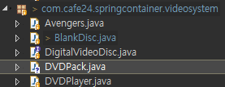
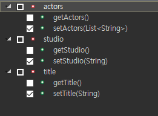

[TOC]


---

## 생성자를 통한 빈 주입 08 : Wiring Collection 01

**BlankDisc.java**

```java
public class BlankDisc implements DigitalVideoDisc {

	private String title;
	private String studio;
	private List<String> actors;
	
	public BlankDisc(String title, String studio) {
		this.title = title;
		this.studio = studio;
	}
	public BlankDisc(String title, String studio, List<String> actors) {
		this.title = title;
		this.studio = studio;
		this.actors = actors;
	}

	@Override
	public void play() {
		System.out.println("Playing Movie " + studio + "'s " + title);
	}
	
	@Override
	public String toString() {
		return "BlankDisc [title=" + title + ", studio=" + studio + ", actors=" + actors + "]";
	}
	
}

```

**DVDPlayerConfig.xml**

```xml
<!-- 10. 생성자를 통한 빈 주입 08 : Wiring Collection 01 -->
<bean id="captainAmeria"
      class="com.cafe24.springcontainer.videosystem.BlankDisc" >
    <constructor-arg name="title" value="Avengers Captain America" />
    <constructor-arg name="studio" value="MARVEL" />
    <constructor-arg><null/></constructor-arg>
</bean>
```

**DVDPlayerXmlConfigTest.java**

```java
@Autowired
@Qualifier("captainAmeria")
private DigitalVideoDisc dvd6;

@Test
public void testDVD6() {
    assertNotNull(dvd6);
    System.out.println(dvd6.toString());
    assertEquals("BlankDisc [title=Captain America, studio=MARVEL, actors=null]", systemOutRule.getLog().replace("\r\n", "").replace("\n", ""));
}
```

---


## 02

**DVDPlayerConfig.xml**

```xml
<bean id="avengersDirectorEdition"
      class="com.cafe24.springcontainer.videosystem.BlankDisc" >
    <constructor-arg name="title" value="Avengers Director's Edition" />
    <constructor-arg name="studio" value="MARVEL" />
    <constructor-arg>
        <list>
            <value>Robert Downey Jr.</value>
            <value>Scarlett</value>
            <value>Chris Evans</value>
        </list>
    </constructor-arg>
</bean>
```

**DVDPlayerXmlConfigTest.java**

```java
@Autowired
@Qualifier("avengersDirectorEdition")
private DigitalVideoDisc dvd7;

@Test
public void testDVD7() {
    assertNotNull(dvd7);
    System.out.println(dvd7.toString());
    assertEquals("BlankDisc [title=Avengers Director's Edition, studio=MARVEL, actors=[Robert Downey Jr., Scarlett, Chris Evans]]", systemOutRule.getLog().replace("\r\n", "").replace("\n", ""));
}
```

---


---

## DVDPack 만들기 

**DVDPack.java**

```java
public class DVDPack {
    private String title;
    private List<DigitalVideoDisc> dvds;

    public DVDPack(String title, List<DigitalVideoDisc> dvds) {
        this.title = title;
        this.dvds = dvds; 
    }

    @Override
    public String toString() {
        return "DVDPack [title=" + title + ", dvds=" + dvds + "]";
    }
}
```

**DVDPlayerConfig.xml**

```xml
<!-- 12. 생성자를 통한 빈 주입10 : Wiring Collection 03 -->
<!-- DVD Pack! -->
<bean id="avengersTriplepack"
      class="com.cafe24.springcontainer.videosystem.DVDPack" >
    <constructor-arg name="title" value="Avengers Triplepack" />
    <constructor-arg>
        <list>
            <ref bean="avengersAgeOfUltron"/>
            <ref bean="avengersInfinityWar"/>
            <ref bean="avengersEndgame"/>
        </list>
    </constructor-arg>
</bean>
```

**DVDPlayerXmlConfigTest.java**

```java
// DVDPack
@Autowired
private DVDPack dvdPack;

@Test
public void testDVDPack() {
    assertNotNull(dvdPack);
    System.out.println(dvdPack.toString());
    assertEquals("DVDPack [title=Avengers Triplepack, dvds=[BlankDisc [title=Avengers Age Of Ultron, studio=MARVEL, actors=null], BlankDisc [title=Avengers Infinity War, studio=MARVEL, actors=null], BlankDisc [title=Avengers Endgame, studio=MARVEL, actors=null]]]", systemOutRule.getLog().replace("\r\n", "").replace("\n", ""));
}
```

---


---

## property를 통한 빈 주입 1

**DVDPlayerConfig.xml**

```xml
<!-- 13. 프로퍼티를 통한 빈 주입 01 -->
<bean id="dvdPlayer6"
      class="com.cafe24.springcontainer.videosystem.DVDPlayer">
    <property name="dvd" ref="avengersInfinityWar"/>
</bean>
```

**DVDPlayer.java** 추가

```java
public DVDPlayer() {
}

public void setDvd(DigitalVideoDisc dvd) {
    this.dvd = dvd;
}
```

**DVDPlayerXmlConfigTest.java**

```java
@Autowired
@Qualifier("dvdPlayer6")
private DVDPlayer player6;

@Test
public void testPlayer6Null() {
    assertNotNull(player6);
}

@Test
public void testPlay6() {
    player6.play();
   assertEquals("Playing Movie MARVEL's Avengers Infinity War", systemOutRule.getLog().replace("\r\n", "").replace("\n", ""));
}
```

---

---

## property를 통한 빈 주입 2 - p:namespace

**DVDPlayerConfig.xml**

```xml
<!-- 14. 프로퍼티를 통한 빈 주입 02 -->
<bean id="dvdPlayer7"
      class="com.cafe24.springcontainer.videosystem.DVDPlayer"
      p:dvd-ref="avengersInfinityWar" />
```

**DVDPlayerXmlConfigTest.java**

```java
@Autowired
@Qualifier("dvdPlayer7")
private DVDPlayer player7;

@Test
public void testPlayer7Null() {
    assertNotNull(player7);
}

@Test
public void testPlay7() {
    player7.play(); 
    assertEquals("Playing Movie MARVEL's Avengers Infinity War", systemOutRule.getLog().replace("\r\n", "").replace("\n", ""));
}

```

---

---

## property를 통한 빈 주입 3

**BlankDisc.java**  **setter 추가**

```java
//기본생성자 추가
public BlankDisc() {
}
```


**DVDPlayerConfig.xml**

```xml
<!-- 15. 프로퍼티를 통한 빈 주입 03 -->
<bean id="avengersExpansionPack1"
      class="com.cafe24.springcontainer.videosystem.BlankDisc" >
    <property name="title" value="Avengers Expansion Pack1" />
    <property name="studio" value="MARVEL" />
    <property name="actors">
        <list>
            <value>Robert Downey Jr.</value>
            <value>Scarlett</value>
            <value>Chris Evans</value>
        </list>
    </property>
</bean>
```

**DVDPlayerXmlConfigTest.java**

```java
@Autowired
@Qualifier("avengersExpansionPack1")
private DigitalVideoDisc dvd8;

@Test
public void testDVD8() {
    assertNotNull(dvd8);
    System.out.println(dvd8.toString());
    assertEquals("BlankDisc [title=Avengers Expansion Pack1, studio=MARVEL, actors=[Robert Downey Jr., Scarlett, Chris Evans]]", systemOutRule.getLog().replace("\r\n", "").replace("\n", ""));
}

```

---


---

## property를 통한 빈 주입 4

**DVDPlayerConfig.xml**

```xml
<!-- 16. 프로퍼티를 통한 빈 주입 04 -->
<bean id="avengersExpansionPack2"
      class="com.cafe24.springcontainer.videosystem.BlankDisc" 
      p:title="Avengers Expansion Pack2"
      p:studio="MARVEL">
    <property name="actors">
        <list>
            <value>Robert Downey Jr.</value>
            <value>Scarlett</value>
            <value>Chris Evans</value>
        </list>
    </property>
</bean>
```

**DVDPlayerXmlConfigTest.java**

```java
@Autowired
@Qualifier("avengersExpansionPack2")
private DigitalVideoDisc dvd9;	

@Test
public void testDVD9() {
    assertNotNull(dvd9);
    System.out.println(dvd9.toString());
    assertEquals("BlankDisc [title=Avengers Expansion Pack2, studio=MARVEL, actors=[Robert Downey Jr., Scarlett, Chris Evans]]", systemOutRule.getLog().replace("\r\n", "").replace("\n", ""));
}
```

---


---

## property를 통한 빈 주입 5 - util

**DVDPlayerConfig.xml**

```xml
// xsi-schemaLocation 추가
http://www.springframework.org/schema/util http://www.springframework.org/schema/util/spring-util.xsd"
```

```xml
<!-- 17. 프로퍼티를 통한 빈 주입 05 --> 
<util:list id="actorList">
    <value>Robert Downey Jr.</value>
    <value>Scarlett</value>
    <value>Chris Evans</value>
</util:list>
<bean id="avengersExpansionPack3"
      class="com.cafe24.springcontainer.videosystem.BlankDisc" 
      p:title="Avengers Expansion Pack3"
      p:studio="MARVEL"
      p:actors-ref="actorList"/> 
```

**DVDPlayerXmlConfigTest.java**

```java
@Autowired
@Qualifier("avengersExpansionPack3")
private DigitalVideoDisc dvd10;

@Test
public void testDVD10() {
    assertNotNull(dvd10);
    System.out.println(dvd10.toString());
    assertEquals("BlankDisc [title=Avengers Expansion Pack3, studio=MARVEL, actors=[Robert Downey Jr., Scarlett, Chris Evans]]", systemOutRule.getLog().replace("\r\n", "").replace("\n", ""));
}
```