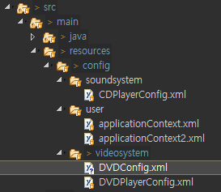
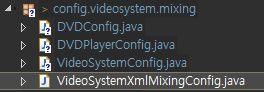

[TOC]


---

**DVDConfig.xml** 

```xml
<bean id="avengersInfinityWar"
      class="com.cafe24.springcontainer.videosystem.BlankDisc">
    <constructor-arg name="title" value="Avengers Infinity War" />
    <constructor-arg name="studio" value="MARVEL" />
</bean>
```


**VideoSystemXmlMixingConfig.java** 

```java
@Configuration
@Import({DVDPlayerConfig.class})
@ImportResource("classpath:/config/videosystem/DVDConfig.xml")
public class VideoSystemXmlMixingConfig {

}
```


### Test - DVDPlayerMixingConfigTest03.java

```java
/*
 * 명시적(Explicit) Configuration - Java Mixing Config Test
 * Java Config <----- (JavaConfig1,JavaConfig2, JavaConfig3) 
 * 			   @Import
 * 자바 컨피그에 자바 컨피그를 줌
 */
@RunWith(SpringJUnit4ClassRunner.class)
@ContextConfiguration(classes=VideoSystemXmlMixingConfig.class)
public class DVDPlayerMixingConfigTest03 {
	@Rule
	public final SystemOutRule systemOutRule = new SystemOutRule().enableLog();

	@Autowired
	private DVDPlayer player;
	
	@Test
	public void testDVDNull() {
		assertNotNull(player);
	}
}
```


