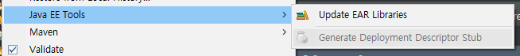
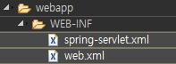
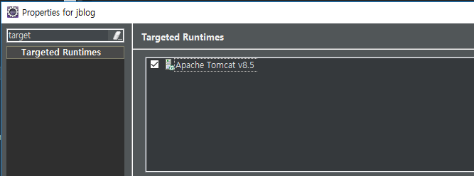
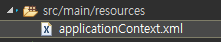
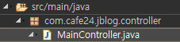
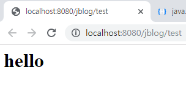

[TOC]

# new maven project 

# **pom.xml**

```xml
<project xmlns="http://maven.apache.org/POM/4.0.0"
	xmlns:xsi="http://www.w3.org/2001/XMLSchema-instance"
	xsi:schemaLocation="http://maven.apache.org/POM/4.0.0 http://maven.apache.org/xsd/maven-4.0.0.xsd">
	<modelVersion>4.0.0</modelVersion>
	<groupId>com.cafe24</groupId>
	<artifactId>mysite2</artifactId>
	<version>0.0.1-SNAPSHOT</version>
	<packaging>war</packaging>

	<properties>
		<project.build.sourceEncoding>UTF-8</project.build.sourceEncoding>
		<project.reporting.outputEncoding>UTF-8</project.reporting.outputEncoding>
		<org.springframework-version>4.3.1.RELEASE</org.springframework-version>
		<jcloverslf4j.version>1.7.6</jcloverslf4j.version>
		<logback.version>1.1.1</logback.version>
	</properties>

	<dependencies>
		<!-- Spring Core -->
		<dependency>
			<groupId>org.springframework</groupId>
			<artifactId>spring-context</artifactId>
			<version>${org.springframework-version}</version>
			<!-- JCL 제외 -->
			<exclusions>
				<exclusion>
					<groupId>commons-logging</groupId>
					<artifactId>commons-logging</artifactId>
				</exclusion>
			</exclusions>
		</dependency>
		<!-- Spring Web -->
		<dependency>
			<groupId>org.springframework</groupId>
			<artifactId>spring-web</artifactId>
			<version>${org.springframework-version}</version>
		</dependency>

		<!-- Spring Web MVC -->
		<dependency>
			<groupId>org.springframework</groupId>
			<artifactId>spring-webmvc</artifactId>
			<version>${org.springframework-version}</version>
		</dependency>

		<!-- Spring Aspect -->
		<dependency>
			<groupId>org.springframework</groupId>
			<artifactId>spring-aspects</artifactId>
			<version>${org.springframework-version}</version>
		</dependency>
		
		<!-- test -->
		<dependency>
			<groupId>org.springframework</groupId>
			<artifactId>spring-test</artifactId>
			<version>${org.springframework-version}</version>
		</dependency>
		<dependency>
			<groupId>junit</groupId>
			<artifactId>junit</artifactId>
			<version>4.12</version>
			<scope>test</scope>
		</dependency>
		<!-- https://mvnrepository.com/artifact/com.github.stefanbirkner/system-rules -->
		<dependency>
			<groupId>com.github.stefanbirkner</groupId>
			<artifactId>system-rules</artifactId>
			<version>1.19.0</version>
			<scope>test</scope>
		</dependency>

		<!-- Spring jdbc -->
		<dependency>
			<groupId>org.springframework</groupId>
			<artifactId>spring-jdbc</artifactId>
			<version>${org.springframework-version}</version>
		</dependency>

		<!-- Common DBCP -->
		<dependency>
			<groupId>commons-dbcp</groupId>
			<artifactId>commons-dbcp</artifactId>
			<version>1.4</version>
		</dependency>

		<!-- MyBatis -->
		<dependency>
			<groupId>org.mybatis</groupId>
			<artifactId>mybatis</artifactId>
			<version>3.2.2</version>
		</dependency>

		<dependency>
			<groupId>org.mybatis</groupId>
			<artifactId>mybatis-spring</artifactId>
			<version>1.2.0</version>
		</dependency>

		<!-- jstl -->
		<dependency>
			<groupId>jstl</groupId>
			<artifactId>jstl</artifactId>
			<version>1.2</version>
		</dependency>

		<!-- validation -->
		<dependency>
			<groupId>javax.validation</groupId>
			<artifactId>validation-api</artifactId>
			<version>1.0.0.GA</version>
		</dependency>

		<dependency>
			<groupId>org.hibernate</groupId>
			<artifactId>hibernate-validator</artifactId>
			<version>4.2.0.Final</version>
		</dependency>

		<!-- mariadb java client -->
		<dependency>
			<groupId>org.mariadb.jdbc</groupId>
			<artifactId>mariadb-java-client</artifactId>
			<version>2.4.0</version>
		</dependency>

		<!-- jackson -->
		<dependency>
			<groupId>com.fasterxml.jackson.core</groupId>
			<artifactId>jackson-databind</artifactId>
			<version>2.9.8</version>
		</dependency>

		<!-- Logback -->
		<dependency>
			<groupId>org.slf4j</groupId>
			<artifactId>jcl-over-slf4j</artifactId>
			<version>${jcloverslf4j.version}</version>
		</dependency>
		<dependency>
			<groupId>ch.qos.logback</groupId>
			<artifactId>logback-classic</artifactId>
			<version>${logback.version}</version>
		</dependency>
	</dependencies>

	<profiles>
		<profile>
			<id>production</id>
			<build>
				<resources>
					<resource>
						<directory>${project.basedir}/src/main/resources</directory>
						<excludes>
							<exclude>**/*.java</exclude>
						</excludes>
					</resource>
					<resource>
						<directory>${project.basedir}/src/main/production/resources</directory>
						<excludes>
							<exclude>**/*.java</exclude>
						</excludes>
					</resource>
				</resources>
				<plugins>
					<plugin>
						<groupId>org.apache.maven.plugins</groupId>
						<artifactId>maven-resources-plugin</artifactId>
						<configuration>
							<encoding>UTF-8</encoding>
						</configuration>
					</plugin>
				</plugins>
			</build>
			<dependencies>
				<!-- Servlet -->
				<dependency>
				    <groupId>javax.servlet</groupId>
				    <artifactId>javax.servlet-api</artifactId>
				    <version>3.0.1</version>
				    <scope>provided</scope>
				</dependency>
				<dependency>
					<groupId>javax.servlet.jsp</groupId>
					<artifactId>jsp-api</artifactId>
					<version>2.0</version>
					<scope>provided</scope>
				</dependency>
			</dependencies>
		</profile>
	</profiles>

	<build>
		<sourceDirectory>src/main/java</sourceDirectory>
		<plugins>
			<plugin>
				<groupId>org.apache.maven.plugins</groupId>
				<artifactId>maven-compiler-plugin</artifactId>
				<version>3.8.0</version>
				<configuration>
					<source>1.8</source>
					<target>1.8</target>
				</configuration>
			</plugin>
			<plugin>
				<groupId>org.apache.maven.plugins</groupId>
				<artifactId>maven-war-plugin</artifactId>
				<version>3.2.1</version>
				<configuration>
					<warSourceDirectory>src/main/webapp</warSourceDirectory>
				</configuration>
			</plugin>
			<plugin>
				<groupId>org.codehaus.mojo</groupId>
				<artifactId>tomcat-maven-plugin</artifactId>
				<configuration>
					<url>http://127.0.0.1:8080/manager/text</url>
					<path>/mysite10</path>
					<username>admin</username>
					<password>manager</password>
				</configuration>
			</plugin>
			
		</plugins>
	</build>
</project> 
```





# **web.xml**

```xml
<?xml version="1.0" encoding="UTF-8"?>
<web-app xmlns:xsi="http://www.w3.org/2001/XMLSchema-instance" xmlns="http://java.sun.com/xml/ns/javaee" xsi:schemaLocation="http://java.sun.com/xml/ns/javaee http://java.sun.com/xml/ns/javaee/web-app_2_5.xsd" version="2.5">
  <display-name>jblog</display-name>
  <welcome-file-list>
    <welcome-file>index.html</welcome-file>
    <welcome-file>index.htm</welcome-file>
    <welcome-file>index.jsp</welcome-file>
    <welcome-file>default.html</welcome-file>
    <welcome-file>default.htm</welcome-file>
    <welcome-file>default.jsp</welcome-file>
  </welcome-file-list>
  
  	<context-param>
		<param-name>contextConfigLocation</param-name>
		<param-value>classpath:applicationContext.xml</param-value> 
	</context-param>
	
		<!-- Context Loader Lister -->
	<listener>
		<listener-class>org.springframework.web.context.ContextLoaderListener</listener-class>
	</listener>

	<!-- Encoding filter -->
	<filter>
		<filter-name>encodingFilter</filter-name>
		<filter-class>org.springframework.web.filter.CharacterEncodingFilter</filter-class>
		<init-param>
			<param-name>encoding</param-name>
			<param-value>UTF-8</param-value>
		</init-param>

		<init-param>
			<param-name>forceEncoding</param-name>
			<param-value>true</param-value>
		</init-param>
	</filter>

	<filter-mapping>
		<filter-name>encodingFilter</filter-name>
		<url-pattern>/*</url-pattern>
	</filter-mapping>
	
	<!-- Dispatcher Servlet(Front Controller) --> 
	<servlet>
		<servlet-name>spring</servlet-name>
		<servlet-class>org.springframework.web.servlet.DispatcherServlet</servlet-class>
		<init-param>
			<param-name>contextConfigLocation</param-name>
			<param-value>/WEB-INF/*-servlet.xml</param-value>
		</init-param>
	</servlet> 

	<servlet-mapping> 
		<servlet-name>spring</servlet-name>
		<url-pattern>/</url-pattern>
	</servlet-mapping>

	<!-- 공통 에러 페이지  -->
	<error-page>
		<error-code>404</error-code>
		<location>/WEB-INF/views/error/404.jsp</location>
	</error-page>
	<error-page>
		<error-code>500</error-code>
		<location>/WEB-INF/views/error/500.jsp</location>
	</error-page>
	
	
	
</web-app>
```

# **spring-servlet.xml**

```xml
<?xml version="1.0" encoding="UTF-8"?>
<beans xmlns:xsi="http://www.w3.org/2001/XMLSchema-instance"
	xmlns:aop="http://www.springframework.org/schema/aop"
	xmlns="http://www.springframework.org/schema/beans"
	xmlns:p="http://www.springframework.org/schema/p"
	xmlns:context="http://www.springframework.org/schema/context"
	xmlns:mvc="http://www.springframework.org/schema/mvc"
	xsi:schemaLocation="http://www.springframework.org/schema/mvc http://www.springframework.org/schema/mvc/spring-mvc.xsd
	http://www.springframework.org/schema/aop http://www.springframework.org/schema/aop/spring-aop.xsd
	http://www.springframework.org/schema/beans http://www.springframework.org/schema/beans/spring-beans.xsd
	http://www.springframework.org/schema/context http://www.springframework.org/schema/context/spring-context.xsd">

	<!-- auto proxy -->
	<aop:aspectj-autoproxy />
	 
	<!-- validator, conversionService, messageConverter를 자동으로 등록 -->
	<mvc:annotation-driven>
		<mvc:message-converters>
			<bean class="org.springframework.http.converter.StringHttpMessageConverter">
				<property name="supportedMediaTypes">
					<list>
						<value>text/html; charset=UTF-8</value>
					</list>
				</property>
			</bean>
			<bean class="org.springframework.http.converter.json.MappingJackson2HttpMessageConverter">
				<property name="supportedMediaTypes">
					<list>
						<value>application/json; charset=UTF-8</value>
					</list>
				</property>
			</bean>
		</mvc:message-converters>
		
		<!-- Argument Resolver 
		<mvc:argument-resolvers>
			<bean class="com.cafe24.security.AuthUserHandlerMethodArgumentResolver"/>
		</mvc:argument-resolvers> -->
	</mvc:annotation-driven> 

	<!-- 서블릿 컨테이너의 디폴트 서블릿 위임 핸들러  -->
	<mvc:default-servlet-handler />
	
	<!-- the mvc resources tag does the magic --> 
	<mvc:resources mapping="/images/**" location="file:/mysite-uploads" />
	
	 <!-- MessageSource -->
	<bean id="messageSource" class="org.springframework.context.support.ResourceBundleMessageSource">
	   <property name="basenames">
	      <list>
		<value>messages/messages_ko</value>
	      </list>
	   </property> 
	</bean>

	<!-- ViewResolver 설정  -->
	<bean id="viewResolver"
		class="org.springframework.web.servlet.view.InternalResourceViewResolver">
		<property name="viewClass"
			value="org.springframework.web.servlet.view.JstlView" />
		<property name="prefix" value="/WEB-INF/views/" />
		<property name="suffix" value=".jsp" />
	</bean>

	<!-- 빈 설정을 annotation으로 하겠다 (@Controller에 대한 auto scanning하겠다) -->
	<context:annotation-config />

	<!-- Controller Scanning하는 base package 지정 -->
	<context:component-scan
		base-package="com.cafe24.jblog.controller" />


</beans> 
 
```


# Targeted runtime




# applicationContext.xml



```xml
<?xml version="1.0" encoding="UTF-8"?>
<beans xmlns="http://www.springframework.org/schema/beans"
	xmlns:xsi="http://www.w3.org/2001/XMLSchema-instance"
	xmlns:aop="http://www.springframework.org/schema/aop"
	xmlns:context="http://www.springframework.org/schema/context"
	xsi:schemaLocation="http://www.springframework.org/schema/beans http://www.springframework.org/schema/beans/spring-beans.xsd
        http://www.springframework.org/schema/aop http://www.springframework.org/schema/aop/spring-aop.xsd
        http://www.springframework.org/schema/context http://www.springframework.org/schema/context/spring-context.xsd
        http://www.springframework.org/schema/jee http://www.springframework.org/schema/jee/spring-jee.xsd
        http://www.springframework.org/schema/lang http://www.springframework.org/schema/lang/spring-lang.xsd
        http://www.springframework.org/schema/tx http://www.springframework.org/schema/tx/spring-tx.xsd
        http://www.springframework.org/schema/util http://www.springframework.org/schema/util/spring-util.xsd
        http://www.springframework.org/schema/task http://www.springframework.org/schema/task/spring-task.xsd">

	<!-- auto proxy -->
	<aop:aspectj-autoproxy />

	<context:annotation-config />

	<context:component-scan
		base-package="com.cafe24.jblog.repository, com.cafe24.jblog.service">
		<context:include-filter type="annotation"
			expression="org.springframework.stereotype.Repository" />
		<context:include-filter type="annotation"
			expression="org.springframework.stereotype.Service" />
		<context:include-filter type="annotation"
			expression="org.springframework.stereotype.Component" />
	</context:component-scan>

	<!-- Connection Pool DataSource -->
	<bean id="dataSource"
		class="org.apache.commons.dbcp.BasicDataSource">
		<property name="driverClassName"
			value="org.mariadb.jdbc.Driver" />
		<property name="url"
			value="jdbc:mariadb://192.168.1.52:3307/jblog" />
		<property name="username" value="jblog" />
		<property name="password" value="jblog" />
	</bean>

</beans>
```


**MainController.java** 

```java
@Controller
public class MainController {

	@RequestMapping("/test")
	@ResponseBody
	public String hello() {
		return "<h1>hello</h1>";
	}
}
```




