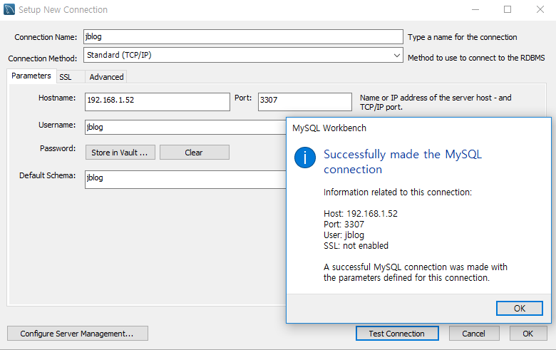
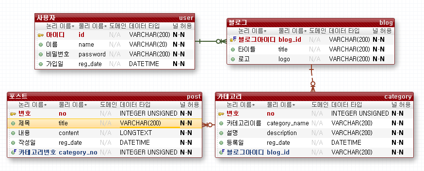
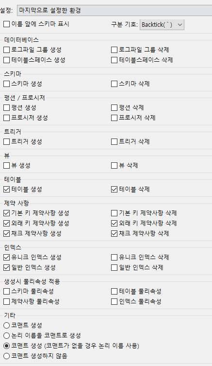

```shell
[root@localhost ~]# mysql -p
```

```mysql
MariaDB [(none)]> create database jblog;
Query OK, 1 row affected (0.01 sec)

MariaDB [(none)]> show databases;
+--------------------+
| Database           |
+--------------------+
| bookmall           |
| cdmall             |
| employees          |
| information_schema |
| jblog              |
| mysql              |
| performance_schema |
| test               |
| webdb              |
+--------------------+
9 rows in set (0.00 sec)
```

```mysql
MariaDB [(none)]> create user 'jblog'@'192.168.%' identified by 'jblog';
Query OK, 0 rows affected (0.00 sec)

MariaDB [(none)]> grant all privileges on jblog.* to 'jblog'@'192.168.%';
Query OK, 0 rows affected (0.00 sec)

MariaDB [(none)]> flush privileges;
Query OK, 0 rows affected (0.00 sec)

MariaDB [(none)]> flush privileges;
Query OK, 0 rows affected (0.00 sec)


```




# 포워드



