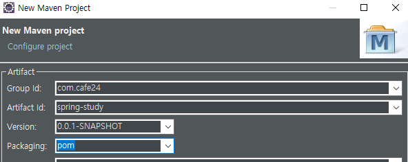
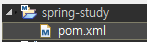
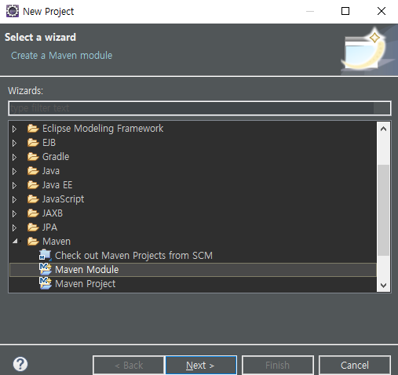
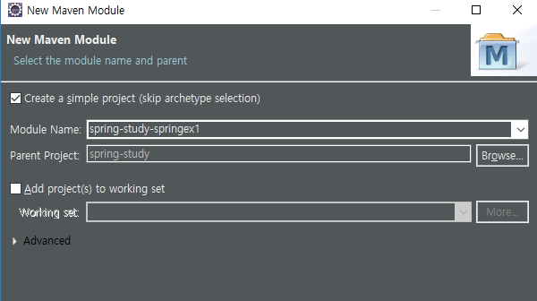
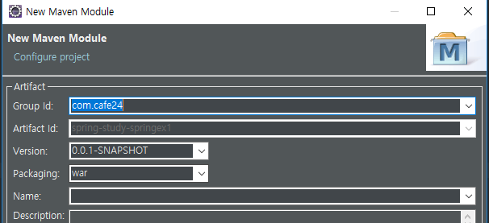
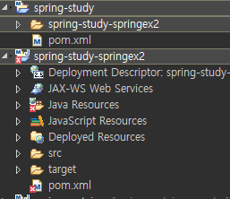
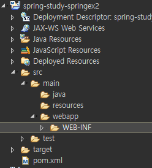
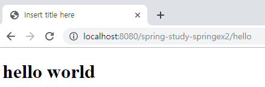

[TOC]


---

# multi project

spring-study

​	|-- spring-study-container

​	|-- spring-study-springex2	 -xml

​	|-- spring-study-springex3	 -javaconfig1

​	|-- spring-study-springex4	 -javaconfig2


mysite3

mysite4

---

## new project




**pom.xml** 

```xml
<project xmlns="http://maven.apache.org/POM/4.0.0"
         xmlns:xsi="http://www.w3.org/2001/XMLSchema-instance"
         xsi:schemaLocation="http://maven.apache.org/POM/4.0.0 http://maven.apache.org/xsd/maven-4.0.0.xsd">
    <modelVersion>4.0.0</modelVersion>
    <groupId>com.cafe24</groupId>
    <artifactId>spring-study</artifactId>
    <version>0.0.1-SNAPSHOT</version>
    <packaging>pom</packaging>

    <properties>
        <project.build.sourceEncoding>UTF-8</project.build.sourceEncoding>
        <project.reporting.outputEncoding>UTF-8</project.reporting.outputEncoding>
        <org.springframework-version>4.3.1.RELEASE</org.springframework-version>
    </properties>

    <dependencies>
        <!-- Spring Core -->
        <dependency>
            <groupId>org.springframework</groupId>
            <artifactId>spring-context</artifactId>
            <version>${org.springframework-version}</version>
        </dependency>
        <!-- Spring Web -->
        <dependency>
            <groupId>org.springframework</groupId>
            <artifactId>spring-web</artifactId>
            <version>${org.springframework-version}</version>
        </dependency>
        <!-- Spring Web MVC -->
        <dependency>
            <groupId>org.springframework</groupId>
            <artifactId>spring-webmvc</artifactId>
            <version>${org.springframework-version}</version>
        </dependency>

    </dependencies>

    <build>
        <sourceDirectory>src/main/java</sourceDirectory>

        <plugins>
            <plugin>
                <artifactId>maven-compiler-plugin</artifactId>
                <version>3.8.0</version>
                <configuration>
                    <source>1.8</source>
                    <target>1.8</target>
                </configuration>
            </plugin>
        </plugins>
    </build>
</project>
```

## Maven Module









**springex1**

wepapp, java resources 옮기기



**springex2.pom.xml**

```xml
<project xmlns="http://maven.apache.org/POM/4.0.0"
         xmlns:xsi="http://www.w3.org/2001/XMLSchema-instance"
         xsi:schemaLocation="http://maven.apache.org/POM/4.0.0 http://maven.apache.org/xsd/maven-4.0.0.xsd">
    <modelVersion>4.0.0</modelVersion>
    <parent>
        <groupId>com.cafe24</groupId>
        <artifactId>spring-study</artifactId>
        <version>0.0.1-SNAPSHOT</version>
    </parent>
    <artifactId>spring-study-springex1</artifactId>
    <packaging>war</packaging>

    <build>
        <plugins> 
            <plugin>
                <groupId>org.apache.maven.plugins</groupId>
                <artifactId>maven-war-plugin</artifactId>
                <version>3.2.1</version>
                <configuration>
                    <warSourceDirectory>src/main/webapp</warSourceDirectory>
                </configuration>
            </plugin>
        </plugins>
    </build>
</project>
```




