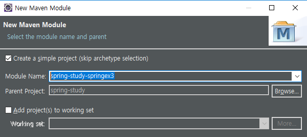
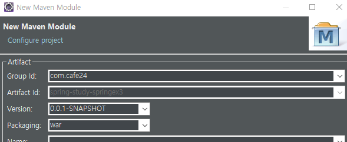
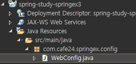
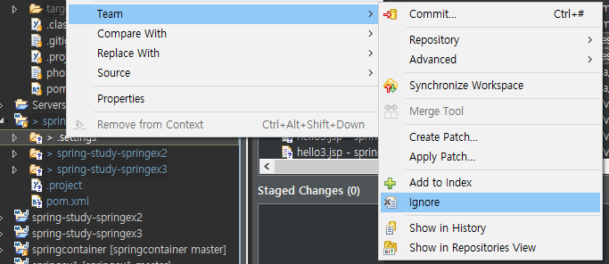

[TOC]


---

# java config - springex3

new maven module





springex2 webapp, javaresources 복사

spring-study-springex3/**web.xml**

```xml
<?xml version="1.0" encoding="UTF-8"?>
<web-app xmlns:xsi="http://www.w3.org/2001/XMLSchema-instance"
	xmlns="http://java.sun.com/xml/ns/javaee"
	xsi:schemaLocation="http://java.sun.com/xml/ns/javaee http://java.sun.com/xml/ns/javaee/web-app_3_0.xsd"
	version="3.0">
	<display-name>springex1</display-name>
	<welcome-file-list>
		<welcome-file>index.html</welcome-file>
		<welcome-file>index.htm</welcome-file>
		<welcome-file>index.jsp</welcome-file>
		<welcome-file>default.html</welcome-file>
		<welcome-file>default.htm</welcome-file>
		<welcome-file>default.jsp</welcome-file>
	</welcome-file-list>

	<!-- Dispatcher Server(Front Controller) -->
	<servlet>
		<servlet-name>spring</servlet-name>
		<servlet-class>org.springframework.web.servlet.DispatcherServlet</servlet-class>
		<init-param>
			<param-name>contextClass</param-name>
			<param-value>org.springframework.web.context.support.AnnotationConfigWebApplicationContext</param-value>
		</init-param>
		<init-param>
			<param-name>contextConfigLocation</param-name>
			<param-value>com.cafe24.springex.config.WebConfig</param-value>
		</init-param>
	</servlet>
	
	<servlet-mapping>
		<servlet-name>spring</servlet-name>
		<url-pattern>/</url-pattern>
	</servlet-mapping>

</web-app>
```


**WebConfig.java**



```java
package com.cafe24.springex.config;

@Configuration
@EnableWebMvc
@ComponentScan({"com.cafe24.springex.controller"})
public class WebConfig {

}

```


---

## git 



---


## ViewResolver

springex3/**WebConfig.java**

```java
package com.cafe24.springex.config;
@Configuration
@EnableWebMvc
@ComponentScan({"com.cafe24.springex.controller"})
public class WebConfig {

    @Bean
    public ViewResolver viewResolver() {
        InternalResourceViewResolver resolver = new InternalResourceViewResolver();
        resolver.setPrefix("/WEB-INF/views/");
        resolver.setSuffix(".jsp");
        resolver.setExposeContextBeansAsAttributes(true);

        return resolver;
    }
}
```

**Controller 경로 변경**

```java
@Controller
public class HelloController {
	@RequestMapping("/hello")
	public String hello() {
		return "test/hello";
	}
}
```


