[TOC]

---

# MySite3


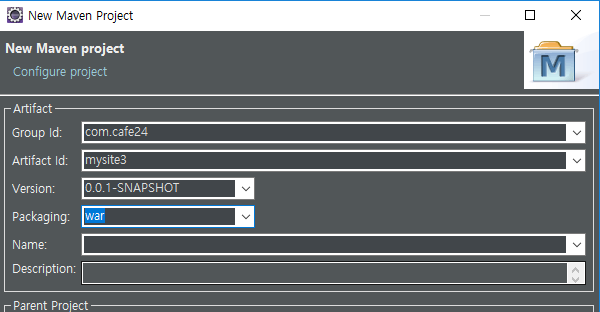

**mysite2꺼 다 복사**


## 설정 순서

```
1. Maven Project 생성

2. POM 설정

3. web.xml 설정
   controller <-- Service <-- Repository <-- SQLSessoion
   
4. AppConfig 설정
	|--- DBConfig: DataSource	
	|		|--- jdbc.properties
	|
	|--- MyBatisConfig : SqlSession, SqlSessionFactory 

5. WebConfig
	|--- MVCConfig(view resolver..)
	|--- SecurityConfig
	|--- MessageConfig
	|--- FileUploadConfig
	
6. GlobalExceptionHandler

7. slf4j, Logback

/mysite
8. /WEB-INF
	|--- /classes [ src/main/java, src/main.resource, src/test/java, src/test/resources]
	|		|--- /com
	|		|		|--- /cafe24
	|		|		|		|--- /mysite
	|		|		|		|		|--- /config
	|		|		|		|		|		|--- AppConfig
	|		|		|		|		|		|--- WebConfig
	|		|		|		|--- /config
	|		|		|		|		|--- /app
	|		|		|		|		|		|--- DBConfig
	|		|		|		|		|		|--- MyBatisConfig
	|		|		|		|		|		|--- /mybatis
	|		|		|		|		|		|		|--- configuration.xml
	|		|		|		|		|		|		|--- /mappers
	|		|		|		|		|		|		|		|--- user.xml
	|		|		|		|		|		|		|		|--- board.xml
	|		|		|		|		|		|--- /properties
	|		|		|		|		|		|		|--- jdbc.properties
	|		|		|		|		|--- /web
	|		|		|		|		|		|--- MVCConfig
	|		|		|		|		|		|--- SecurityConfig
	|		|		|		|		|		|--- MessageConfig
	|		|		|		|		|		|--- FileUploadConfig
	|		|		|		|		|		|--- /messages
	|		|		|		|		|		|		|--- messages_ko.properties
	|		|		|		|		|		|--- /properties
	|		|		|		|		|		|		|--- multipart.properties
```

---

### web.xml 설정

```xml
<context-param>
    <param-name>contextClass</param-name>
    <param-value>org.springframework.web.context.support.AnnotationConfigWebApplicationContext</param-value>
</context-param>
<context-param>
    <param-name>contextConfigLocation</param-name>
    <param-value>com.cafe24.mysite.config.AppConfig</param-value>
</context-param>
```

---

### Config 폴더 구조 & 설정

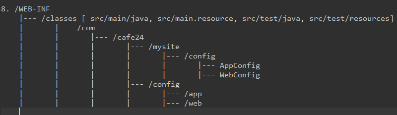


**AppConfig.java** 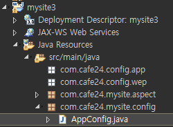

```java
@Configuration
public class AppConfig {
}
```


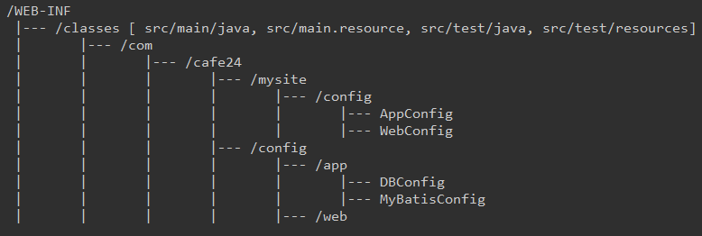

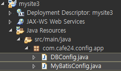

```java
@Configuration
public class MyBatisConfig {
}
```

```java
@Configuration
public class DBConfig {
}
```

---

### 1. 기존 xml :arrow_right: config 

#### **- DBConfig**

##### [ DataSource ]

```xml
<!-- Connection Pool DataSource -->
<bean id="dataSource"
      class="org.apache.commons.dbcp.BasicDataSource">
    <property name="driverClassName"
              value="org.mariadb.jdbc.Driver" />
    <property name="url"
              value="jdbc:mariadb://192.168.1.52:3307/webdb" />
    <property name="username" value="webdb" />
    <property name="password" value="webdb" />
</bean>
```

​													:arrow_down: :arrow_down: :arrow_down: :arrow_down::arrow_down:

```java
@Configuration
@EnableTransactionManagement
public class DBConfig {
	
	@Bean
	public DataSource basicDataSource() {
		BasicDataSource basicDataSource = new BasicDataSource();
		basicDataSource.setDriverClassName("org.mariadb.jdbc.Driver");
		basicDataSource.setUrl("jdbc:mariadb://192.168.1.52:3307/webdb");
		basicDataSource.setUsername("webdb");
		basicDataSource.setPassword("webdb");
		basicDataSource.setInitialSize(10);
		basicDataSource.setMaxActive(100);
		return basicDataSource;
	}
	
	@Bean
	public PlatformTransactionManager transactionManager(DataSource dataSource) {
		return new DataSourceTransactionManager(dataSource);
	}

}
```


#### **- MyBatisConfig**

##### [MyBatis]

```xml
<!-- MyBatis SqlSessionFactoryBean -->
<bean id="sqlSessionFactory"
      class="org.mybatis.spring.SqlSessionFactoryBean">
    <property name="dataSource" ref="dataSource" />
    <property name="configLocation"
              value="classpath:mybatis/configuration.xml" />
</bean>

<!-- MyBatis SqlSessionTemplate -->
<bean id="sqlSession"
      class="org.mybatis.spring.SqlSessionTemplate">
    <constructor-arg index="0" ref="sqlSessionFactory" />
</bean>
```

​											:arrow_down: :arrow_down: :arrow_down: :arrow_down: :arrow_down:

```java
@Configuration
public class MyBatisConfig {

	@Bean
	public SqlSessionFactory sqlSessionFactoryBean(
			DataSource dataSource, 
			ApplicationContext applicationContext) throws Exception {
		
		SqlSessionFactoryBean sqlSessionFactoryBean = new SqlSessionFactoryBean();
		
		sqlSessionFactoryBean.setDataSource(dataSource);
		sqlSessionFactoryBean.setConfigLocation(applicationContext.getResource("classpath:com/cafe24/config/app/mybatis/configuration.xml"));
		
		return sqlSessionFactoryBean.getObject();
	}
	
	@Bean
	public SqlSessionTemplate sqlSession(SqlSessionFactory sqlSessionFactory) {
		return new SqlSessionTemplate(sqlSessionFactory);
	}
}
```

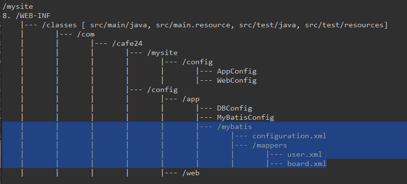

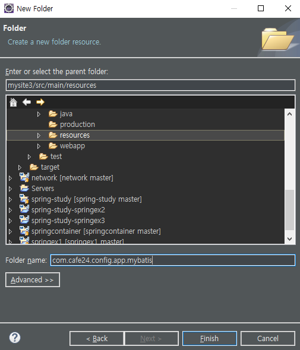


**configuration.xml**

```xml
<?xml version="1.0" encoding="UTF-8" ?>
<!DOCTYPE configuration PUBLIC "-//mybatis.org//DTD Config 3.0//EN" "http://mybatis.org/dtd/mybatis-3-config.dtd">
<configuration>
	<typeAliases>
		<typeAlias alias="uservo" type="com.cafe24.mysite.vo.UserVo"/>
		<typeAlias alias="guestbookvo" type="com.cafe24.mysite.vo.GuestbookVo"/>
		<typeAlias alias="boardvo" type="com.cafe24.mysite.vo.BoardVo"/>
		<typeAlias alias="fcri" type="com.cafe24.mysite.dto.FindCriteria"/>
		<typeAlias alias="sitevo" type="com.cafe24.mysite.vo.SiteVo"/>
	</typeAliases> 
	<mappers>
		<mapper resource="com/cafe24/config/app/mybatis/mapper/user.xml" />
		<mapper resource="com/cafe24/config/app/mybatis/mapper/guestbook.xml" />
		<mapper resource="com/cafe24/config/app/mybatis/mapper/board.xml" />
		<mapper resource="com/cafe24/config/app/mybatis/mapper/admin.xml" /> 
	</mappers>
</configuration>
```

> 기존 resources 경로는 삭제! ! ! ! ! !

**AppCong.java**

```java
@Configuration
@EnableAspectJAutoProxy
@ComponentScan({"com.cafe24.mysite.service", "com.cafe24.mysite.repository", "com.cafe24.mysite.aspect"})
@Import({DBConfig.class, MyBatisConfig.class})
public class AppConfig {

}
```

> ERROR!!!!!
>
> 이유 : 
>
> Web App Context와
>
> root App Context가 다르니까 같게 하면 될 것 같음 
>
> **web.xml** - init-param추가
>
> ```xml
> <!-- Dispatcher Servlet(Front Controller) -->
> <servlet>
>     <servlet-name>spring</servlet-name>
>     <servlet-class>org.springframework.web.servlet.DispatcherServlet</servlet-class>
>     <init-param>
>         <param-name>contextClass</param-name>
>         <param-value>org.springframework.web.context.support.AnnotationConfigWebApplicationContext</param-value>
>     </init-param>
>     <init-param>
>         <param-name>contextConfigLocation</param-name>
>         <param-value>com.cafe24.mysite.config.WebConfig</param-value>
>     </init-param>
>     <load-on-startup>1</load-on-startup>
> </servlet>
> ```

**WebConfig.java** 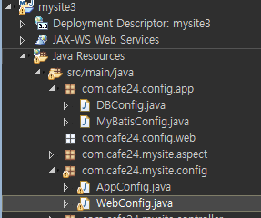

```java
@Configuration
@EnableWebMvc
@ComponentScan({"com.cafe24.mysite.controller"})
public class WebConfig {
	
	@Bean
	public ViewResolver viewResolver() {
		InternalResourceViewResolver resolver = new InternalResourceViewResolver();
		resolver.setPrefix("/WEB-INF/views/");
		resolver.setSuffix(".jsp");
		resolver.setExposeContextBeansAsAttributes(true);
				
		return resolver;
	}
}
```


#### **- properties**

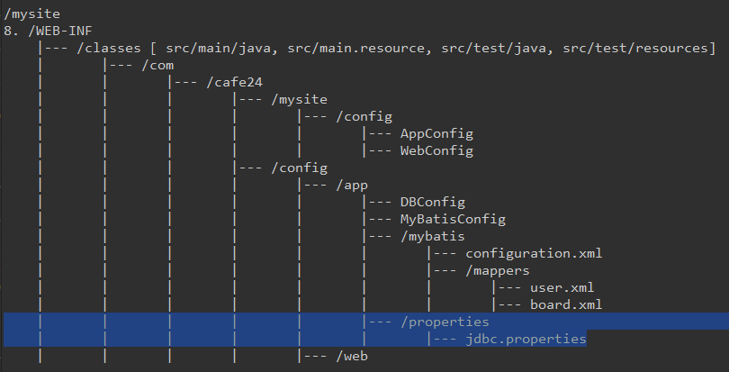

**jdbc.properties**  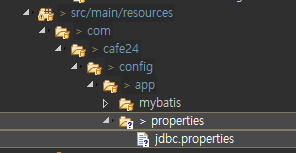

```properties
jdbc.driverClassName=org.mariadb.jdbc.Driver
jdbc.url=jdbc:mariadb://192.168.1.52:3307/webdb
jdbc.username=webdb
jdbc.password=webdb
jdbc.initialSize=10
jdbc.maxActive=100
```

**DBConfig.java** `@PropertySource` 추가, 수정

```java
package com.cafe24.config.app;

@Configuration
@EnableTransactionManagement
@PropertySource("classpath:com/cafe24/config/app/properties/jdbc.properties")
public class DBConfig {

    @Autowired
    private Environment env;

    @Bean
    public DataSource basicDataSource() {
        BasicDataSource basicDataSource = new BasicDataSource();
        basicDataSource.setDriverClassName(env.getProperty("jdbc.driverClassName"));
        basicDataSource.setUrl(env.getProperty("jdbc.url"));
        basicDataSource.setUsername(env.getProperty("jdbc.username"));
        basicDataSource.setPassword(env.getProperty("jdbc.password"));
        basicDataSource.setInitialSize(env.getProperty("jdbc.initialSize", Integer.class));
        basicDataSource.setMaxActive(env.getProperty("jdbc.maxActive", Integer.class));
        return basicDataSource;
    }

    @Bean
    public PlatformTransactionManager transactionManager(DataSource dataSource) {
        return new DataSourceTransactionManager(dataSource);
    }

}
```


####  **- View Resolver, Default Servlet Handler, Message Converter**

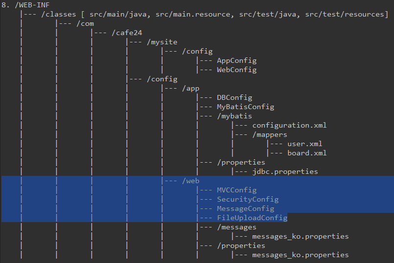

##### - WebConfig `@Import`

```java
@Import({MVCConfig.class})
```


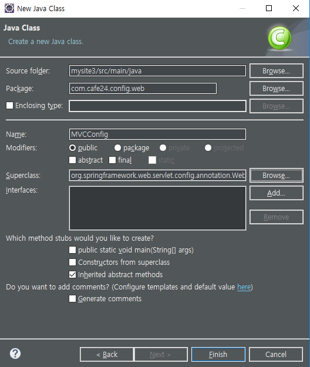

##### - MVCConfig.java

**pom.xml** 추가 

```xml
<dependency> 
    <groupId>com.fasterxml.jackson.module</groupId>
    <artifactId>jackson-module-parameter-names</artifactId>
    <version>2.9.8</version>
</dependency>
```

```java
package com.cafe24.config.web;
@Configuration
@EnableWebMvc
public class MVCConfig extends WebMvcConfigurerAdapter {

    // View Resolver
    @Bean
    public ViewResolver viewResolver() {
        InternalResourceViewResolver resolver = new InternalResourceViewResolver();
        resolver.setPrefix("/WEB-INF/views/");
        resolver.setSuffix(".jsp");
        resolver.setExposeContextBeansAsAttributes(true);

        return resolver;
    }

    // Default Servlet Handler
    @Override
    public void configureDefaultServletHandling(DefaultServletHandlerConfigurer configurer) {
        configurer.enable();
    }

    // Message Converter
    @Bean
    public MappingJackson2HttpMessageConverter mappingJackson2HttpMessageConverter() {
        Jackson2ObjectMapperBuilder builder = new Jackson2ObjectMapperBuilder()
            .indentOutput(true)
            .dateFormat(new SimpleDateFormat("yyyy-MM-dd"))
            .modulesToInstall(new ParameterNamesModule());

        MappingJackson2HttpMessageConverter converter 
            = new MappingJackson2HttpMessageConverter(builder.build());

        converter.setSupportedMediaTypes(
            Arrays.asList(
                new MediaType("application","json", Charset.forName("UTF-8"))
            )
        );

        return converter;
    }

    @Bean
    public StringHttpMessageConverter stringHttpMessageConverter() {
        StringHttpMessageConverter converter = new StringHttpMessageConverter();
        converter.setSupportedMediaTypes(
            Arrays.asList(
                new MediaType("text","html", Charset.forName("UTF-8"))
            )
        );
        return converter;
    }

    @Override
    public void configureMessageConverters(List<HttpMessageConverter<?>> converters) {
        converters.add(mappingJackson2HttpMessageConverter());
        converters.add(stringHttpMessageConverter());
    }
}
```


#### **- SecurityConfig**


**SecurityConfig.java**  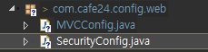

##### - Argument Resolver

##### - Interceptor

```java
package com.cafe24.config.web;
@Configuration
@EnableWebMvc
public class SecurityConfig extends WebMvcConfigurerAdapter {

	// Argument Resolver
	@Bean
	public AuthUserHandlerMethodArgumentResolver authUserHandlerMethodArgumentResolver() {
		return new AuthUserHandlerMethodArgumentResolver();
	}
	
	@Override
	public void addArgumentResolvers(List<HandlerMethodArgumentResolver> argumentResolvers) {
		argumentResolvers.add(authUserHandlerMethodArgumentResolver());
	}

	
	// Interceptor
	@Bean
	public AuthLoginInterceptor authLoginInterceptor() {
		return new AuthLoginInterceptor();
	}
	
	@Bean
	public AuthLogoutInterceptor authLogoutInterceptor() {
		return new AuthLogoutInterceptor();
	}
	
	@Bean
	public AuthInterceptor authInterceptor() {
		return new AuthInterceptor();
	}
	
	@Override
	public void addInterceptors(InterceptorRegistry registry) {
		registry
		.addInterceptor(authLoginInterceptor())
		.addPathPatterns("/user/auth");

		registry
		.addInterceptor(authLogoutInterceptor())
		.addPathPatterns("/user/logout");

		registry
		.addInterceptor(authInterceptor())
		.addPathPatterns("/**")
		.excludePathPatterns("/user/auth")
		.excludePathPatterns("/user/logout")
		.excludePathPatterns("/assets/**");
	}
}
```


#### **- MessageConfig**  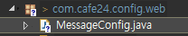

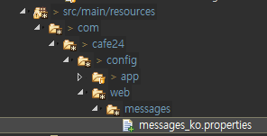

```java
@Configuration
public class MessageConfig {

    @Bean
    public MessageSource messageSource() {
        ResourceBundleMessageSource messageSource = new ResourceBundleMessageSource();
        messageSource.setBasename("com/cafe24/config/web/messages/messages_ko");
        messageSource.setDefaultEncoding("UTF-8");

        return messageSource;
    }
}

```

**WebConfig.java** `@Import`추가

```java
@EnableAspectJAutoProxy
@Import({MVCConfig.class, MessageConfig.class, SecurityConfig.class})
```


#### **- fileupload - Multipart Resolver**

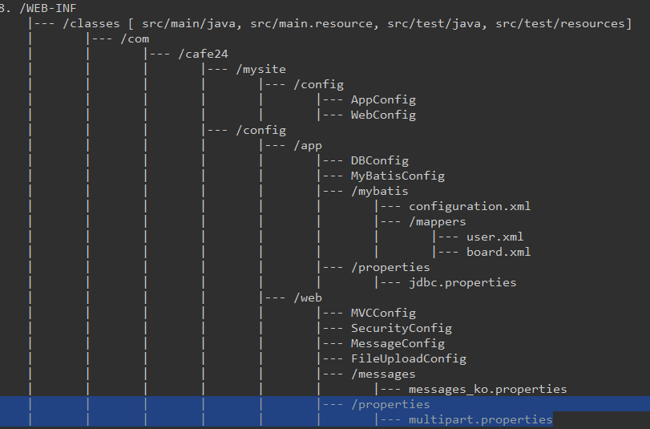

**FileuploadConfig.java** 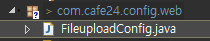

**pom.xml**

```xml
<!-- common fileupload -->
<dependency>
    <groupId>commons-fileupload</groupId>
    <artifactId>commons-fileupload</artifactId>
    <version>1.2.1</version>
</dependency>
<dependency>
    <groupId>commons-io</groupId>
    <artifactId>commons-io</artifactId>
    <version>1.4</version>
</dependency>
```

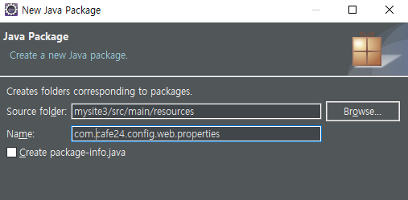

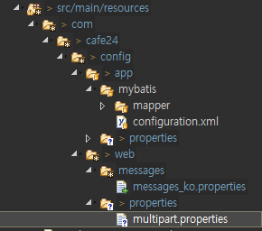

**multipart.properties**

```properties
maxUploadSize=52428800
maxInMemorySize=4096
defaultEncoding=utf-8
uploadLocation=/mysite-uploads/
resourceMapping=/images/**
```

**FileuploadConfig.java**

```java
package com.cafe24.config.web;

@Configuration
@PropertySource("classpath:com/cafe24/config/web/properties/multipart.properties")
@EnableWebMvc
public class FileuploadConfig extends WebMvcConfigurerAdapter {

    @Autowired
    private Environment env;

    // Multipart Resolver
    @Bean
    public CommonsMultipartResolver multipartResolver() {
        CommonsMultipartResolver multipartResolver = new CommonsMultipartResolver();

        multipartResolver.setMaxUploadSize(env.getProperty("maxUploadSize",Long.class));
        multipartResolver.setMaxInMemorySize(env.getProperty("maxInMemorySize",Integer.class));
        multipartResolver.setDefaultEncoding(env.getProperty("defaultEncoding"));

        return multipartResolver;
    }

    @Override
    public void addResourceHandlers(ResourceHandlerRegistry registry) {
        registry.addResourceHandler("/images/**").addResourceLocations("file:/mysite-uploads");
    }


}

```

**WebConfig.java** `@Import`추가

```java
@Import({MVCConfig.class, FileuploadConfig.class, MessageConfig.class, SecurityConfig.class})
```

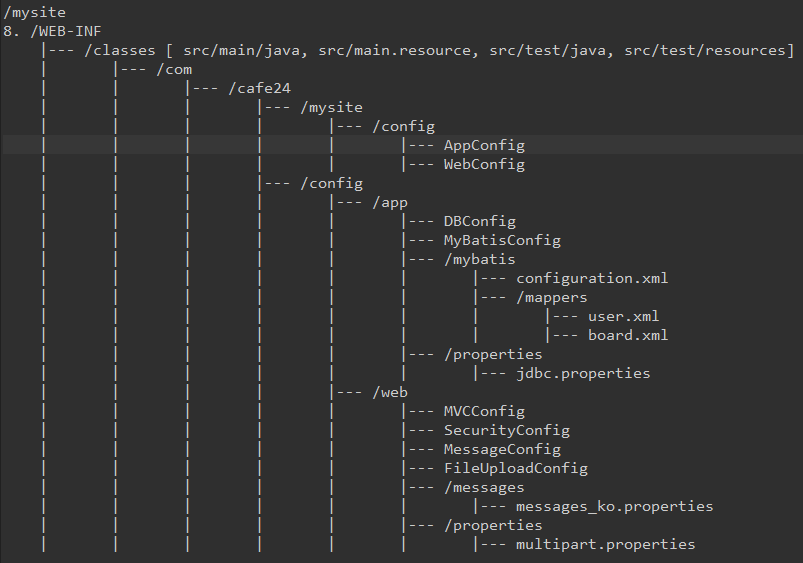


---

## Auth 오류 해결

WebConfig.java

```java
@ComponentScan({"com.cafe24.mysite.controller", "com.cafe24.mysite.exception"})
```

UserController.java

```java
@RequestMapping(value="/auth", method=RequestMethod.POST)
public void auth() {
}
@RequestMapping(value="/logout", method=RequestMethod.GET)
public void logout() {
}
```


