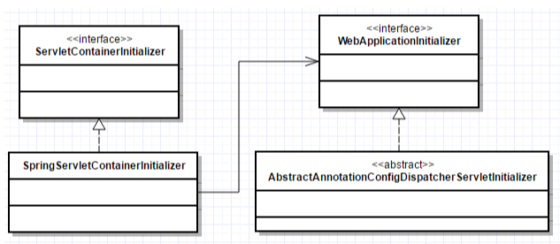
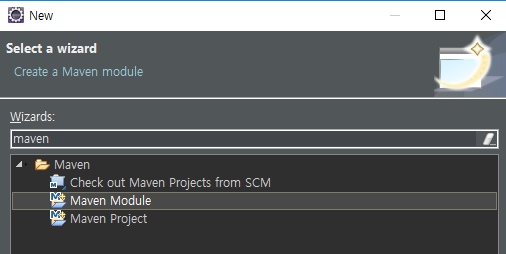
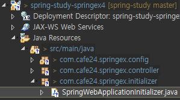

[TOC]


---




---

# Java Config  [2] 



## spring-study-springex4 - WebInitializer 버전

**web.xml** 간단하게!

```xml
<?xml version="1.0" encoding="UTF-8"?>
<web-app xmlns:xsi="http://www.w3.org/2001/XMLSchema-instance"
         xmlns="http://java.sun.com/xml/ns/javaee"
         xsi:schemaLocation="http://java.sun.com/xml/ns/javaee http://java.sun.com/xml/ns/javaee/web-app_3_0.xsd"
         version="3.0">
    <display-name>springex4</display-name>
    <welcome-file-list>
        <welcome-file>index.html</welcome-file>
        <welcome-file>index.htm</welcome-file>
        <welcome-file>index.jsp</welcome-file>
        <welcome-file>default.html</welcome-file>
        <welcome-file>default.htm</welcome-file>
        <welcome-file>default.jsp</welcome-file>
    </welcome-file-list>
</web-app>
```


### :ballot_box_with_check: WebApplicationInitializer 

new pacakge - com.cafe24.springex.initializer

**SpringWebApplicationInitializer.java**

#### AbstractAnnotationConfigDispatcherServletInitializer

```java
public class SpringWebApplicationInitializer extends AbstractAnnotationConfigDispatcherServletInitializer {
	@Override
	protected Class<?>[] getRootConfigClasses() {
		return null;
	}

	@Override
	protected Class<?>[] getServletConfigClasses() {
		return new Class<?>[] {WebConfig.class};
	}

	@Override
	protected String[] getServletMappings() {
		// servlet 매핑
		return new String[] { "/" };
	}
}
```

