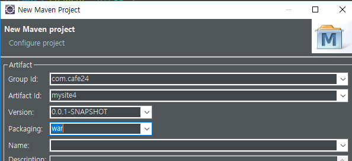
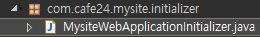

[TOC]


---



mysite4 

**web.xml**

```xml
<?xml version="1.0" encoding="UTF-8"?>
<web-app xmlns:xsi="http://www.w3.org/2001/XMLSchema-instance"
         xmlns="http://java.sun.com/xml/ns/javaee"
         xsi:schemaLocation="http://java.sun.com/xml/ns/javaee http://java.sun.com/xml/ns/javaee/web-app_3_0.xsd"
         version="3.0">
    <display-name>mysite4</display-name>

    <!-- 공통 에러 페이지 -->
    <error-page>
        <error-code>404</error-code>
        <location>/WEB-INF/views/error/404.jsp</location>
    </error-page>
    <error-page>
        <error-code>500</error-code>
        <location>/WEB-INF/views/error/500.jsp</location>
    </error-page>
</web-app>
```


## WebApplicationInitializer

new pacakge  - com.cafe24.mysite.initializer

**MysiteWebApplicationInitializer.java** 

```java
public class MysiteWebApplicationInitializer extends AbstractAnnotationConfigDispatcherServletInitializer {
    @Override
    protected String[] getServletMappings() {
        //servlet 매핑
        return new String[] {"/"};
    }

    @Override
    protected Class<?>[] getRootConfigClasses() {
        // root Application Context
        return new Class<?>[] { AppConfig.class };
    }

    @Override
    protected Class<?>[] getServletConfigClasses() {
        // Web Application Context
        return new Class<?>[] { WebConfig.class };
    }

    @Override
    protected Filter[] getServletFilters() {
        // Filter
        return new Filter[] { new CharacterEncodingFilter("UTF-8", true) };
    }

    @Override
    protected FrameworkServlet createDispatcherServlet(WebApplicationContext servletAppContext) {
        //createDispatcherServlet
        DispatcherServlet dispatcherServlet = (DispatcherServlet) super.createDispatcherServlet(servletAppContext);
        // exception hadler가 없으면 error 던진다 true
        dispatcherServlet.setThrowExceptionIfNoHandlerFound(true);
        return dispatcherServlet;
    }

}
```

### 