[TOC]

---

```
springboot
	|-- springboot-springex
	|-- springboot-mysite
	|-- springboot-jblog
```


# springboot

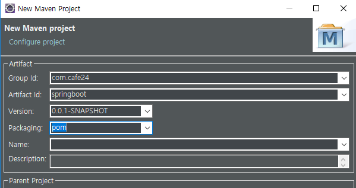

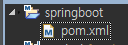

**pom.xml**

```xml
<project xmlns="http://maven.apache.org/POM/4.0.0"
         xmlns:xsi="http://www.w3.org/2001/XMLSchema-instance"
         xsi:schemaLocation="http://maven.apache.org/POM/4.0.0 http://maven.apache.org/xsd/maven-4.0.0.xsd">
    <modelVersion>4.0.0</modelVersion>
    <groupId>com.cafe24</groupId>
    <artifactId>springboot</artifactId>
    <version>0.0.1-SNAPSHOT</version>
    <packaging>pom</packaging>

    <parent>
        <groupId>org.springframework.boot</groupId>
        <artifactId>spring-boot-starter-parent</artifactId>
        <version>2.1.3.RELEASE</version>
    </parent>

    <dependencies>
        <dependency>
            <groupId>org.springframework.boot</groupId>
            <artifactId>spring-boot-starter</artifactId>
        </dependency>
        <dependency>
            <groupId>org.springframework.boot</groupId>
            <artifactId>spring-boot-devtools</artifactId>
        </dependency>
    </dependencies>

    <build>
        <plugins>
            <plugin>
                <groupId>org.springframework.boot</groupId>
                <artifactId>spring-boot-maven-plugin</artifactId>
            </plugin>
        </plugins>
    </build>
    <modules>
        <module>springboot-springex</module>
        <module>springboot-mysite</module>
        <module>springboot-test</module>
    </modules>
</project>
```


---

## |-- springboot-springex

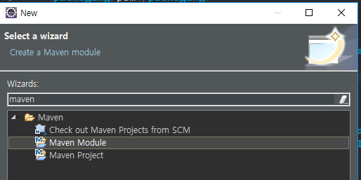

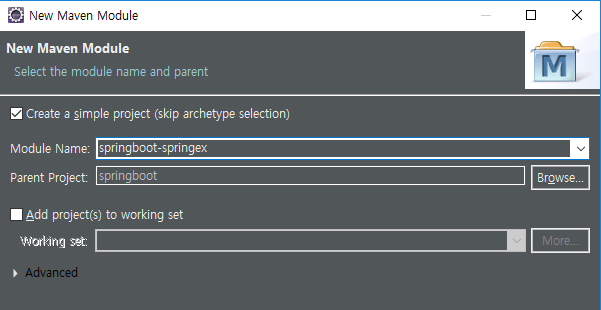

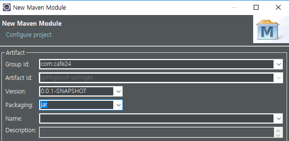

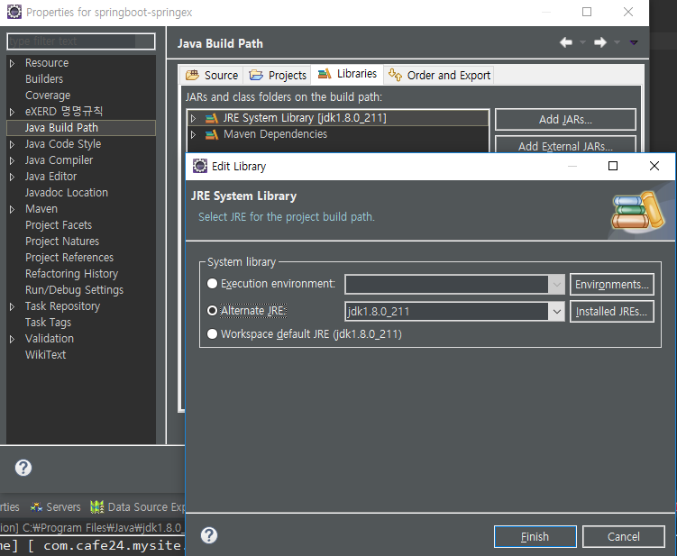


**pom.xml**

```xml
<project xmlns="http://maven.apache.org/POM/4.0.0" xmlns:xsi="http://www.w3.org/2001/XMLSchema-instance" xsi:schemaLocation="http://maven.apache.org/POM/4.0.0 http://maven.apache.org/xsd/maven-4.0.0.xsd">
    <modelVersion>4.0.0</modelVersion>
    <parent>
        <groupId>com.cafe24</groupId>
        <artifactId>springboot</artifactId>
        <version>0.0.1-SNAPSHOT</version>
    </parent>

    <artifactId>springboot-springex</artifactId>

    <dependencies>
        <dependency>
            <groupId>org.springframework.boot</groupId>
            <artifactId>spring-boot-starter-web</artifactId>
        </dependency>
        <dependency>
            <groupId>org.apache.tomcat.embed</groupId>
            <artifactId>tomcat-embed-jasper</artifactId>
        </dependency>
    </dependencies>

</project>
```

new package

**BootApplication.java**  

```java
@SpringBootConfiguration
@EnableAutoConfiguration
@ComponentScan("com.cafe24.springex.controller")
public class BootApplication {
	public static void main(String[] args) {
		SpringApplication.run(BootApplication.class, args);
	}
}
```

---

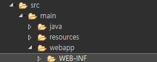

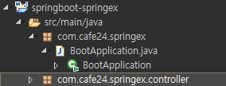

---

new file

**application.properties**   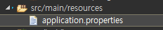

```properties
spring.profile.active=develope

server.port=8888

spring.mvc.servlet.path=/
```


**BootApplication.java**

```java
@SpringBootApplication
public class BootApplication {
	
	public static void main(String[] args) {
		SpringApplication.run(BootApplication.class, args);
	}
}
```

---

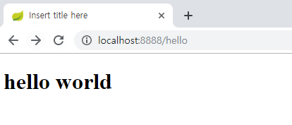


---


---

## |-- springboot-mysite

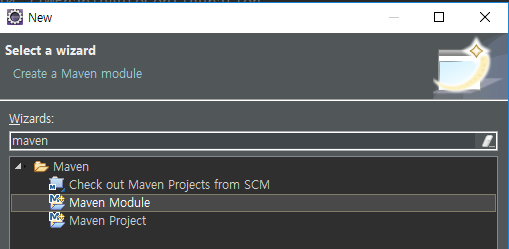

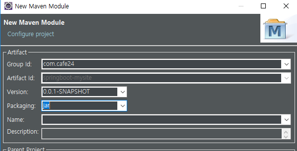

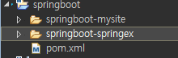

**pom.xml**

```xml
<project xmlns="http://maven.apache.org/POM/4.0.0"
         xmlns:xsi="http://www.w3.org/2001/XMLSchema-instance"
         xsi:schemaLocation="http://maven.apache.org/POM/4.0.0 http://maven.apache.org/xsd/maven-4.0.0.xsd">
    <modelVersion>4.0.0</modelVersion>
    <artifactId>springboot-mysite</artifactId>
    <packaging>jar</packaging>

    <parent>
        <groupId>com.cafe24</groupId>
        <artifactId>springboot</artifactId>
        <version>0.0.1-SNAPSHOT</version>
    </parent>

    <dependencies>
        <dependency>
            <groupId>org.springframework.boot</groupId>
            <artifactId>spring-boot-starter-web</artifactId>
        </dependency>
        <dependency>
            <groupId>org.apache.tomcat.embed</groupId>
            <artifactId>tomcat-embed-jasper</artifactId>
        </dependency>
    </dependencies>

</project>
```

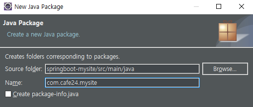

**BootApp.java**  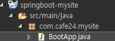

```java
@SpringBootApplication
public class BootApp {
	public static void main(String[] args) {
		SpringApplication.run(BootApp.class, args);
	}
}
```

---

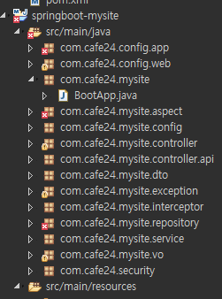

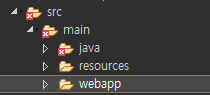

---

라이브러리 추가

**pom.xml**

```xml
<dependencies>
    <!-- Spring Web(MVC) -->
    <dependency>
        <groupId>org.springframework.boot</groupId>
        <artifactId>spring-boot-starter-web</artifactId>
    </dependency>

    <!-- Spring AOP(AspectJ) -->
    <dependency>
        <groupId>org.springframework.boot</groupId>
        <artifactId>spring-boot-starter-aop</artifactId>
    </dependency>

    <!-- MyBatis Starter -->
    <dependency>
        <groupId>org.mybatis.spring.boot</groupId>
        <artifactId>mybatis-spring-boot-starter</artifactId>
        <version>1.3.2</version>
    </dependency>

    <!-- Common DBCP -->
    <dependency>
        <groupId>commons-dbcp</groupId>
        <artifactId>commons-dbcp</artifactId>
        <version>1.4</version>
    </dependency>

    <!-- mariaDB java Client -->
    <dependency>
        <groupId>org.mariadb.jdbc</groupId>
        <artifactId>mariadb-java-client</artifactId>
    </dependency>

    <!-- JSTL -->
    <dependency>
        <groupId>javax.servlet</groupId>
        <artifactId>jstl</artifactId>
    </dependency>
    <dependency>
        <groupId>org.apache.tomcat.embed</groupId>
        <artifactId>tomcat-embed-jasper</artifactId>
    </dependency>
</dependencies>
```

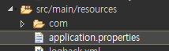

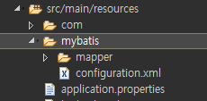

**configuration.xml**

```xml
<?xml version="1.0" encoding="UTF-8" ?>
<!DOCTYPE configuration PUBLIC "-//mybatis.org//DTD Config 3.0//EN" "http://mybatis.org/dtd/mybatis-3-config.dtd">
<configuration>
    <typeAliases>
        <typeAlias alias="uservo" type="com.cafe24.mysite.vo.UserVo" />
        <typeAlias alias="guestbookvo"
                   type="com.cafe24.mysite.vo.GuestbookVo" />
        <typeAlias alias="boardvo"
                   type="com.cafe24.mysite.vo.BoardVo" />
        <typeAlias alias="fcri"
                   type="com.cafe24.mysite.dto.FindCriteria" />
        <typeAlias alias="sitevo" type="com.cafe24.mysite.vo.SiteVo" />
    </typeAliases>
    <mappers>
        <mapper
                resource="mybatis/mapper/user.xml" />
        <mapper
                resource="mybatis/mapper/guestbook.xml" />
        <mapper
                resource="mybatis/mapper/board.xml" />
        <mapper
                resource="mybatis/mapper/admin.xml" />
    </mappers>
</configuration>
```


**application.properties**

```properties
spring.profile.active=develope

# Server
server.port=8080
server.context-path=/

# devtools - pom.xml에 추가(jsp수정 바로 반영)
spring.devtools.livereload.enabled=true

# data source
spring.datasource.driver-class-name=org.mariadb.jdbc.Driver
spring.datasource.url=jdbc:mariadb://192.168.1.52:3307/webdb
spring.datasource.username=webdb
spring.datasource.password=webdb

# mvc
spring.mvc.view.prefix=/WEB-INF/views/
spring.mvc.view.suffix=.jsp

# mybatis
mybatis.config-location=classpath:mybatis/configuration.xml

# http
spring.http.encoding.charset=UTF-8
spring.http.encoding.enabled=true
spring.http.encoding.forced=true
spring.http.encoding.forced-request=true
spring.http.encoding.forced-response=true

# logging 위치 바꾸고 싶다~ 설정 
logging.config=classpath:logback.xml

# multipart
spring.servlet.multipart.enabled=true
spring.servlet.multipart.max-file-size=50MB
spring.servlet.multipart.max-request-size=50MB

# Internationalization(Message Source)
spring.messages.always-use-message-format=true
spring.messages.basename=messages/messages_ko
spring.messages.encoding=UTF-8

# AOP
# add @EnableAspectJAutoProxy
spring.aop.auto=true
spring.aop-proxy-target-class=true

# security
```

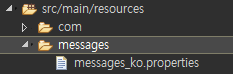

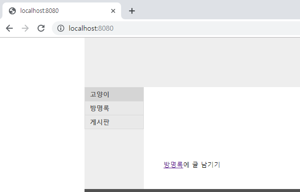

---

### - WebConfig

```java
package com.cafe24.mysite.config;

@Configuration
public class WebConfig implements WebMvcConfigurer {

    // Message Converter
    @Bean
    public MappingJackson2HttpMessageConverter mappingJackson2HttpMessageConverter() {
        Jackson2ObjectMapperBuilder builder = new Jackson2ObjectMapperBuilder().indentOutput(true)
            .dateFormat(new SimpleDateFormat("yyyy-MM-dd")).modulesToInstall(new ParameterNamesModule());

        MappingJackson2HttpMessageConverter converter = new MappingJackson2HttpMessageConverter(builder.build());

        converter.setSupportedMediaTypes(Arrays.asList(new MediaType("application", "json", Charset.forName("UTF-8"))));

        return converter;
    }

    @Bean
    public StringHttpMessageConverter stringHttpMessageConverter() {
        StringHttpMessageConverter converter = new StringHttpMessageConverter();
        converter.setSupportedMediaTypes(Arrays.asList(new MediaType("text", "html", Charset.forName("UTF-8"))));
        return converter;
    }

    @Override
    public void configureMessageConverters(List<HttpMessageConverter<?>> converters) {
        converters.add(mappingJackson2HttpMessageConverter());
        converters.add(stringHttpMessageConverter());
    }


    // Argument Resolver
    @Bean
    public AuthUserHandlerMethodArgumentResolver authUserHandlerMethodArgumentResolver() {
        return new AuthUserHandlerMethodArgumentResolver();
    }

    @Override
    public void addArgumentResolvers(List<HandlerMethodArgumentResolver> argumentResolvers) {
        argumentResolvers.add(authUserHandlerMethodArgumentResolver());
    }


    // Interceptor
    @Bean
    public AuthLoginInterceptor authLoginInterceptor() {
        return new AuthLoginInterceptor();
    }

    @Bean
    public AuthLogoutInterceptor authLogoutInterceptor() {
        return new AuthLogoutInterceptor();
    }

    @Bean
    public AuthInterceptor authInterceptor() {
        return new AuthInterceptor();
    }

    @Override
    public void addInterceptors(InterceptorRegistry registry) {
        registry
            .addInterceptor(authLoginInterceptor())
            .addPathPatterns("/user/auth");

        registry
            .addInterceptor(authLogoutInterceptor())
            .addPathPatterns("/user/logout");

        registry
            .addInterceptor(authInterceptor())
            .addPathPatterns("/**")
            .excludePathPatterns("/user/auth")
            .excludePathPatterns("/user/logout")
            .excludePathPatterns("/assets/**");
    }

    @Override
    public void addResourceHandlers(ResourceHandlerRegistry registry) {
        registry.addResourceHandler("/images/**").addResourceLocations("file:/mysite-uploads/");
    }

}

```

**AuthLoginInterceptor.java** 경로 변경

```java
response.sendRedirect(request.getContextPath() + "/");
```


