[TOC]


---

톰캣 서비스 부분과 젠킨스 두개로 분리 ! 

WAS(Tomcat) - war파일 실행시켜줌(servlet..) -> only jvm에서 도는 언어들

	> web server가 하는 일을 하기도함(css, image) 
	>
	> 톰캣만 가지고도 웹서비스 가능하긴함


web server - 자바 빼고 거의 다 프로그램 실행

> 기본역할 - static(동적이미지, js, css .. ), dynamic programming


**톰캣이 웹서버 역할도 할수있는데 왜 두개를 붙여서 사용할거야!?**

**[1]** 따로 처리 --> :x:

1. 정적 - apache

2. 동적(java) - tomcat

   > 아파치와 톰캣을 TCP/IP 소켓으로 연결을 했겠지
   >
   > 일단 모든 요청은 아파치가 받아
   >
   > 아파치가 요청을보고 내가 처리할 요청이 아니면(join) 통째로 톰캣에 넘김

===> 이건 별로 방법!!!!!!!!!!!!!!!!!!!!!!!!!!!!!!!!!!!!!!!!!!!!!!!!!!!!!!!!!!!!!!!!!!!!!!!!!!!!!!!!!!


**[2]** 방화벽 --> :x:

tomcat에 80포트 열려있으면 뭔가 불안해할수도있어.. 그래서 80포트를 막아버려 

tomcat에 방화벽을 쳐버려, 방화벽 안에 있는 모든 것은 포트를 열면 안돼!(이쪽으로 아예 못들어오게!!!Inbound!!! 나가는건 할수있어)

그리고 apache에는 아무나 다 들어올수있어! 그리고 apache가 포트 열고 기다리면 톰캣이 찔러서 연결을 맺어 (out bound)  

===> 이것도 별로인 방법!!!!!!!!!!!!!!!!!!!!!!!!!!!!!!!!!!!!!!!!!!!!!!!!!!!!!!!!!!!!!!!!!!!!!!!!!!!!!!!!!!


**[3]** 분산 --> :o:

아파치가 분산!(로드밸런서 역할)

톰캣이 서버를 늘렸을 때, DNS에서 요청을 분산시키는 방법도 있는데

아파치를 톰캣 앞에 두고 아파치가 분산


---

# Tomcat Multi Instance

## 경로 링크걸기

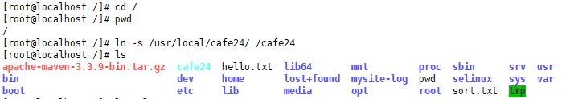


```
/cafe24
	|-- tomcat -> tomcat8
	|-- tomcat-jenkins
	|-- tomcat-cafe24
lib, jar파일 등은 tomcat껄 tomcat-jenkins, tomcat-cafe24가 같이씀
config, webapp같은건 각자 갖고있고!
```

일단 tomcat꺼 전부 카피해오기


## tomcat-jenkins

`mkdir tomcat-jenkins`

`cd tomcat-jenkins/`

`cp -R ../tomcat8/* .`

#### 필요없는 설정파일 지우기

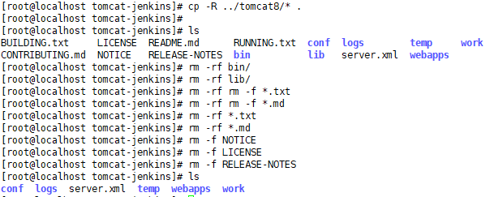

---

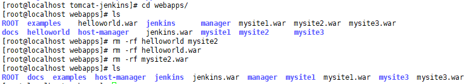

---

#### conf 변경

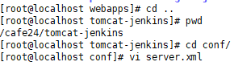

> 1. port
>
>    > 
>
>    그냥 8 다 9로 바꾸기

#### startup.sh, shutdown.sh


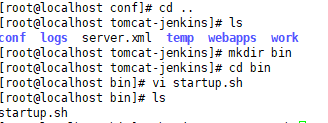

```
#!/usr/bin/env bash
export CATALINA_BASE=/usr/local/cafe24/tomcat-jenkins
export JAVA_OPTS="-Djava.awt.headless=true -server -Xms512m -Xmx1024m -XX:NewSize=256m -XX:MaxNewSize=256m -XX:PermSize=256m -XX:MaxPermSize=512m -XX:+DisableExplicitGC"
export CATALINA_OPTS="-Denv=product -Denv.servername=jenkins"
$CATALINA_HOME/bin/catalina.sh start
```

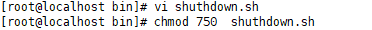

```
#!/usr/bin/env bash

export CATALINA_BASE=/usr/local/cafe24/tomcat-jenkins
export JAVA_OPTS="-Djava.awt.headless=true -server -Xms512m -Xmx1024m -XX:NewSize=256m -XX:MaxNewSize=256m -XX:PermSize=256m -XX:MaxPermSize=512m -XX:+DisableExplicitGC"
export CATALINA_OPTS="-Denv=product -Denv.servername=jenkins"
$CATALINA_HOME/bin/catalina.sh stop
```


#### 방화벽 port 열기


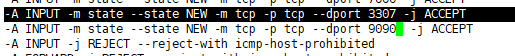

#### 재시작

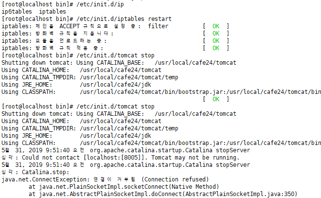

#### jenkins 시작

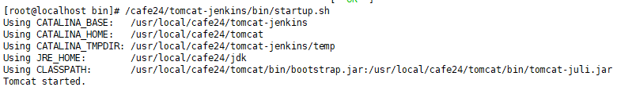

---


---

## tomcat-cafe24

#### mkdir

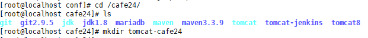


#### tomcat8 복사, 삭제

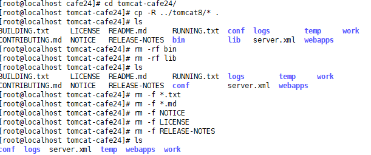


#### server.xml  8080->80으로 고치기

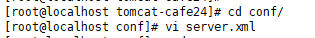

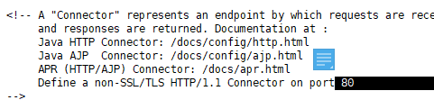

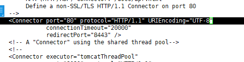


####  startup.sh, shutdown.sh

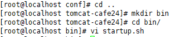

```
#!/usr/bin/env bash
export CATALINA_BASE=/usr/local/cafe24/tomcat-cafe24
export JAVA_OPTS="-Djava.awt.headless=true -server -Xms512m -Xmx1024m -XX:NewSize=256m -XX:MaxNewSize=256m -XX:PermSize=256m -XX:MaxPermSize=512m -XX:+DisableExplicitGC"
export CATALINA_OPTS="-Denv=product -Denv.servername=cafe24"
$CATALINA_HOME/bin/catalina.sh start

```

`vi shutdown.sh`

```
#!/usr/bin/env bash
export CATALINA_BASE=/usr/local/cafe24/tomcat-cafe24export JAVA_OPTS="-Djava.awt.headless=true -server -Xms512m -Xmx1024m -XX:NewSize=256m -XX:MaxNewSize=256m -XX:PermSize=256m -XX:MaxPermSize=512m -XX:+DisableExplicitGC"
export CATALINA_OPTS="-Denv=product -Denv.servername=cafe24"
$CATALINA_HOME/bin/catalina.sh stop

```

```
[root@localhost bin]# chmod 750 startup.sh 
[root@localhost bin]# chmod 750 shutdown.sh 
```


#### restart

`# [root@localhost bin]# vi /etc/sysconfig/iptables`

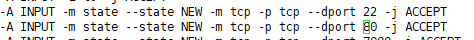

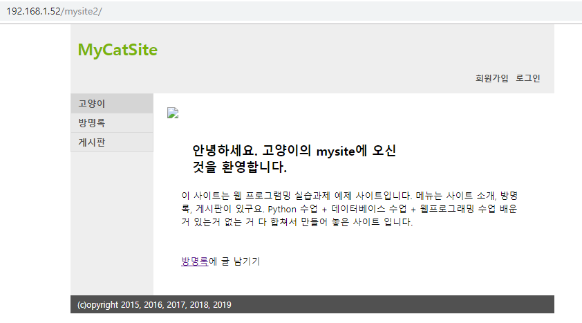


#### 내리기

`# /cafe24/tomcat-cafe24/bin/shutdown.sh`


---

---

#### demo script 파일 수정

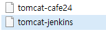

### tomcat-cafe24

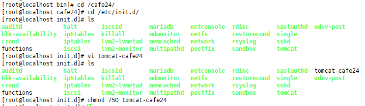

```
#!/bin/sh 
# 
# Startup script for Tomcat for HMO
# 
# chkconfig: 35 85 35 
# description: Start Tomcat 
# 
# processname: tomcat 
# 
# Source function library. 

. /etc/rc.d/init.d/functions 

export JAVA_HOME=/usr/local/cafe24/jdk
export CLASSPATH=.:$JAVA_HOME/lib/tools.jar
export CATALINA_HOME=/usr/local/cafe24/tomcat
export PATH=$PATH:$JAVA_HOME/bin

case "$1" in 

	start) 

		echo -n "Starting tomcat-cafe24: " 
		daemon /usr/local/cafe24/tomcat-cafe24/bin/startup.sh 
		touch /var/lock/subsys/tomcat-cafe24
		echo
		;; 
	stop) 
		echo -n "Shutting down tomcat-cafe24: " 
		daemon /usr/local/cafe24/tomcat-cafe24/bin/shutdown.sh 
		rm -f /var/lock/subsys/tomcat-cafe24 
		echo 
		;; 
	restart) 
		$0 stop
		sleep 2 
		$0 start 
		;; 
	*) 
		echo "Usage: $0 {start|stop|restart}" 
		exit 1 
esac 
exit 0
```


### tomcat 지우고 tomcat-cafe24 올리기

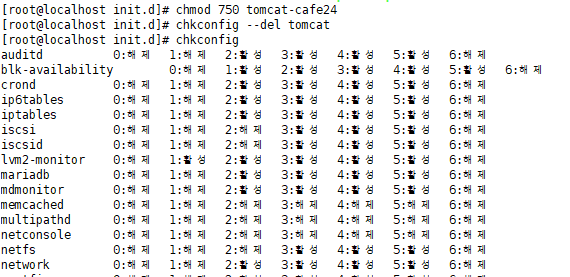

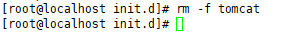

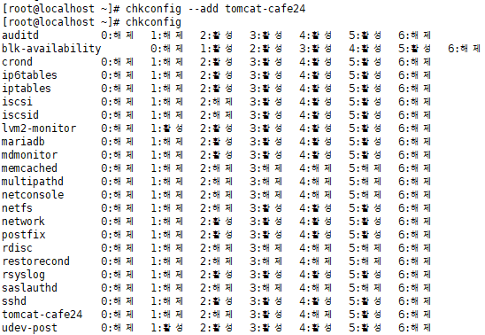


### 실행해보기 tomcat-cafe24

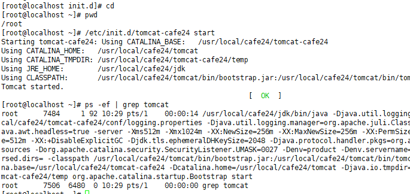

**내리기** 

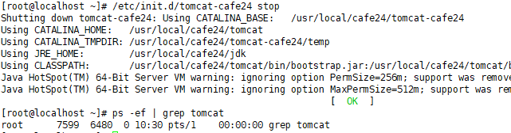


### tomcat-jenkins 올리기

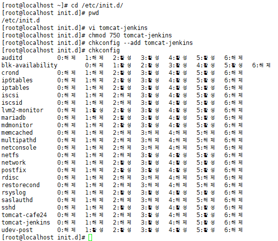

```visual basic
#!/bin/sh 
# 
# Startup script for Tomcat for HMO
# 
# chkconfig: 35 87 37 
# description: Start Tomcat 
# 
# processname: tomcat 
# 
# Source function library. 

. /etc/rc.d/init.d/functions 

export JAVA_HOME=/usr/local/cafe24/jdk
export CLASSPATH=.:$JAVA_HOME/lib/tools.jar
export CATALINA_HOME=/usr/local/cafe24/tomcat
export PATH=$PATH:$JAVA_HOME/bin:/usr/local/cafe24/maven/bin

case "$1" in 

	start) 

		echo -n "Starting tomcat-jenkins: " 
		daemon /usr/local/cafe24/tomcat-jenkins/bin/startup.sh 
		touch /var/lock/subsys/tomcat-jenkins 
		echo
		;; 
	stop) 
		echo -n "Shutting down tomca-jenkins: " 
		daemon /usr/local/cafe24/tomcat-jenkins/bin/shutdown.sh 
		rm -f /var/lock/subsys/tomcat-jenkins 
		echo 
		;; 
	restart) 
		$0 stop
		sleep 2 
		$0 start 
		;; 
	*) 
		echo "Usage: $0 {start|stop|restart}" 
		exit 1 
esac 
exit 0

```

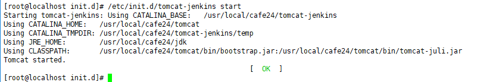

---

### 젠킨스 지우기

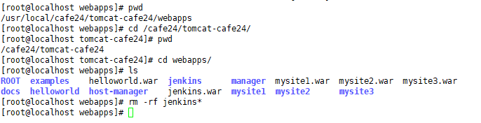


## jenkins 빌드

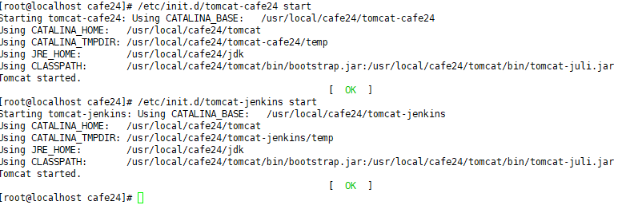


> 실패!

## **mysite2 - pom.xml** 포트 변경

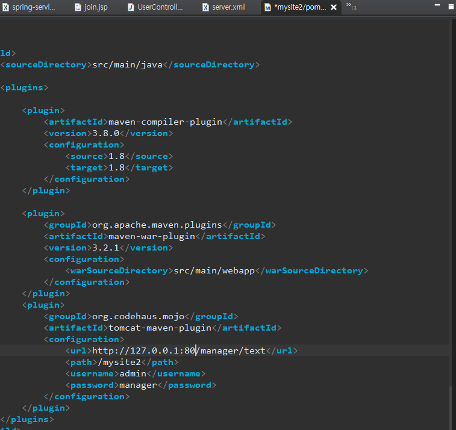

> 성공
>
> 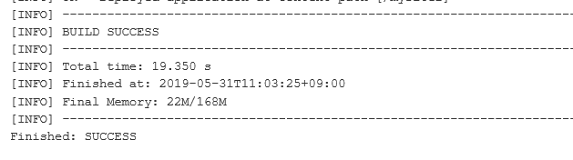


---

### tomcat dir 정리

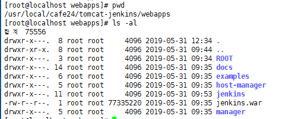

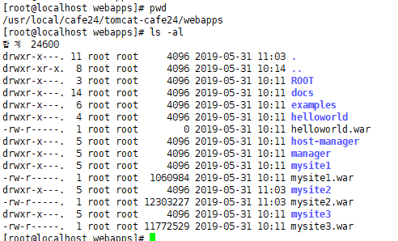


-jenkins

-cafe24