[TOC]

---

# 개념

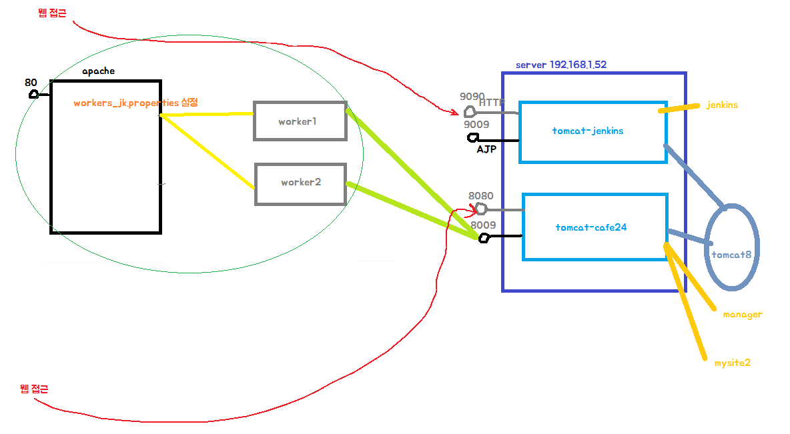

> 8080 포트는 닫는게 좋음! 많이 열수록 안좋아

> 젠킨스에서 빌드할경우
>
> `uriworkermap.properties` 파일에 `/manager/text` 설정 해주고
>
> 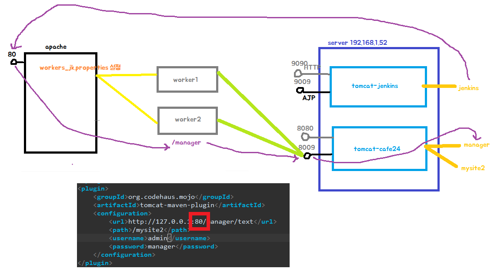


**mod_jk**

아파치와 톰캣이 연동하기 위해선 **AJP**를 통해 서로 통신을 하여야 한다.

AJP란, 아파치가 웹서버와 외부서비스(톰캣)를 연동하기 위해 정한 규약(프로토콜)이다. 

아파치는 이를 사용하여 포트 80으로 들어오는 요청은 자신이 받고, 이 요청 중 서블릿을 필요로 하는 요청은 톰캣에 넘겨 처리한다.

아파치, 톰캣 연동을 위해 **mod_jk**라는 모듈을 사용하는데, 이는 AJP프로토콜을 사용하여 톰캣과 연동하기 위해 만들어진 모듈이다.

mod_jk는 톰캣의 일부로 배포되지만, 아파치 웹서버에 설치하여야 한다.

**동작 방식**

1. 아파치 웹서버의 httpd.conf에 톰캣 연동을 위한 설정을 추가하고 톰캣에서 처리할 요청을 지정한다.

2. 사용자의 브라우저는 아파치 웹서버(보통 포트80)에 접속해 요청한다.

3. 아파치 웹서버는 사용자의 요청이 톰캣에서 처리하도록 지정된 요청인지 확인 후, 톰캣에서 처리해야 하는 경우 아파치 웹서버는 톰캣의 AJP포트(보통 8009포트)에 접속해 요청을 전달한다.

4. 톰캣은 아파치 웹서버로부터 요청을 받아 처리한 후, 처리 결과를 아파치 웹서버에 되돌려 준다.

5. 아파치 웹서버는 톰캣으로부터 받은 처리 결과를 사용자에게 전송한다.


---

# Apache linux 설치

## 1 설치

```shell
yum -y install net-tools
yum -y install bind-utils
yum -y install ntsysv
yum -y install wget
yum -y install unzip
yum -y install make cmake 
yum -y install gcc g++ cpp gcc-c++ 
yum -y install perl 
yum -y install ncurses-devel 
yum -y install bison 
yum -y install zlib curl 
yum -y install openssl openssl-devel 
yum -y install bzip2-devel 
yum -y install libtermcap-devel libc-client-devel
yum -y install httpd-devel
```


## 2 SELINUX 설정 disabled로 변경

```shell
1. vi /etc/selinux/config

2. SELINUX=disabled 

3. 재부팅
```

**1** :     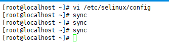

**2** :     

**3** :     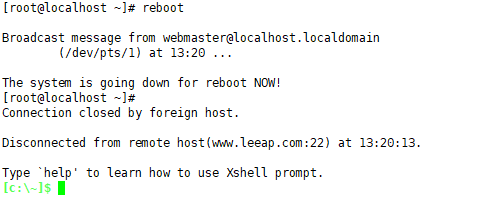

---


##  3 Apache 컴파일 설치

apache 2.2.8.tar.gz

<http://archive.apache.org/dist/httpd/>


`wget http://archive.apache.org/dist/httpd/httpd-2.2.8.tar.gz`

`tar xvfz httpd-2.2.8.tar.gz`

`cd httpd-2.2.8`

```shell
CFLAGS=" -DHARD_SERVER_LIMIT=1024 -DDEFAULT_SERVER_LIMIT=1024 -DHARD_SERVER_LIMIT=1024 -DDEFAULT_SERVER_LIMIT=1024"; export CFLAGS 
./configure --prefix=/usr/local/cafe24/apache --with-mpm=worker --enable-so --disable-access --enable-access=shared --disable-auth --enable-auth=shared --disable-include --enable-include=shared --disable-log-config --enable-log-config=shared --disable-env --enable-env=shared --disable-setenvif --enable-setenvif=shared --disable-mime --enable-mime=shared --disable-status --enable-status=shared --disable-autoindex --enable-autoindex=shared -disable-asis --enable-asis=shared --disable-cgi --disable-cgid --enable-cgid=shared --disable-negotiation --enable-negotiation=shared --disable-dir --enable-dir=shared --disable-imap --enable-imap=shared --disable-actions --enable-actions=shared --disable-userdir --enable-userdir=shared --disable-alias --enable-alias=shared --enable-mods-shared=all 
```


---

### :x: 여긴 건너뛰기 :x:

`make ` : 오류:x: 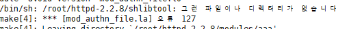

>  참고사이트(egloos.zum.com/js7309/v/11081643)

`yum install -y apr*`

다시 `make` 또 오류 :x:

삭제하고 다시

```shell
rm -rf httpd-2.2.8
tar xvfz httpd-2.2.8.tar.gz
cd httpd-2.2.8
```

```shell
CFLAGS=" -DHARD_SERVER_LIMIT=1024 -DDEFAULT_SERVER_LIMIT=1024 -DHARD_SERVER_LIMIT=1024 -DDEFAULT_SERVER_LIMIT=1024"; export CFLAGS 
./configure --prefix=/usr/local/cafe24/apache --with-mpm=worker --enable-so --disable-access --enable-access=shared --disable-auth --enable-auth=shared --disable-include --enable-include=shared --disable-log-config --enable-log-config=shared --disable-env --enable-env=shared --disable-setenvif --enable-setenvif=shared --disable-mime --enable-mime=shared --disable-status --enable-status=shared --disable-autoindex --enable-autoindex=shared -disable-asis --enable-asis=shared --disable-cgi --disable-cgid --enable-cgid=shared --disable-negotiation --enable-negotiation=shared --disable-dir --enable-dir=shared --disable-imap --enable-imap=shared --disable-actions --enable-actions=shared --disable-userdir --enable-userdir=shared --disable-alias --enable-alias=shared --enable-mods-shared=all 
```

`make` ---> 또 오류!! :x:

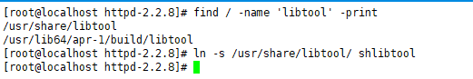

`make clean`

`make`

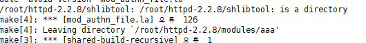

---


---

### :star::o: ​오류 해결 :o: 

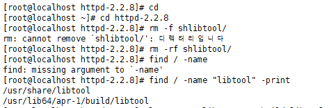

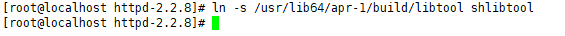

​								`ln -s /usr/lib64/apr-1/build/libtool shlibtool`

`make clean`

`make`

---

`make install`

---

#### 기존 tomcat-cafe24 port변경

-> apache 기본 port가 80이여서

`cd /cafe24`

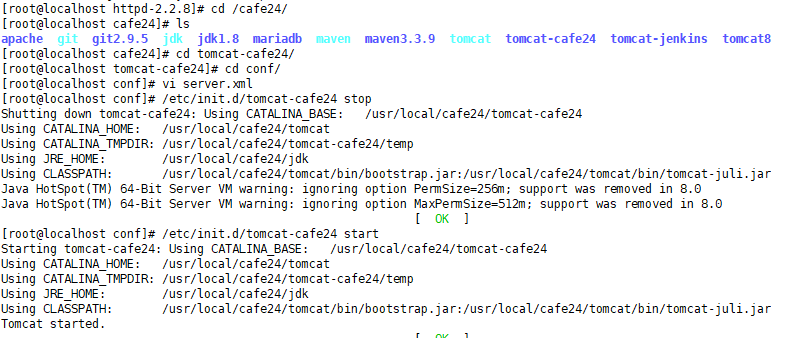

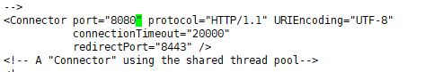

> ///// apache 설치후 실행 해볼것.. 실행 안될시 
> ///// /usr/local/apache/lib 이동, ln -s /usr/local/lib/libiconv.so.2 libiconv.so.2 


#### 8080, 80 방화벽 열기

` vi /etc/sysconfig/iptables`

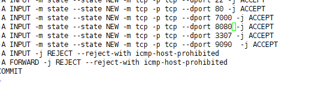

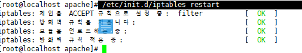


### 들어가보기! & 수정 index.html

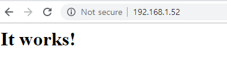


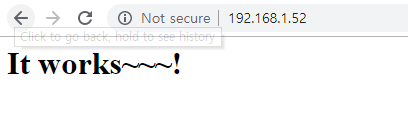

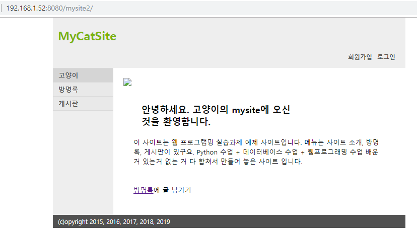

---


---

## 4 mod-jk 빌드

다운로드 : http://tomcat.apache.org/download-connectors.cgi 

```shell
wget http://mirror.navercorp.com/apache/tomcat/tomcat-connectors/jk/tomcat-connectors-1.2.46-src.tar.gz

tar xvfz tomcat-connectors-1.2.46-src.tar.gz

cd tomcat-connectors-1.2.46-src

cd native

# 컴파일
./configure --with-apxs=/usr/local/cafe24/apache/bin/apxs

```

`make`

`make install`

`cd /cafe24/apache/`

`cd conf`

`vi httpd.conf`

> port 바꾸고 싶으면 여기서 바꿔
>
> 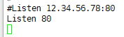
>
> 

## 5 httpd.conf 설정

```shell
LoadModule jk_module modules/mod_jk.so 
```

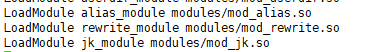

```shell
2.
# 대문자 G치면 맨아래 가는데 거기다 붙여넣기
# mod_jk
<IfModule mod_jk.c>
JkWorkersFile conf/workers_jk.properties
JkShmFile run/mod_jk.shm
JkLogFile logs/mod_jk.log

JkLogLevel info
JkLogStampFormat "[%a %b %d %H:%M:%S %Y] "

JkMountFile conf/uriworkermap.properties
</IfModule> 
```

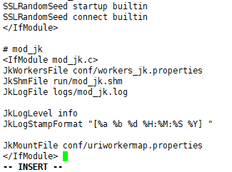


## 6 workers_jk.properties 설정

새창 켜서 해보장

workers 나누는거!

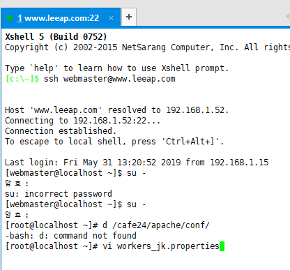

아래는 worker1이랑 woker2가 사실상 같은 서버 같은 포트 똑같은 곳 가리킴

같은 서버의 다른 톰캣이라면 port번호를 다르게,

다른 서버라면 포트번호 같아도되는데 host(ip)를 다르게 설정하면 됨

```shell
worker.list=worker1, worker2

# server1
worker.worker1.port=8009
worker.worker1.host=localhost
worker.worker1.type=ajp13
worker.worker1.lbfactor=1

# server 2
worker.worker2.port=8009
worker.worker2.host=localhost
worker.worker2.type=ajp13
worker.worker2.lbfactor=1 
```

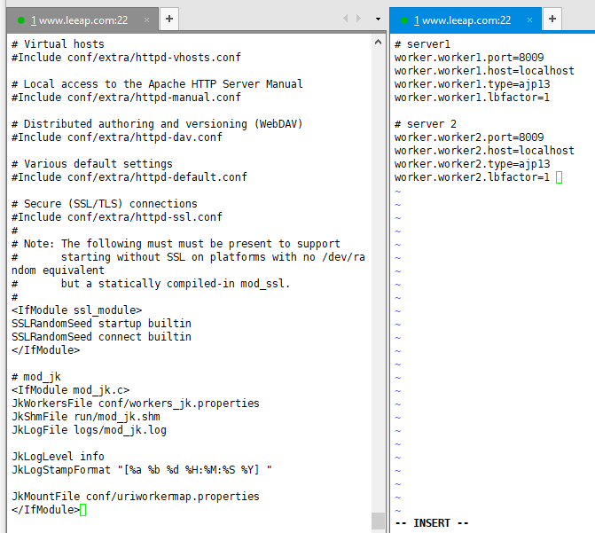


## 7 uriworkermap.properties

`vi uriworkermap.properties`

```shell
## Mapping the URI
/helloworld*=worker1
/mysite2*=worker2
## /mysite2/api*=worker3  : api만 받는 서버 나누고싶다?
:
```

/helloworld는 worker1으로

/mysite2는 worker2로

---


## 8 tomcat의 server.xml

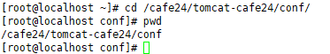

`vi server.xml`

```shell
 <!-- Define an AJP 1.3 Connector on port 8009 -->
<Connector port="8009" protocol="AJP/1.3" redirectPort="8443" URIEncoding="UTF-8"/>
```

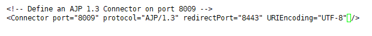

---


## 9 실행

restart


`# /cafe24/apache/bin/apachectl start`

---

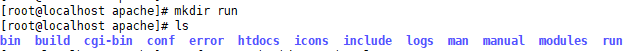


> error

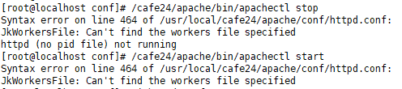

 uriworkermap.properties와 workers_jk.properties가

`/cafe24/apache/conf` 밑에 있어야하는데 `~`에 있었음

> ```
> mv /root/workers_jk.properties .
> mv /root/uriworkermap.properties .
> ```


` /cafe24/apache/bin/apachectl start`

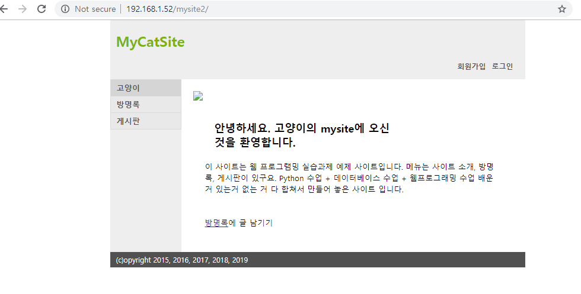

