[TOC]

apache chkconfig & virtual host


---

## apache chkconfig 올리기

`cd /etc/init.d`

`vi httpd`

```shell
#!/bin/bash
#
# httpd        Startup script for the Apache HTTP Server
#
# chkconfig: - 85 15
# description: The Apache HTTP Server is an efficient and extensible  \
#              server implementing the current HTTP standards.
# processname: httpd
# config: /etc/httpd/conf/httpd.conf
# config: /etc/sysconfig/httpd
# pidfile: /var/run/httpd/httpd.pid
#
### BEGIN INIT INFO
# Provides: httpd
# Required-Start: $local_fs $remote_fs $network $named
# Required-Stop: $local_fs $remote_fs $network
# Should-Start: distcache
# Short-Description: start and stop Apache HTTP Server
# Description: The Apache HTTP Server is an extensible server
#  implementing the current HTTP standards.
### END INIT INFO

# Source function library.
. /etc/rc.d/init.d/functions

if [ -f /etc/sysconfig/httpd ]; then
        . /etc/sysconfig/httpd
fi

# Start httpd in the C locale by default.
HTTPD_LANG=${HTTPD_LANG-"C"}

# This will prevent initlog from swallowing up a pass-phrase prompt if
# mod_ssl needs a pass-phrase from the user.
INITLOG_ARGS=""

# Set HTTPD=/usr/sbin/httpd.worker in /etc/sysconfig/httpd to use a server
# with the thread-based "worker" MPM; BE WARNED that some modules may not
# work correctly with a thread-based MPM; notably PHP will refuse to start.

# Path to the apachectl script, server binary, and short-form for messages.
apachectl=/usr/local/cafe24/apache/bin/apachectl
httpd=${HTTPD-/usr/local/cafe24/apache/bin/httpd}
prog=httpd
pidfile=${PIDFILE-/var/run/httpd/httpd.pid}
lockfile=${LOCKFILE-/var/lock/subsys/httpd}
RETVAL=0
STOP_TIMEOUT=${STOP_TIMEOUT-10}


# The semantics of these two functions differ from the way apachectl does
# things -- attempting to start while running is a failure, and shutdown
# when not running is also a failure.  So we just do it the way init scripts
# are expected to behave here.
start() {
        echo -n $"Starting $prog: "
        LANG=$HTTPD_LANG daemon --pidfile=${pidfile} $httpd $OPTIONS
        RETVAL=$?
        echo
        [ $RETVAL = 0 ] && touch ${lockfile}
        return $RETVAL
}

# When stopping httpd, a delay (of default 10 second) is required
# before SIGKILLing the httpd parent; this gives enough time for the
# httpd parent to SIGKILL any errant children.
stop() {
        status -p ${pidfile} $httpd > /dev/null
        if [[ $? = 0 ]]; then
                echo -n $"Stopping $prog: "
                killproc -p ${pidfile} -d ${STOP_TIMEOUT} $httpd
        else
                echo -n $"Stopping $prog: "
                success
        fi
        RETVAL=$?
        echo
        [ $RETVAL = 0 ] && rm -f ${lockfile} ${pidfile}
}

reload() {
    echo -n $"Reloading $prog: "
    if ! LANG=$HTTPD_LANG $httpd $OPTIONS -t >&/dev/null; then
        RETVAL=6
        echo $"not reloading due to configuration syntax error"
        failure $"not reloading $httpd due to configuration syntax error"
    else
        # Force LSB behaviour from killproc
        LSB=1 killproc -p ${pidfile} $httpd -HUP
        RETVAL=$?
        if [ $RETVAL -eq 7 ]; then
            failure $"httpd shutdown"
        fi
    fi
    echo
}

# See how we were called.
case "$1" in
  start)
        start
        ;;
  stop)
        stop
        ;;
  status)
        status -p ${pidfile} $httpd
        RETVAL=$?
        ;;
  restart)
        stop
        start
        ;;
  condrestart|try-restart)
        if status -p ${pidfile} $httpd >&/dev/null; then
                stop
                start
        fi
        ;;
  force-reload|reload)
        reload
        ;;
  graceful|help|configtest|fullstatus)
        $apachectl $@
        RETVAL=$?
        ;;
  *)
        echo $"Usage: $prog {start|stop|restart|condrestart|try-restart|force-reload|reload|status|fullstatus|graceful|help|configtest}"
        RETVAL=2
esac

exit $RETVAL
```

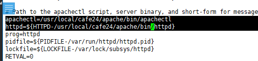


` /etc/init.d/httpd start` : 띄우기 

 == `/usr/local/cafe24/apache/bin/apachectl start`

`ps -ef | grep httpd`  : 확인

`chmod 755 httpd`

` chkconfig --add httpd`

> 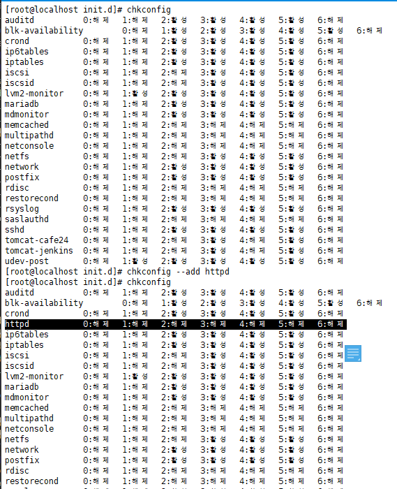

---

확인

`sync`

`sync`

`sync`

`reboot`

`chkconfig`

` ps -ef | grep httpd`

> 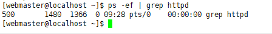
>
> > 안올라옴!!!!!
> >
> > 

`chkconfig --del httpd`

`chkconfig --add httpd`

`chkconfig httpd on`

`chkconfig`

> 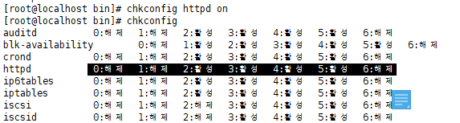

`sync`

`sync`

`sync`

`reboot`

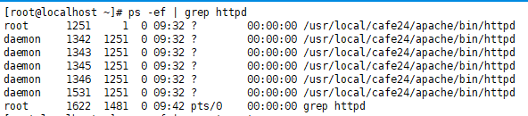

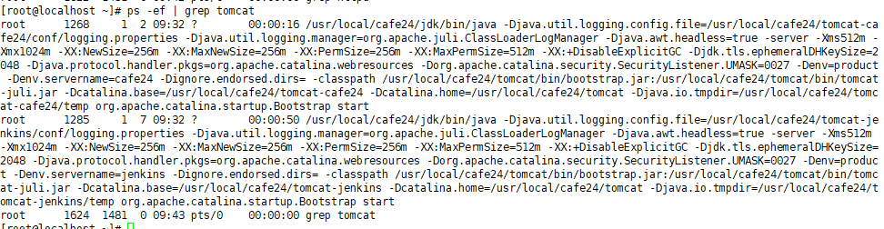

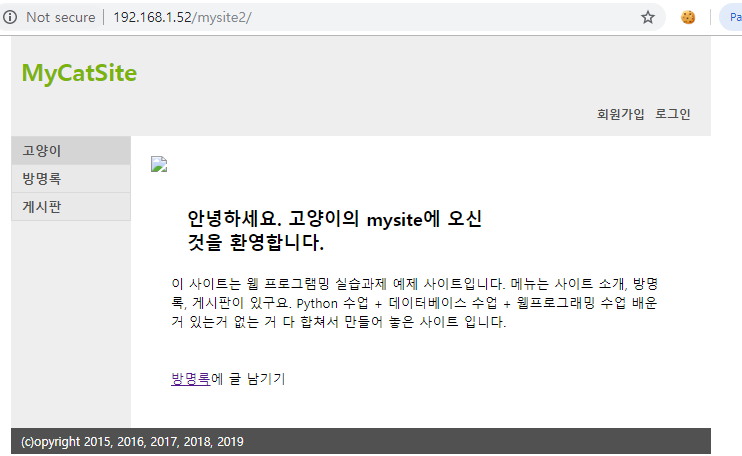

---


## virtual host

` vi /cafe24/apache/conf/extra/httpd-vhosts.conf`

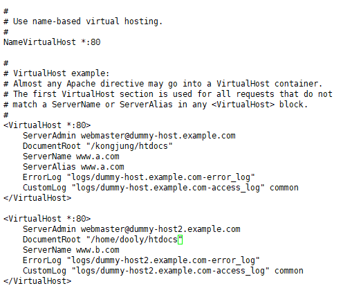


---

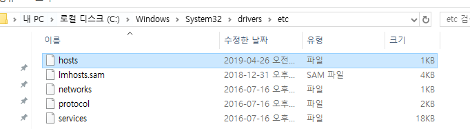

---


## `/etc/init.d/httpd stop` 오류

---

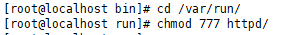

---

**httpd.pid가 만들어지는 위치 찾기**

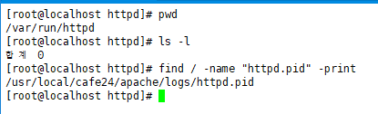

> `find / -name "httpd.pid" -print`
>
> :arrow_lower_right:/usr/local/cafe24/apache/logs/httpd.pid


**수정**

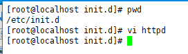

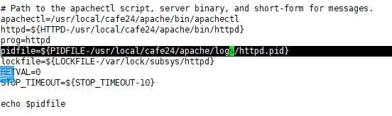


:star:이제 스탑 잘 된다!

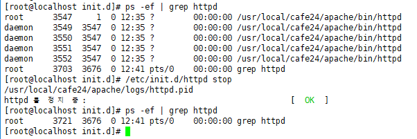


