[TOC]

---

## mysite2  빌드

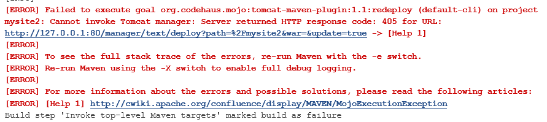

> 아직 80 manager를 안달아줌!

## mysite2 pom.xml -> port 변경

```xml
	<modelVersion>4.0.0</modelVersion>
	<artifactId>springboot-mysite</artifactId>
	<packaging>war</packaging> 

---
---

<plugin>
    <groupId>org.codehaus.mojo</groupId>
    <artifactId>tomcat-maven-plugin</artifactId>
    <configuration>
        <url>http://127.0.0.1:8080/manager/text</url>
        <path>/mysite2</path>
        <username>admin</username>
        <password>manager</password>
    </configuration>
</plugin>
```

> 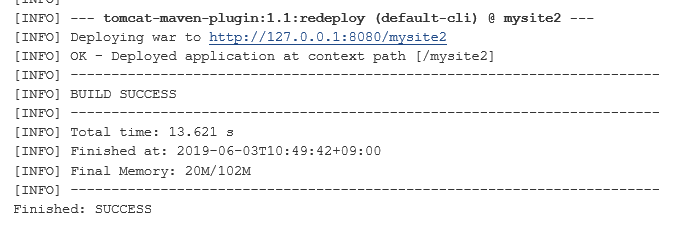

---


---

# spring boot - multi project

## Mysite Tomcat 배포 구성

springboot- mysite : **pom.xml** 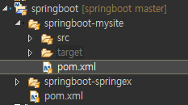

```xml
	<build>
		<finalName>${artifactId}</finalName>
		<plugins>
			<plugin>
				<artifactId>maven-war-plugin</artifactId>
				<configuration>
					<warSourceDirectory>src/main/webapp</warSourceDirectory>
				</configuration>
			</plugin>
			<plugin>
				<groupId>org.codehaus.mojo</groupId>
				<artifactId>tomcat-maven-plugin</artifactId>
				<configuration>
					<url>http://127.0.0.1:8080/manager/text</url>
					<path>/mysite5</path>
					<username>admin</username>
					<password>manager</password>
				</configuration>
			</plugin>
		</plugins>
	</build>
```


**BootInitializer.java**  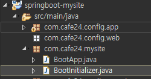

```java
@EnableAutoConfiguration
public class BootInitializer extends SpringBootServletInitializer {
	@Override
	protected SpringApplicationBuilder configure(SpringApplicationBuilder builder) {
		return builder.sources(BootApp.class);
	}
}
```

---


---

## Jenkins 배포

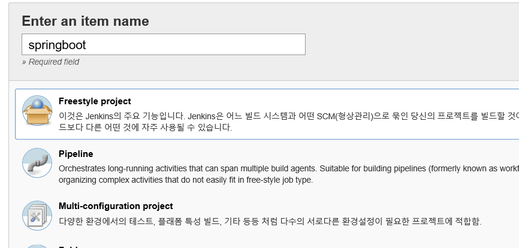

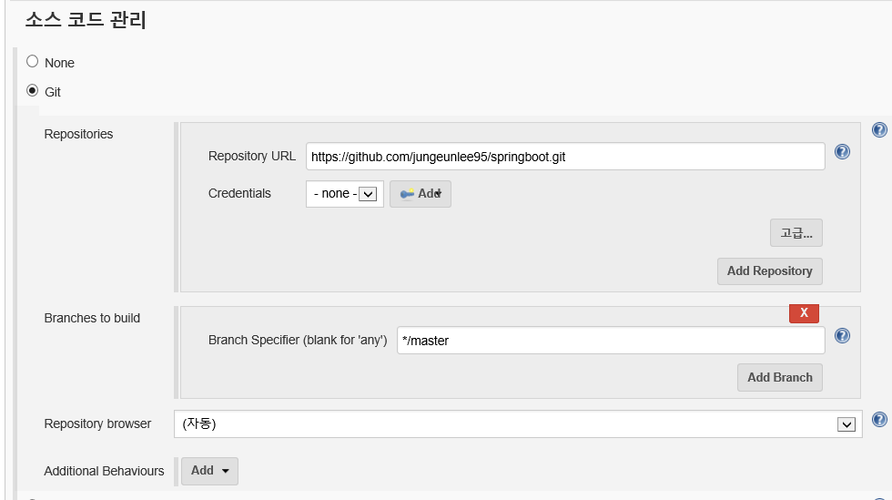

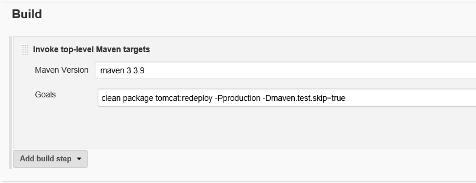

---


---

## Build Now

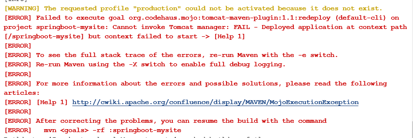

### :x: error!!!!  -> `tail -f catalina.out`

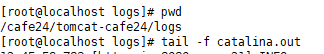

`tail -f catalina.out`


**새창**

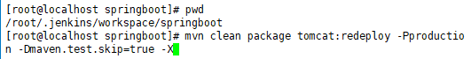

`/usr/lcoal/cafe24/maven/bin/mvn mvn clean package tomcat:redeploy -Pproduction -Dmaven.test.skip=true`


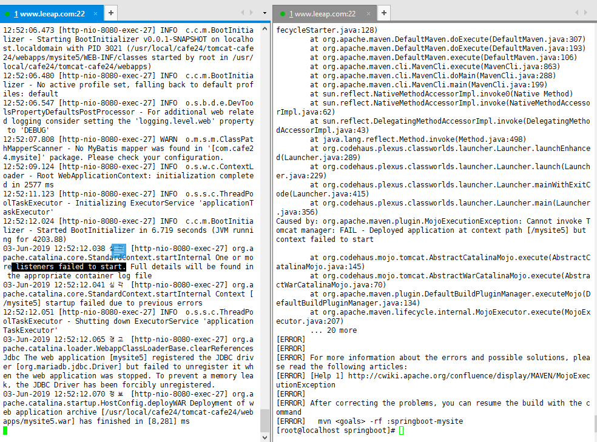

> application이 뜨면서 error가 생김!!!! listerners의 문제!!!!!!!
>
> springboot-mysite 의 web.xml을 지워버려!!!!!!!!!!!!
>
> 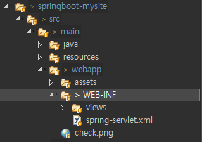

---

빠른확인!!!

`cd /cafe24/tomcat-cafe24/webapps/`

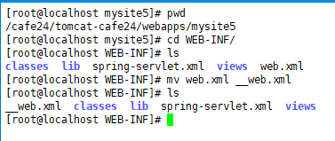

`/etc/init.d/tomcat-cafe24 stop`

`/etc/init.d/tomcat-cafe24 start`


### :star: ​error 해결

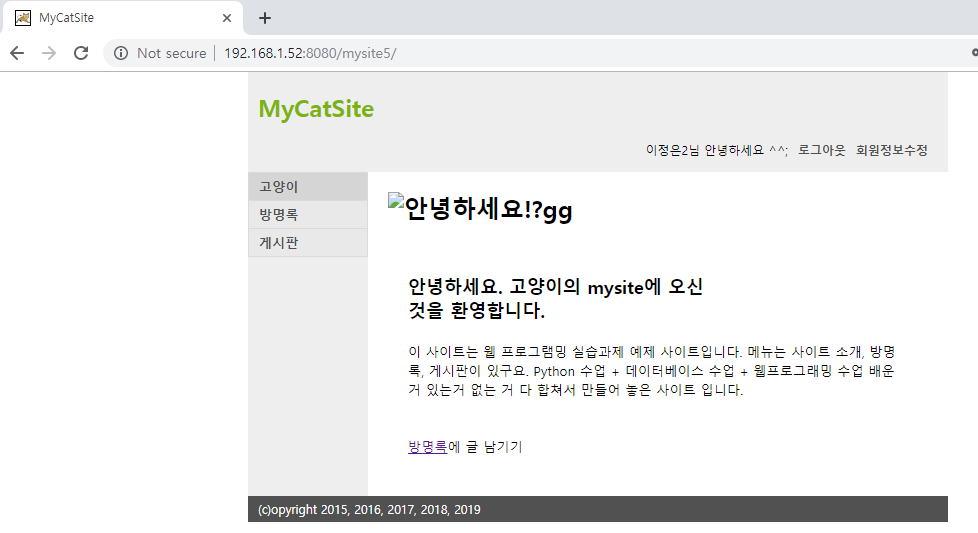

---


---

## Jenkins Build Now 다시


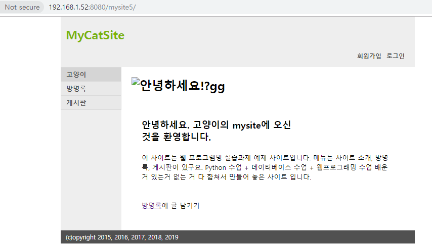


