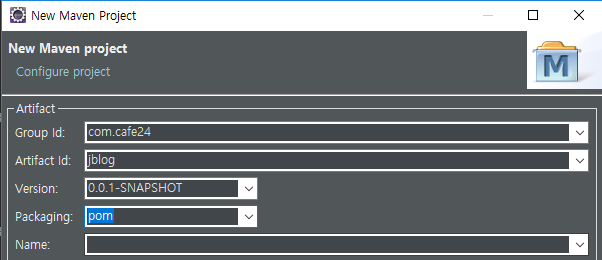
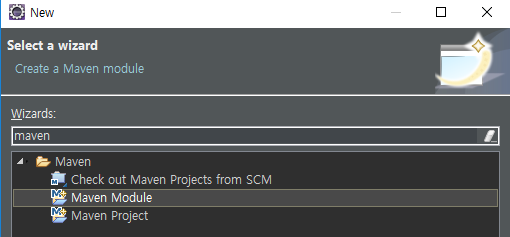
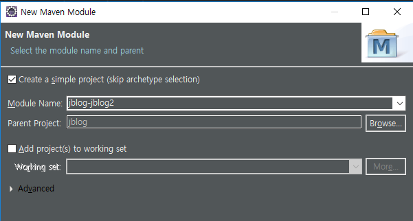
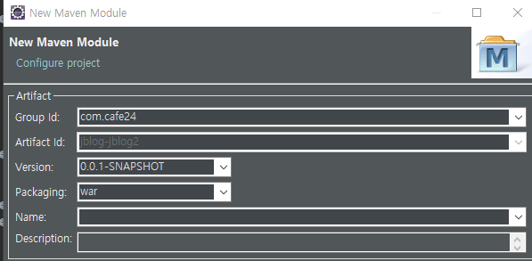
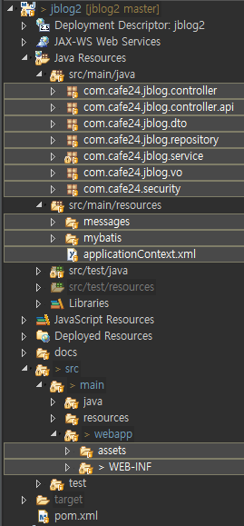

[TOC]


---

jblog

-jblog2 web.xml기반, xml 설정

-jblog3 web.xml기반 java config 설정

-jblog4 application initializer기반 java config설정

-jblog5 spring boot, application.properties 기반 + java config

---


# 1. jblog multi project 만들기



```xml
<project xmlns="http://maven.apache.org/POM/4.0.0"
	xmlns:xsi="http://www.w3.org/2001/XMLSchema-instance"
	xsi:schemaLocation="http://maven.apache.org/POM/4.0.0 http://maven.apache.org/xsd/maven-4.0.0.xsd">
	<modelVersion>4.0.0</modelVersion>
	<groupId>com.cafe24</groupId>
	<artifactId>jblog</artifactId>
	<version>0.0.1-SNAPSHOT</version>
	<packaging>pom</packaging>
	
	<properties>
		<project.build.sourceEncoding>UTF-8</project.build.sourceEncoding>
		<project.reporting.outputEncoding>UTF-8</project.reporting.outputEncoding>
		<org.springframework-version>4.3.1.RELEASE</org.springframework-version>
	</properties>

	<dependencies>
	
		<!-- Spring Core -->
		<dependency>
			<groupId>org.springframework</groupId>
			<artifactId>spring-context</artifactId>
			<version>${org.springframework-version}</version>
		</dependency>
		
		<!-- Spring Web -->
		<dependency>
			<groupId>org.springframework</groupId>
			<artifactId>spring-web</artifactId>
			<version>${org.springframework-version}</version>
		</dependency>
		
		<!-- Spring Web MVC -->
		<dependency>
			<groupId>org.springframework</groupId>
			<artifactId>spring-webmvc</artifactId>
			<version>${org.springframework-version}</version>
		</dependency>

	</dependencies>

	<build>
		<sourceDirectory>src/main/java</sourceDirectory>

		<plugins>
			<plugin>
				<artifactId>maven-compiler-plugin</artifactId>
				<version>3.8.0</version>
				<configuration>
					<source>1.8</source>
					<target>1.8</target>
				</configuration>
			</plugin>
		</plugins>
	</build>
	<modules>
		<module>jblog-jblog2</module>
	</modules>
</project>
```


## 2. jblog maven module








### sources 옮겨오기




**pom.xml**

```xml
<project xmlns="http://maven.apache.org/POM/4.0.0" xmlns:xsi="http://www.w3.org/2001/XMLSchema-instance" xsi:schemaLocation="http://maven.apache.org/POM/4.0.0 http://maven.apache.org/xsd/maven-4.0.0.xsd">
  <modelVersion>4.0.0</modelVersion>
  <parent>
    <groupId>com.cafe24</groupId>
    <artifactId>jblog</artifactId>
    <version>0.0.1-SNAPSHOT</version>
  </parent>
  <artifactId>jblog-jblog2</artifactId>
  <packaging>war</packaging>
  
  <dependencies>
  			<!-- mariadb java client -->
		<dependency>
			<groupId>org.mariadb.jdbc</groupId>
			<artifactId>mariadb-java-client</artifactId>
			<version>2.4.0</version> 
		</dependency>
  </dependencies>
  	<build>
		<plugins> 
			<plugin>
				<groupId>org.apache.maven.plugins</groupId>
				<artifactId>maven-war-plugin</artifactId>
				<version>3.2.1</version>
				<configuration>
					<warSourceDirectory>src/main/webapp</warSourceDirectory>
				</configuration>
			</plugin>
		</plugins>
	</build>
  
</project>
```


