[TOC]

---

# jblog3 

# - web.xml 기반 java config 버전

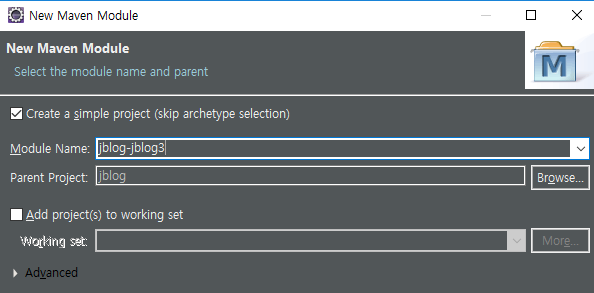

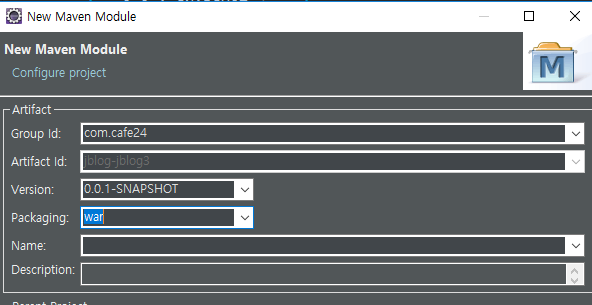

---


일단 jblog2꺼 복사해오기!!!


---

## 1 web.xml 설정

```xml
<?xml version="1.0" encoding="UTF-8"?>
<web-app xmlns:xsi="http://www.w3.org/2001/XMLSchema-instance"
         xmlns="http://java.sun.com/xml/ns/javaee"
         xsi:schemaLocation="http://java.sun.com/xml/ns/javaee http://java.sun.com/xml/ns/javaee/web-app_2_5.xsd"
         version="2.5">
    <display-name>jblog2</display-name>
    <welcome-file-list>
        <welcome-file>index.html</welcome-file>
        <welcome-file>index.htm</welcome-file>
        <welcome-file>index.jsp</welcome-file>
        <welcome-file>default.html</welcome-file>
        <welcome-file>default.htm</welcome-file>
        <welcome-file>default.jsp</welcome-file>
    </welcome-file-list>

    <context-param>
        <param-name>contextClass</param-name>
        <param-value>org.springframework.web.context.support.AnnotationConfigWebApplicationContext</param-value>
    </context-param>
    <context-param>
        <param-name>contextConfigLocation</param-name>
        <param-value>com.cafe24.mysite.config.AppConfig</param-value>
    </context-param>

    <!-- Context Loader Lister -->
    <listener>
        <listener-class>org.springframework.web.context.ContextLoaderListener</listener-class>
    </listener>

    <!-- Encoding filter -->
    <filter>
        <filter-name>encodingFilter</filter-name>
        <filter-class>org.springframework.web.filter.CharacterEncodingFilter</filter-class>
        <init-param>
            <param-name>encoding</param-name>
            <param-value>UTF-8</param-value>
        </init-param>
        <init-param>
            <param-name>forceEncoding</param-name>
            <param-value>true</param-value>
        </init-param>
    </filter>

    <filter-mapping>
        <filter-name>encodingFilter</filter-name>
        <url-pattern>/*</url-pattern>
    </filter-mapping>

    <!-- Dispatcher Servlet(Front Controller) -->
    <servlet>
        <servlet-name>spring</servlet-name>
        <servlet-class>org.springframework.web.servlet.DispatcherServlet</servlet-class>
        <init-param>
            <param-name>contextConfigLocation</param-name>
            <param-value>/WEB-INF/*-servlet.xml</param-value>
        </init-param>
    </servlet>

    <servlet-mapping>
        <servlet-name>spring</servlet-name>
        <url-pattern>/</url-pattern>
    </servlet-mapping>

    <!-- 공통 에러 페이지 -->
    <error-page>
        <error-code>404</error-code>
        <location>/WEB-INF/views/error/404.jsp</location>
    </error-page>
    <error-page>
        <error-code>500</error-code>
        <location>/WEB-INF/views/error/500.jsp</location>
    </error-page>

</web-app>
```


## 2 config 폴더 구조 & 설정


**AppConfig.java**   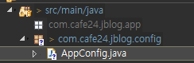

```java
@Configuration
public class AppConfig {
}
```

**DBConfig.java, MyBatisConfig.java**  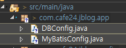

```java
@Configuration
public class MyBatisConfig {
}
```

```java
@Configuration
public class DBConfig {
}
```


## 3 기존 xml :arrow_right: config로

**DBConfig.java**

```java
@Configuration
@EnableTransactionManagement
public class DBConfig {
	@Bean
	public DataSource basicDataSource() {
		BasicDataSource basicDataSource = new BasicDataSource();
		basicDataSource.setDriverClassName("org.mariadb.jdbc.Driver");
		basicDataSource.setUrl("jdbc:mariadb://192.168.1.52:3307/jblog");
		basicDataSource.setUsername("jblog");
		basicDataSource.setPassword("jblog");
		basicDataSource.setInitialSize(10);
		basicDataSource.setMaxActive(100);
		return basicDataSource;
	}
	
	@Bean
	public PlatformTransactionManager transactionManager(DataSource dataSource) {
		return new DataSourceTransactionManager(dataSource);
	}
}
```

**MyBatisConfig.java**

```java
@Configuration
public class MyBatisConfig {

	@Bean
	public SqlSessionFactory sqlSessionFactoryBean(DataSource dataSource, ApplicationContext applicationContext)
			throws Exception {

		SqlSessionFactoryBean sqlSessionFactoryBean = new SqlSessionFactoryBean();

		sqlSessionFactoryBean.setDataSource(dataSource);
		sqlSessionFactoryBean.setConfigLocation(
				applicationContext.getResource("classpath:com/cafe24/config/app/mybatis/configuration.xml"));

		return sqlSessionFactoryBean.getObject();
	}

	@Bean
	public SqlSessionTemplate sqlSession(SqlSessionFactory sqlSessionFactory) {
		return new SqlSessionTemplate(sqlSessionFactory);
	}
}
```

---

**configuration.xml 만들기**

new pacakge

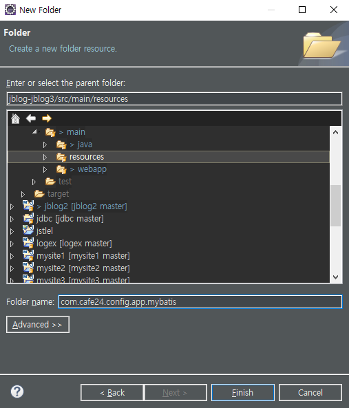

**configuration.xml** 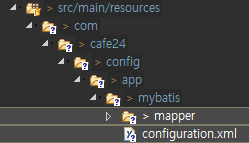

```xml
<configuration>
    <typeAliases>
        <typeAlias alias="uservo" type="com.cafe24.jblog.vo.UserVo" />
        <typeAlias alias="blogvo" type="com.cafe24.jblog.vo.BlogVo" />
        <typeAlias alias="categoryvo" type="com.cafe24.jblog.vo.CategoryVo" />
        <typeAlias alias="postvo" type="com.cafe24.jblog.vo.PostVo" />
    </typeAliases>

    <mappers>
        <mapper resource="com/cafe24/config/app/mybatis/mapper/user.xml" />
        <mapper resource="com/cafe24/config/app/mybatis/mapper/blog.xml" />
        <mapper resource="com/cafe24/config/app/mybatis/mapper/category.xml" />
    </mappers>
</configuration>
```

기존껀 삭제해도됨 ​ :arrow_right:  ​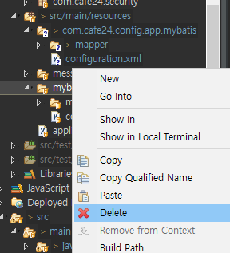

---


## 4 AppConfig.java

```java
@Configuration
@EnableAspectJAutoProxy
@ComponentScan({"com.cafe24.jblog.service","com.cafe24.jblog.repository"})
@Import({DBConfig.class, MyBatisConfig.class})
public class AppConfig {

}
```


## 5 web.xml  init-param 수정

```xml
	<!-- Dispatcher Servlet(Front Controller) -->
	<servlet>
		<servlet-name>spring</servlet-name>
		<servlet-class>org.springframework.web.servlet.DispatcherServlet</servlet-class>
		<init-param>
			<param-name>contextClass</param-name>
			<param-value>org.springframework.web.context.support.AnnotationConfigWebApplicationContext</param-value>
		</init-param>
		<init-param>
			<param-name>contextConfigLocation</param-name>
			<param-value>com.cafe24.jblog.config.WebConfig</param-value>
		</init-param>
		<load-on-startup>1</load-on-startup>
	</servlet>
```


## 6 WebConfig.java  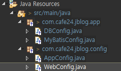

```java
@Configuration
@EnableWebMvc
@ComponentScan({ "com.cafe24.jblog.controller" })
public class WebConfig {
	@Bean
	public ViewResolver viewResolver() {
		InternalResourceViewResolver resolver = new InternalResourceViewResolver();
		resolver.setPrefix("/WEB-INF/views/");
		resolver.setSuffix(".jsp");
		resolver.setExposeContextBeansAsAttributes(true);

		return resolver;
	}
}
```


## 7  jdbc.properties  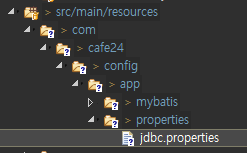

```properties
jdbc.driverClassName=org.mariadb.jdbc.Driver
jdbc.url=jdbc:mariadb://192.168.1.52:3307/jblog
jdbc.username=jblog
jdbc.password=jblog
jdbc.initialSize=10
jdbc.maxActive=100
```


## 8 **DBConfig.java** `@PropertySource` 추가, 수정

```java
@Configuration
@EnableTransactionManagement
@PropertySource("classpath:com/cafe24/config/app/properties/jdbc.properties")
public class DBConfig {
	
    @Autowired
    private Environment env;

	@Bean
	public DataSource basicDataSource() {
		BasicDataSource basicDataSource = new BasicDataSource();
		basicDataSource.setDriverClassName(env.getProperty("jdbc.driverClassName"));
		basicDataSource.setUrl(env.getProperty("jdbc.url"));
		basicDataSource.setUsername(env.getProperty("jdbc.username"));
		basicDataSource.setPassword(env.getProperty("jdbc.password"));
		basicDataSource.setInitialSize(env.getProperty("jdbc.initialSize", Integer.class));
		basicDataSource.setMaxActive(env.getProperty("jdbc.maxActive", Integer.class));
		return basicDataSource;
	}

	@Bean
	public PlatformTransactionManager transactionManager(DataSource dataSource) {
		return new DataSourceTransactionManager(dataSource);
	}

}
```


## 9 MVCConfig.java

**WebConfig.java Import 추가**

```java
@Import({MVCConfig.class})
```

**pom.xml** 추가 

```xml
<dependency> 
    <groupId>com.fasterxml.jackson.module</groupId>
    <artifactId>jackson-module-parameter-names</artifactId>
    <version>2.9.8</version>
</dependency>
```

**MVCConfig.java**  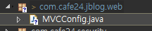

```java
import java.nio.charset.Charset;
import java.text.SimpleDateFormat;
import java.util.Arrays;
import java.util.List;


@Configuration
@EnableWebMvc
public class MVCConfig extends WebMvcConfigurerAdapter {

    // View Resolver
    @Bean
    public ViewResolver viewResolver() {
        InternalResourceViewResolver resolver = new InternalResourceViewResolver();
        resolver.setPrefix("/WEB-INF/views/");
        resolver.setSuffix(".jsp");
        resolver.setExposeContextBeansAsAttributes(true);

        return resolver;
    }

    // Default Servlet Handler
    @Override
    public void configureDefaultServletHandling(DefaultServletHandlerConfigurer configurer) {
        configurer.enable();
    }

    // Message Converter
    @Bean
    public MappingJackson2HttpMessageConverter mappingJackson2HttpMessageConverter() {
        Jackson2ObjectMapperBuilder builder = new Jackson2ObjectMapperBuilder().indentOutput(true)
            .dateFormat(new SimpleDateFormat("yyyy-MM-dd")).modulesToInstall(new ParameterNamesModule());

        MappingJackson2HttpMessageConverter converter = new MappingJackson2HttpMessageConverter(builder.build());

        converter.setSupportedMediaTypes(Arrays.asList(new MediaType("application", "json", Charset.forName("UTF-8"))));

        return converter;
    }

    @Bean
    public StringHttpMessageConverter stringHttpMessageConverter() {
        StringHttpMessageConverter converter = new StringHttpMessageConverter();
        converter.setSupportedMediaTypes(Arrays.asList(new MediaType("text", "html", Charset.forName("UTF-8"))));
        return converter;
    }

    @Override
    public void configureMessageConverters(List<HttpMessageConverter<?>> converters) {
        converters.add(mappingJackson2HttpMessageConverter());
        converters.add(stringHttpMessageConverter());
    }
}
```


## 10 SecurityConfig.java  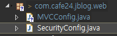

```java

@Configuration
@EnableWebMvc
public class SecurityConfig extends WebMvcConfigurerAdapter {

	// Argument Resolver
	@Bean
	public AuthUserHandlerMethodArgumentResolver authUserHandlerMethodArgumentResolver() {
		return new AuthUserHandlerMethodArgumentResolver();
	}

	@Override
	public void addArgumentResolvers(List<HandlerMethodArgumentResolver> argumentResolvers) {
		argumentResolvers.add(authUserHandlerMethodArgumentResolver());
	}

	// Interceptor
	@Bean
	public AuthLoginInterceptor authLoginInterceptor() {
		return new AuthLoginInterceptor();
	}

	@Bean
	public AuthLogoutInterceptor authLogoutInterceptor() {
		return new AuthLogoutInterceptor();
	}

	@Bean
	public AuthInterceptor authInterceptor() {
		return new AuthInterceptor();
	}

	@Override
	public void addInterceptors(InterceptorRegistry registry) {
		registry.addInterceptor(authLoginInterceptor()).addPathPatterns("/user/auth");

		registry.addInterceptor(authLogoutInterceptor()).addPathPatterns("/user/logout");

		registry.addInterceptor(authInterceptor()).addPathPatterns("/**").excludePathPatterns("/user/auth")
				.excludePathPatterns("/user/logout").excludePathPatterns("/assets/**");
	}
}

```


## 11 MessageConfig.java  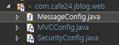

```java
@Configuration
public class MessageConfig {
    @Bean
    public MessageSource messageSource() {
        ResourceBundleMessageSource messageSource = new ResourceBundleMessageSource();
        messageSource.setBasename("com/cafe24/config/web/messages/messages_ko");
        messageSource.setDefaultEncoding("UTF-8");
        return messageSource;
    }
}
```


## 12 messages_ko.properties 옮기기

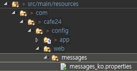


## 13 WebConfig Import 추가

```java
@EnableAspectJAutoProxy
@Import({MVCConfig.class, MessageConfig.class, SecurityConfig.class})
```


## 14 FileuploadConfig.java  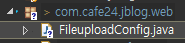

```java
package com.cafe24.jblog.web;

@Configuration 
@PropertySource("classpath:com/cafe24/config/web/properties/multipart.properties")
@EnableWebMvc
public class FileuploadConfig extends WebMvcConfigurerAdapter {
	@Autowired
	private Environment env;

	// Multipart Resolver
	@Bean
	public CommonsMultipartResolver multipartResolver() {
		CommonsMultipartResolver multipartResolver = new CommonsMultipartResolver();

		multipartResolver.setMaxUploadSize(env.getProperty("maxUploadSize", Long.class));
		multipartResolver.setMaxInMemorySize(env.getProperty("maxInMemorySize", Integer.class));
		multipartResolver.setDefaultEncoding(env.getProperty("defaultEncoding"));

		return multipartResolver;
	}

	@Override
	public void addResourceHandlers(ResourceHandlerRegistry registry) {
		registry.addResourceHandler(env.getProperty("resourceMapping")).addResourceLocations(env.getProperty("uploadLocation"));
	}

}
```


## 15 multipart.properties 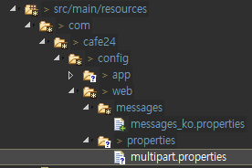

```properties
maxUploadSize=52428800
maxInMemorySize=4096
defaultEncoding=utf-8
uploadLocation=file:/jblog-uploads
resourceMapping=assets/image/**
```


## 16 WebConfig.java `@Import`추가

```java
@Import({MVCConfig.class, FileuploadConfig.class, MessageConfig.class, SecurityConfig.class})
```


## 17 Auth 오류 해결

**WebConfig.java**

```java
@ComponentScan({"com.cafe24.mysite.controller", "com.cafe24.mysite.exception"})
```

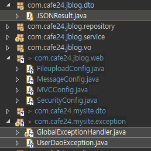

**UserController.java**

```java
@RequestMapping(value="/auth", method=RequestMethod.POST)
public void auth() {
}
@RequestMapping(value="/logout", method=RequestMethod.GET)
public void logout() {
}
```


## 18 applicationContext, spring-servlet 삭제

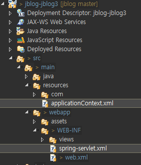


