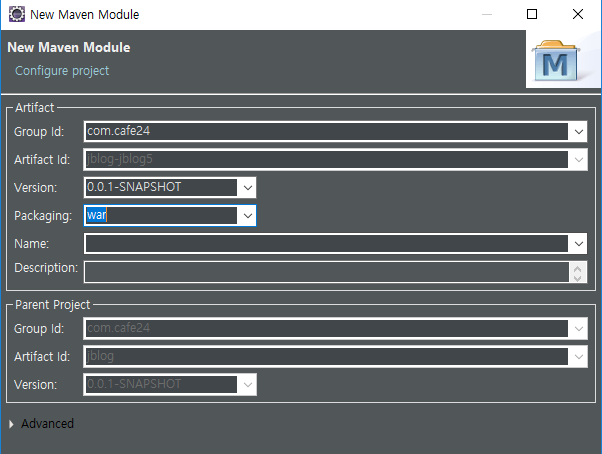
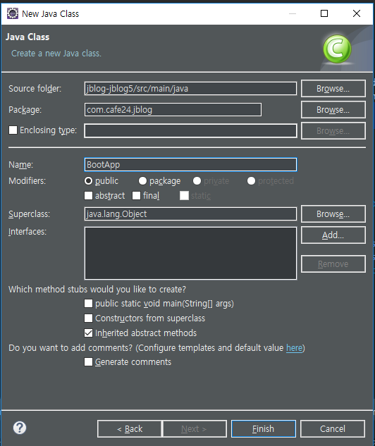
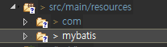
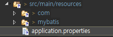
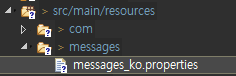

[TOC]

---

# jblog5 - Spring Boot



## 1. **jblog3 복사해오기**

## **2. pom.xml**

```xml
<project xmlns="http://maven.apache.org/POM/4.0.0"
         xmlns:xsi="http://www.w3.org/2001/XMLSchema-instance"
         xsi:schemaLocation="http://maven.apache.org/POM/4.0.0 http://maven.apache.org/xsd/maven-4.0.0.xsd">
    <modelVersion>4.0.0</modelVersion>
    <artifactId>jblog-jblog5</artifactId>
    <packaging>war</packaging>

    <parent>
        <groupId>org.springframework.boot</groupId>
        <artifactId>spring-boot-starter-parent</artifactId>
        <version>2.1.3.RELEASE</version>
    </parent>


    <dependencies>
        <dependency>
            <groupId>org.springframework.boot</groupId>
            <artifactId>spring-boot-starter</artifactId>
        </dependency>
        <dependency>
            <groupId>org.springframework.boot</groupId>
            <artifactId>spring-boot-devtools</artifactId>
        </dependency>
        <!-- Spring Web(MVC) -->
        <dependency>
            <groupId>org.springframework.boot</groupId>
            <artifactId>spring-boot-starter-web</artifactId>
        </dependency>

        <!-- Spring AOP(AspectJ) -->
        <dependency>
            <groupId>org.springframework.boot</groupId>
            <artifactId>spring-boot-starter-aop</artifactId>
        </dependency>

        <!-- MyBatis Starter -->
        <dependency>
            <groupId>org.mybatis.spring.boot</groupId>
            <artifactId>mybatis-spring-boot-starter</artifactId>
            <version>1.3.2</version>
        </dependency>

        <!-- Common DBCP -->
        <dependency>
            <groupId>commons-dbcp</groupId>
            <artifactId>commons-dbcp</artifactId>
            <version>1.4</version>
        </dependency>

        <!-- mariaDB java Client -->
        <dependency>
            <groupId>org.mariadb.jdbc</groupId>
            <artifactId>mariadb-java-client</artifactId>
        </dependency>

        <!-- JSTL -->
        <dependency>
            <groupId>javax.servlet</groupId>
            <artifactId>jstl</artifactId>
        </dependency>
        <dependency>
            <groupId>org.apache.tomcat.embed</groupId>
            <artifactId>tomcat-embed-jasper</artifactId>
        </dependency>
    </dependencies>

    <build>
        <plugins>
            <plugin>
                <groupId>org.springframework.boot</groupId>
                <artifactId>spring-boot-maven-plugin</artifactId>
            </plugin>
        </plugins>
    </build>
</project>
```



## **3. BootApp.java**

```java
@SpringBootApplication
public class BootApp {
	public static void main(String[] args) {
		SpringApplication.run(BootApp.class, args);
	}
}
```


## 4. mybatis 경로 변경 


## 5. configuration.xml

```xml
<?xml version="1.0" encoding="UTF-8" ?>
<!DOCTYPE configuration PUBLIC "-//mybatis.org//DTD Config 3.0//EN" "http://mybatis.org/dtd/mybatis-3-config.dtd">
<configuration>

	<typeAliases>
		<typeAlias alias="uservo" type="com.cafe24.jblog.vo.UserVo" />
		<typeAlias alias="blogvo" type="com.cafe24.jblog.vo.BlogVo" />
		<typeAlias alias="categoryvo" type="com.cafe24.jblog.vo.CategoryVo" />
		<typeAlias alias="postvo" type="com.cafe24.jblog.vo.PostVo" />
	</typeAliases>

	<mappers>
		<mapper resource="mybatis/mapper/user.xml" />
		<mapper resource="mybatis/mapper/blog.xml" />
		<mapper resource="mybatis/mapper/category.xml" />
	</mappers>
</configuration>
```


## 6. application.properties 

```properties
spring.profile.active=develope

# Server
server.port=8080
server.context-path=/

# devtools
spring.devtools.livereload.enabled=true

# data source
spring.datasource.driver-class-name=org.mariadb.jdbc.Driver
spring.datasource.url=jdbc:mariadb://192.168.1.52:3307/jblog
spring.datasource.username=jblog
spring.datasource.password=jblog

# mvc
spring.mvc.view.prefix=/WEB-INF/views/
spring.mvc.view.suffix=.jsp

# mybatis
mybatis.config-location=classpath:mybatis/configuration.xml

# http
spring.http.encoding.charset=UTF-8
spring.http.encoding.enabled=true
spring.http.encoding.forced=true
spring.http.encoding.forced-request=true
spring.http.encoding.forced-response=true

# logging 
logging.config=classpath:logback.xml

# multipart
spring.servlet.multipart.enabled=true
spring.servlet.multipart.max-file-size=50MB
spring.servlet.multipart.max-request-size=50MB

# Internationalization(Message Source)
spring.messages.always-use-message-format=true
spring.messages.basename=messages/messages_ko
spring.messages.encoding=UTF-8

# AOP
# add @EnableAspectJAutoProxy
spring.aop.auto=true
spring.aop-proxy-target-class=true


# security

```


## 7. messages 경로 변경

## 7-2, logback.xml 추가

## 8. WebConfig.java

```java
package com.cafe24.jblog.config;
@Configuration
public class WebConfig implements WebMvcConfigurer {

	// Message Converter
	@Bean
	public MappingJackson2HttpMessageConverter mappingJackson2HttpMessageConverter() {
		Jackson2ObjectMapperBuilder builder = new Jackson2ObjectMapperBuilder().indentOutput(true)
				.dateFormat(new SimpleDateFormat("yyyy-MM-dd")).modulesToInstall(new ParameterNamesModule());

		MappingJackson2HttpMessageConverter converter = new MappingJackson2HttpMessageConverter(builder.build());

		converter.setSupportedMediaTypes(Arrays.asList(new MediaType("application", "json", Charset.forName("UTF-8"))));

		return converter;
	}

	@Bean
	public StringHttpMessageConverter stringHttpMessageConverter() {
		StringHttpMessageConverter converter = new StringHttpMessageConverter();
		converter.setSupportedMediaTypes(Arrays.asList(new MediaType("text", "html", Charset.forName("UTF-8"))));
		return converter;
	}

	@Override
	public void configureMessageConverters(List<HttpMessageConverter<?>> converters) {
		converters.add(mappingJackson2HttpMessageConverter());
		converters.add(stringHttpMessageConverter());
	}

	// Argument Resolver
	@Bean
	public AuthUserHandlerMethodArgumentResolver authUserHandlerMethodArgumentResolver() {
		return new AuthUserHandlerMethodArgumentResolver();
	}

	@Override
	public void addArgumentResolvers(List<HandlerMethodArgumentResolver> argumentResolvers) {
		argumentResolvers.add(authUserHandlerMethodArgumentResolver());
	}

	// Interceptor
	@Bean
	public AuthLoginInterceptor authLoginInterceptor() {
		return new AuthLoginInterceptor();
	}

	@Bean
	public AuthLogoutInterceptor authLogoutInterceptor() {
		return new AuthLogoutInterceptor();
	}

	@Bean
	public AuthInterceptor authInterceptor() {
		return new AuthInterceptor();
	}

	@Override
	public void addInterceptors(InterceptorRegistry registry) {
		registry.addInterceptor(authLoginInterceptor()).addPathPatterns("/user/auth");

		registry.addInterceptor(authLogoutInterceptor()).addPathPatterns("/user/logout");

		registry.addInterceptor(authInterceptor()).addPathPatterns("/**").excludePathPatterns("/user/auth")
				.excludePathPatterns("/user/logout").excludePathPatterns("/assets/**");
	}

	@Override
	public void addResourceHandlers(ResourceHandlerRegistry registry) {
		registry.addResourceHandler("assets/images/**").addResourceLocations("file:/jblog-uploads/");
	}

}
```


## 9. **AuthLoginInterceptor.java** 경로 변경

```java
response.sendRedirect(request.getContextPath() + "/");
```


