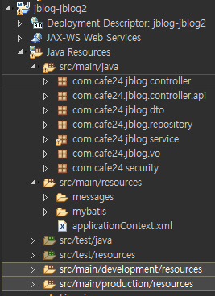
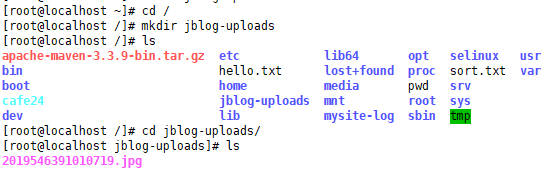

[TOC]


---

개발용, 배포용 resorces 나누기




> 근데 일단 계정 안만들어서 둘다 같음


**pom.xml**

```xml
<profiles>
    <profile>
        <id>production</id>
        <build>
            <resources>
                <resource>
                    <directory>${project.basedir}/src/main/resources</directory>
                    <excludes>
                        <exclude>**/*.java</exclude>
                    </excludes>
                </resource>
                <resource>
                    <directory>${project.basedir}/src/main/production/resources</directory>
                    <excludes>
                        <exclude>**/*.java</exclude>
                    </excludes>
                </resource>
            </resources>
            <plugins>
                <plugin>
                    <groupId>org.apache.maven.plugins</groupId>
                    <artifactId>maven-resources-plugin</artifactId>
                    <configuration>
                        <encoding>UTF-8</encoding>
                    </configuration>
                </plugin>
            </plugins>
        </build>
        <dependencies>
            <!-- Servlet -->
            <dependency>
                <groupId>javax.servlet</groupId>
                <artifactId>javax.servlet-api</artifactId>
                <version>3.0.1</version>
                <scope>provided</scope>
            </dependency>
            <dependency>
                <groupId>javax.servlet.jsp</groupId>
                <artifactId>jsp-api</artifactId>
                <version>2.0</version>
                <scope>provided</scope>
            </dependency>
        </dependencies>
    </profile>
</profiles>
```


**linux에 upload파일 경로 폴더 만들기**




각종에러 


jblog5 - spring boot  에러뜸

https://stackoverflow.com/questions/27440985/unable-to-register-mbean-hikaridatasource-hikaripool-0-with-key-datasource


## 해결법 1

**application.properties**

```
spring.jmx.enabled=false
```


## 해결법 2

jblog5 - pom.xml

```xml
<!-- Mybatis Starter -->
<dependency>
    <groupId>org.mybatis.spring.boot</groupId>
    <artifactId>mybatis-spring-boot-starter</artifactId>
    <version>1.3.2</version>
    <exclusions>
        <exclusion>
            <groupId>com.zaxxer</groupId>
            <artifactId>HikariCP</artifactId>
        </exclusion>
    </exclusions>
</dependency>
```


