[TOC]


---

# 리눅스 내부 구조

## Kernel 구조

프로세스관리   메모리관리   파일시스템관리   디바이스 제어   네트워크

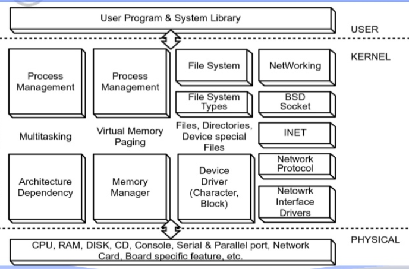

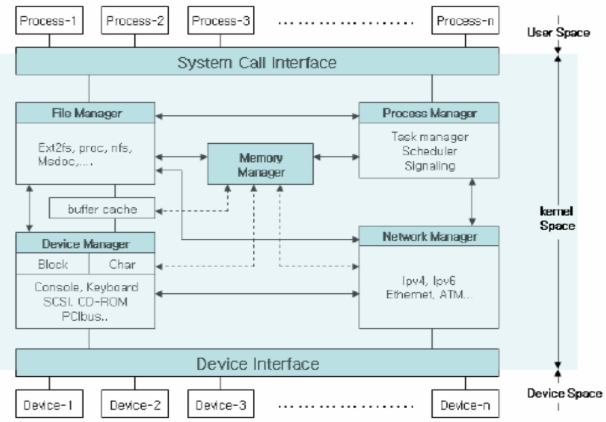

---

## VFS

VFS - 디스크 파일이 아니야@@ 데이터를 저장하거나 내보내는 큰 노드라고 생각해

진짜 파일이 실존하는게 아니라

여기 저장된 무언가를 실행시키는거야 (devfs & procfs & sysfs->시스템)

ex) /home/helloWorld.java를 키면 얘가 디스크에서 찾아서 오픈시킴

ex) /dev의 tty0을 실행시키면 디바이스 제어를 통해 콘솔에가서 실행시키는거고 

> 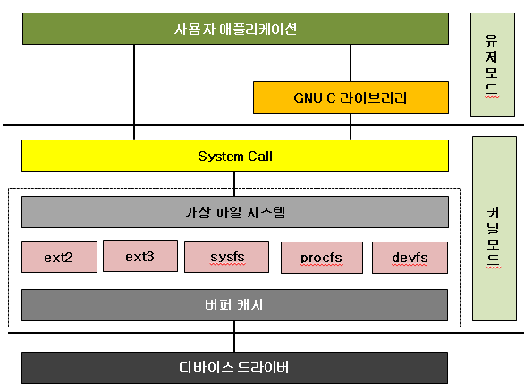
>
> 1. procfs : 커널 및 커널 모듈(디바이스 드라이버) 정보를 참조하거나, 설정 변경을 위한 파일 시스템으로 /proc에 마운트
>
> 2. sysfs : 시스템에 접속된 디바이스 정보를 참조하거나, 설정 변경을 위한 파일 시스템. /sys 에 마운트
>
> 3. devfs : 물리 디바이스에 액세스하기 위한 디바이스 파일을 배치하는 파일 시스템 . /dev 에 마운트

---


---

## 리눅스 디렉토리 구조


> 모든 디바이스에 접근하기 위한 경로!  -> 얘네는 하드 디스크에 있는 애들이 아니야
>
> 경로야 경로!!! 1! ! ! 1! ! 1
>
> ```
> /root
> 루트 디렉터리는 시스템의 근간이 되는 가장 중요한 디렉터리이다.  모든 파티션, 디렉터리는 루트 디렉터리 아래에 위치하기 때문에 반드시 존재해야 한다.
> 
> /bin
> 시스템 관리자 혹은 일반 사용자가 실행할 수 있는 수많은 명령어들이 들어있다.
> ex) cat, chmod, date, ls, mkdir, rm, touch, vi . . .
> 
> /sbin
> 시스템 관리자가 사용할 수 있는 명령어들이 들어 있다. 시스템을 수정, 복구에 관한 많은 명령어들이 들어 있으며 일반 사용자의 실행 권한도 제한을 해야 하는 등 보안에 신경을 써야 한다. 
> ex) ifconfig, reboot, shutdown, mount, fsck
> 
> /boot
> 부트로더와 부팅에 관련된 파일들이 있다. 손상되면 시스템이 부팅이 되지 않으므로 특별한 목적이 아니면 건들지 말아야 한다.
> 
> /home
> 유저들의 홈 디렉터리가 하위 디렉터리로 존재하게 된다. 
> 
> /dev  
> 디바이스 파일들이 있다. 시스템의 모든 장치가 파일로 표현되어 있는데 udev라는 데몬이 이곳의 장치 파일을 관리한다.
> ex) /dev/sda, /dev/hda, /dev/tty1, /dev/pts/0
> 
> /etc
> 시스템 혹은 각종 프로그램들의 환경 설정 파일들이 위치한다. 시스템 관리에서는 이곳의 파일들을 주로 수정하게 된다. 따라서 이 곳의 설정 파일들은 백업을 해 두는 것이 좋다.
> ex) /etc/fstab, /etc/gourp, /etc/initab, /etc/passwd, /etc/sysconfig/i18n
> 
> /lib
> 시스템의 프로그램이 실행 할 때 필요한 공유 라이브러리들이 들어있다 따라서 특별한 일이 없으면 변경하거나 삭제하지 않는 것이 좋다.
> 
> /mnt
> 마운트를 위한 임시 디렉터리가 위치한다. CD나 USB같은 이동 디스크를 마운트할 때 사용하게 된다.
> 
> /root
> root 계정의 홈 디렉터리이다. root 홈 디렉터리는 root만 접근할 수 있다.
> 
> /var
> log파일등 수시로 업데이트되는 파일들이 위치한다. 또한 시스템 운영에 필요한 파일들도 위치하기 때문에 수정과 삭제에 주의해야 한다.
> ```

---


---

# 실습

`whereis cat`  : 우리가 쓰는 cat은 어디에 있을까 

`> cat: /bin/cat /usr/share/man/man1/cat.1.gz /usr/share/man/man1p/cat.1p.gz`

`who`

`> webmaster pts/3        2019-06-03 22:06 (192.168.1.15)`

---


---

## /proc

`cat /proc/cpuinfo `    : cat이 open하는거야!

> 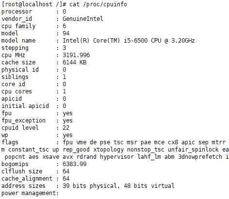


`cat /proc/partitions`

> 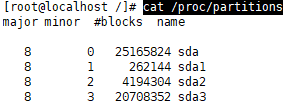


` cat /proc/meminfo `

> 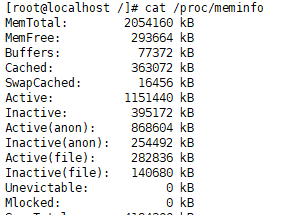


` cat /proc/uptime ` : 부팅된 이후 얼마의 시간이 흘렀나

> 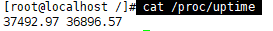
>
> 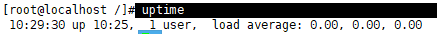


`cat /proc/version` == `uname -a` : 아마 /proc/version밑을 오픈하는 거겠지 

> 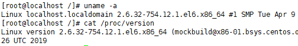


`cat /proc/modules`

---


---

지금 디스크의 각각의 파티션은 장치명이 sda1, sda2,sda3(/, /boot, swap) 이렇게 나뉨

파일시스템 적용, 마운팅?, 경로가 /boot부터 시작 

하드디스크에 파일을 저장하고싶음 여기에 저장되야함!!@!@!@!

## 디스크 추가

리눅스 shutdown 하고

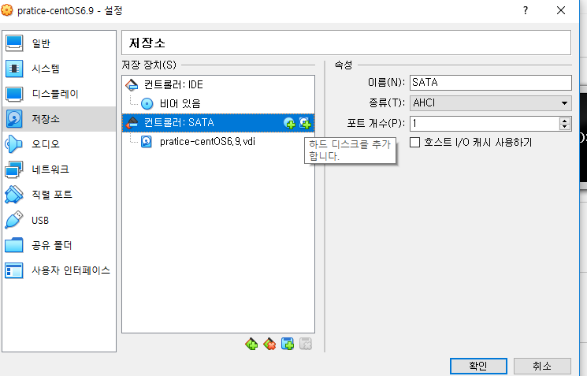

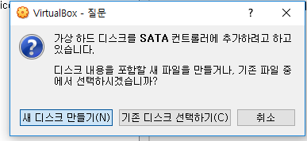

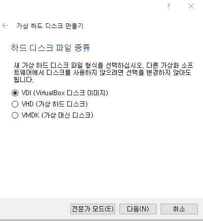

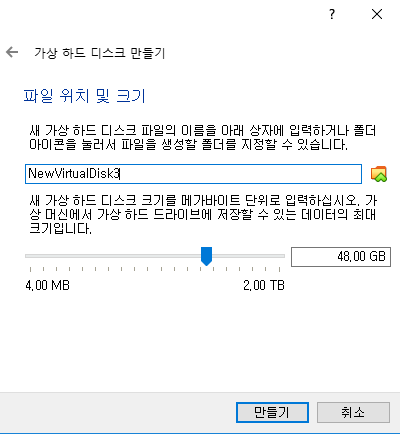

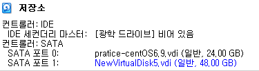

디스크를 하나 만들었잖아

리눅스 시작!

---

### **디스크 확인** `disk -l`

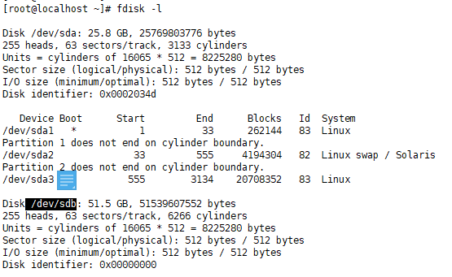


### **파티션 설정**

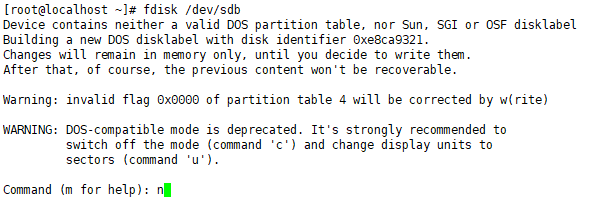

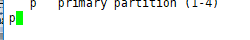

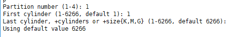

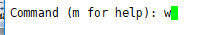

---


### **make file system :**  `mkfs -t ext4 /dev/sdb1`    


---


### **mount**  

data를 새로만든 디스크로 마운트 걸어보기

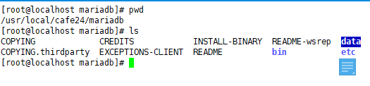


#### mariadb 내리기

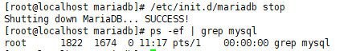


#### 옮기기

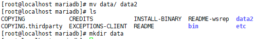


#### 마운트

`mount /dev/sdb1 /usr/local/cafe24/mariadb/data`

> 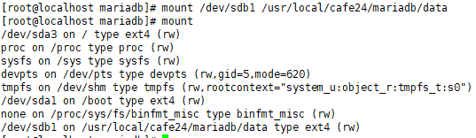


#### 복사

`cp -R data2/* data`


#### 권한

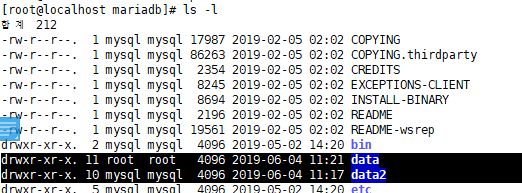

`chown -R mysql:mysql data`

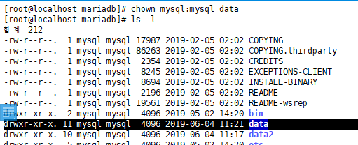


#### 실행확인

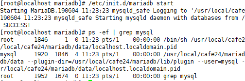

`mysql -p`   


#### 내 UUID 확인, 설정

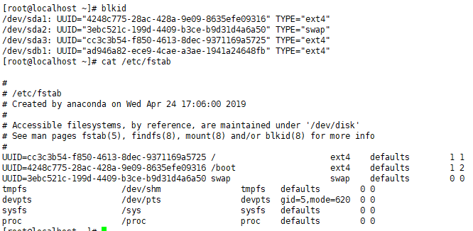


#### `vi /etc/fstab `

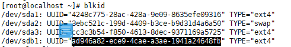

`/usr/local/cafe24/mariadb/data /data ext4 defaults 1 2`

`vi /etc/fstab ` 수정

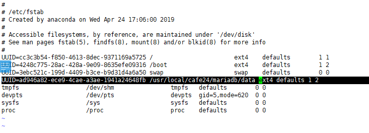


#### reboot


#### 확인

> 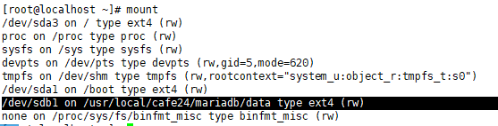
>
> > /usr/local/cafe24/mariadb/data 가 /dev/sdb1 공간을 빌리는 느낌(mount)


